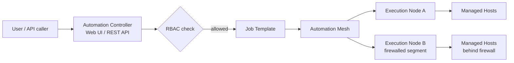

# Part 21 — Automation Controller and Automation Mesh

!!! info "Chapter status: outline"
    This chapter is scoped but not yet written in full prose. The sections below define what each part will cover.

This chapter covers the two pieces of AAP most responsible for turning "playbooks a few engineers run from their laptops" into "automation a whole organization can safely share."

## Why This Exists

- CLI-only Ansible has no built-in concept of who is allowed to run what against which hosts, no shared execution history, and no way to reach infrastructure that isn't directly network-reachable from one control node — Controller and Mesh exist to solve exactly those three gaps.

## Problem Statement

- As team size grows, "everyone SSHes into the same control node and runs playbooks" breaks down: there's no audit trail, no access control, no scheduling, and no good story for automation that must run close to infrastructure spread across multiple networks, clouds, or air-gapped zones.

## Internal Architecture

- **Automation Controller**: a web UI + REST API sitting in front of the same `ansible-core` engine — **Job Templates** (a saved playbook + inventory + credential + variable combination), **Workflows** (chaining job templates, including conditional branches), **RBAC** (organizations, teams, users, and fine-grained object-level permissions), and a **Credential** subsystem that keeps secrets out of playbooks entirely.
- **Automation Mesh**: a peer-to-peer overlay network of **control** and **execution** nodes that lets job execution happen close to target infrastructure (e.g., a node inside a firewalled network segment) while still being centrally managed from Controller — successor to the older, more rigid "isolated nodes" model.

## Workflow

## Step-by-Step Explanation

- Creating a Job Template: binding a project (playbook source, typically a Git repo), an inventory, and a credential, then optionally exposing a **Survey** (a form-based prompt for run-time variables) to non-technical requesters.
- Building a Workflow: chaining multiple Job Templates with success/failure/always branches, similar in spirit to `block`/`rescue`/`always` (Volume 2, Part 40 — Error Handling) but at the orchestration level across entire playbook runs.
- Mesh topology: how control nodes and execution nodes peer, and how a job gets routed to the execution node nearest its target infrastructure.

## Production Best Practices

- Modeling RBAC around least privilege from day one (organizations/teams matching real org structure) rather than granting broad admin access to get started quickly.
- Using Workflows (not ad hoc scripting) to express multi-step release processes so they're visible, auditable, and reusable across teams.

## Common Mistakes

- Storing credentials inside playbooks/variables instead of using Controller's Credential objects, defeating the RBAC/audit benefit entirely.
- Treating Mesh as purely a networking feature and not accounting for it when designing execution node placement relative to firewalled targets.

## Performance Considerations

- Execution node placement within the Mesh directly affects job latency for geographically or network-distant targets — previewed here, covered fully in Volume 6.

## Security Considerations

- RBAC scoping, credential isolation, and full job-run audit history are the core security value-add of Controller over bare `ansible-playbook` — this is often the actual business justification for adopting AAP.

## Interview Questions

- "What does a Job Template represent in Automation Controller, and what does a Workflow add on top of it?"
- "What problem does Automation Mesh solve that a single control node can't?"
- "How does Controller keep secrets out of playbook source code?"

## Hands-On Lab

- (Conceptual/walkthrough lab, since AAP requires a licensed or trial deployment) Sketch a Job Template + Survey + Workflow design for a "deploy app, then run smoke tests, then notify on failure" process, identifying which pieces are Job Templates vs. Workflow branching logic.

## Summary

- Automation Controller adds the access-control, auditability, and scheduling layer that raw CLI Ansible lacks; Automation Mesh extends that same managed execution to infrastructure a single control node can't reach directly.

## Next

Continue to [Part 22 — Execution Environments and Automation Hub](03-execution-environments-and-hub.md).
