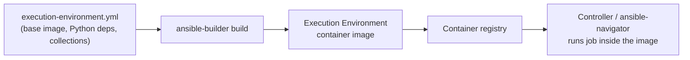

# Part 22 — Execution Environments and Automation Hub

!!! info "Chapter status: outline"
    This chapter is scoped but not yet written in full prose. The sections below define what each part will cover.

"It works on the control node that happens to have the right pip packages installed" is not a production strategy. Execution Environments exist to end that problem permanently.

## Why This Exists

- Real playbooks depend on specific Python libraries (e.g., `boto3` for AWS modules, `pywinrm` for Windows) and specific collection versions — dependency drift between engineers' machines and CI is a constant source of "works for me" bugs.

## Problem Statement

- A traditional control node accumulates whatever Python packages and collections were `pip install`ed and `ansible-galaxy install`ed on it over time, by whoever had access, with no reproducibility guarantee.

## Internal Architecture

- **Execution Environments (EEs)**: container images (built with `ansible-builder`) bundling a pinned `ansible-core` version, Python dependencies, and collections into one versioned, immutable artifact that Controller (or `ansible-navigator`, previewed in Volume 2's CLI chapter) runs jobs inside of, instead of running directly on a bare control node.
- **Automation Hub**: Red Hat's certified, support-backed content registry — the AAP-tier counterpart to the open community Galaxy registry (Volume 2, Part 14), offering vendor-certified collections with support SLAs.

## Workflow

## Step-by-Step Explanation

- Defining an EE with `execution-environment.yml` (base image, `requirements.txt` for Python deps, `requirements.yml` for collections).
- Building it with `ansible-builder build`, producing a container image.
- Publishing to a container registry and referencing it from a Job Template (or `ansible-navigator run --eei`) so every run uses an identical, versioned environment.
- Pulling certified collections from Automation Hub into an EE definition for supported, vendor-backed content.

## Production Best Practices

- Treating EE definitions as version-controlled artifacts (like a Dockerfile) with the same review process as application code, since they define exactly what runs in production automation.
- Building separate EEs per major automation domain (e.g., one for cloud provisioning, one for network automation) rather than one giant EE with every dependency ever needed, to limit blast radius and image size.

## Common Mistakes

- Treating an EE as a one-time build instead of a maintained, periodically-rebuilt artifact — stale EEs silently drift from current collection/security patches.
- Mixing Automation Hub (certified) and Galaxy (community) content in the same EE without tracking which pieces carry vendor support and which don't.

## Performance Considerations

- Large EEs with many unused collections slow down image pulls and job startup; scoping EEs tightly is both a security and performance practice (fully covered in Volume 6).

## Security Considerations

- EEs provide a reproducible, scannable artifact — container image scanning becomes part of the Ansible content supply chain, not just application containers.
- Automation Hub's certification model gives a support and provenance guarantee that community Galaxy content does not.

## Interview Questions

- "What problem do Execution Environments solve that a shared control node doesn't?"
- "What's the difference between Ansible Galaxy and Automation Hub?"
- "How would you build and version an Execution Environment for a specific automation project?"

## Hands-On Lab

- Write a minimal `execution-environment.yml` pinning a base image and one collection, build it with `ansible-builder build`, and run a simple playbook inside it with `ansible-navigator run --eei <image>`.

## Summary

- Execution Environments make "what's installed" a versioned, buildable artifact instead of a control node's accumulated history; Automation Hub is where certified, supported content for those environments comes from.

## Next

Continue to [Part 23 — Licensing and Adoption](04-licensing-and-adoption.md).
