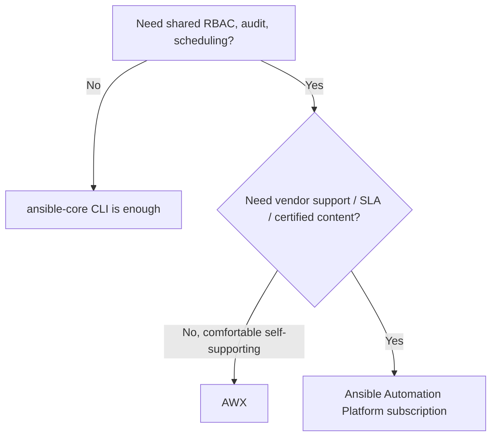

# Part 24 — Licensing and Adoption

!!! info "Chapter status: outline"
    This chapter is scoped but not yet written in full prose. The sections below define what each part will cover.

The technical case for AAP (Controller, Mesh, EEs) is only half the decision — this chapter covers the licensing and organizational side of adopting it.

## Why This Exists

- Engineers frequently make correct technical recommendations that stall because the licensing/support model wasn't part of the pitch — this chapter equips the reader to make that case completely.

## Problem Statement

- Deciding between free, self-supported open-source tooling (`ansible-core` + AWX) and a paid, vendor-supported subscription (AAP) is a real tradeoff involving cost, support SLAs, certification guarantees, and internal operational maturity — not a purely technical choice.

## History / Context

- **AWX** is the open-source upstream project from which AAP's Controller is downstream-productized — the same relationship Fedora has to RHEL. AWX gets new features first but without long-term support guarantees or backports.
- Red Hat's subscription model is typically **node-based** (managed hosts under automation) rather than per-seat, though exact terms should always be confirmed against Red Hat's current published pricing rather than assumed.

## Internal Architecture

- The support/release relationship: AWX (community, latest features, no formal support) → AAP (stabilized, backported, vendor-supported release of the same underlying technology) — mirroring the `ansible-core`/collections release-cadence separation from Volume 2, Part 13.

## Workflow — A Decision Framework

## Production Best Practices

- Piloting on AWX to validate the Controller/Workflow model organizationally before committing budget to an AAP subscription, if support/SLA guarantees aren't yet a hard requirement.
- Right-sizing subscription scope to actual managed-node count rather than over-provisioning "just in case."

## Common Mistakes

- Assuming AWX and AAP are functionally identical long-term — AWX moves faster and drops support guarantees that matter for regulated or mission-critical environments.
- Treating the licensing conversation as separate from the architecture conversation, when they need to happen together (Mesh topology and EE strategy have real cost implications at scale).

## Performance Considerations

- N/A directly — licensing doesn't change runtime performance, only support/SLA posture.

## Security Considerations

- Vendor-backed CVE response and patch SLAs are a genuine security argument for AAP over self-supported AWX in regulated environments — worth stating explicitly in an adoption business case.

## Interview Questions

- "What's the relationship between AWX and Ansible Automation Platform?"
- "What factors would push an organization toward a paid AAP subscription instead of self-supporting AWX?"
- "How is AAP typically licensed?"

## Hands-On Lab

- (Conceptual) Draft a one-page adoption recommendation for a hypothetical 200-host environment, weighing AWX vs. AAP against team size, compliance requirements, and support expectations.

## Summary

- AWX and AAP are the same technology at different points on the support/stability spectrum — choosing between them is an organizational maturity and risk-tolerance decision as much as a technical one.

## Next

Volume 4 is complete. Continue to [Volume 5: Developing Modules, Plugins & Contributing](../volume-5-development-and-contributing/index.md).
