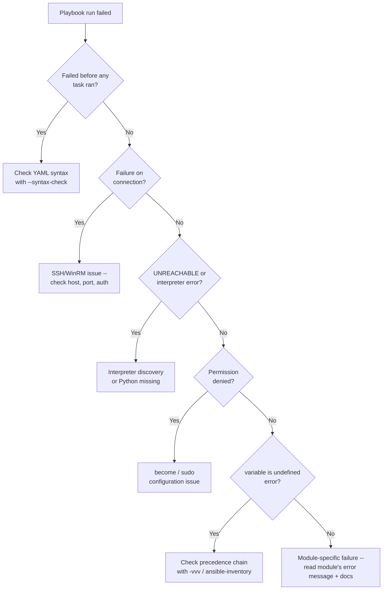

# Part 34 — Troubleshooting

!!! info "Chapter status: outline"
    This chapter is scoped but not yet written in full prose. The sections below define what each part will cover.

This chapter is the "something's broken, where do I look" reference — organized by symptom, cross-referencing the internals chapters that explain *why* each failure happens.

## Why This Exists

- Most Ansible failures fall into a small number of recurring categories — a symptom-indexed guide is faster than re-deriving the cause from first principles under production pressure.

## Problem Statement

- Ansible's error messages vary widely in clarity depending on where in the pipeline (Volume 3, Part 16) a failure occurs — some are immediately actionable, others require `-vvvv` to even locate.

## Master Troubleshooting Flowchart

## Step-by-Step Explanation — By Symptom

- **Interpreter errors**: "no Python interpreter found" — resolved by bootstrapping Python (`raw` module, Volume 3 Part 17) or pinning `ansible_python_interpreter`.
- **Permission denied**: usually a `become`/sudoers misconfiguration, or an SSH key not authorized on the target — distinguishing the two via `-vvvv` output.
- **SSH issues**: host key mismatches, wrong port, wrong user, or `ControlPersist` socket path length limits on some systems.
- **YAML syntax**: caught early with `ansible-playbook --syntax-check`; common causes are the indentation/quoting mistakes from Volume 1, Part 4.
- **Undefined variables**: almost always a precedence question — cross-reference Volume 2, Part 9's pyramid and decision tree, and use `ansible-inventory --host <name>` to see resolved values.
- **Inventory problems**: a host not appearing where expected — usually a pattern/group logic mistake (Volume 2, Part 8) or a dynamic inventory plugin credential/filter issue.
- **Connection failures**: distinguishing "can't reach the host at all" (network/firewall) from "reached the host but auth failed" (credentials) from "connected but became a different failure" (Python/interpreter).
- **Performance issues**: slow runs traced back to the levers in Part 32 (forks, pipelining, fact gathering) rather than assumed to be "Ansible is just slow."
- **Module failures**: reading the module's actual returned `msg`, and checking `ansible-doc <module>` for correct argument usage before assuming a bug.
- **Windows failures**: WinRM connectivity, authentication method mismatches, and the double-hop problem from Part 33.

## Production Best Practices

- Reaching for `-vvvv` and `--syntax-check` immediately as the first two diagnostic steps, before speculating about causes.
- Keeping a team runbook of previously-seen failure signatures and their root causes, since the same handful of issues recur across projects.

## Common Mistakes

- Assuming a cryptic error is an Ansible bug before checking `-vvvv` output, which usually reveals the real underlying SSH/Python/module error.
- Fixing the symptom (e.g., adding `ignore_errors: true`) instead of the root cause revealed by verbose output.

## Performance Considerations

- Diagnosing *perceived* performance problems that are actually correctness problems (e.g., unnecessary re-gathering of facts) versus genuine scaling limits covered in Part 32.

## Security Considerations

- Being careful with `-vvvv` output in shared logs/CI, since maximum verbosity can include sensitive data unless `no_log` (Part 31) is properly applied.

## Interview Questions

- "How would you debug a task that fails with 'UNREACHABLE'?"
- "A variable you expect to be set is 'undefined' at runtime — how do you find out why?"
- "What's your first troubleshooting step when a playbook run behaves unexpectedly?"

## Hands-On Lab

- Intentionally break a playbook three different ways (bad YAML indentation, a wrong SSH port, an undefined variable reference) and practice diagnosing each using `--syntax-check`, `-vvvv`, and `ansible-inventory` respectively.

## Summary

- Most Ansible failures sort into a handful of categories (syntax, connection, interpreter, permissions, variables, module-specific) — the master flowchart above is the fast path to the right chapter and the right diagnostic command.

## Next

Continue to [Part 35 — Best Practices](05-best-practices.md).
