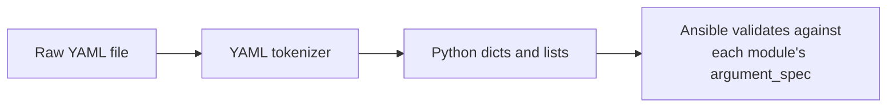

# YAML Essentials

## What You'll Learn

- Why Ansible chose YAML over JSON, XML, and TOML
- The syntax rules that actually matter day to day
- The specific mistakes that cause almost every beginner's first real bug

## Why YAML, Not JSON

Every Ansible beginner's first real bug is a YAML indentation error — treated seriously, that's worth it, because the choice wasn't incidental. Here's the same intent, a two-task play, written both ways.

```json title="Conceptual — Ansible does not actually use JSON playbooks"
[
  {
    "name": "Configure web server",
    "hosts": "web",
    "tasks": [
      {
        "name": "Install nginx",
        "ansible.builtin.package": { "name": "nginx", "state": "present" }
      }
    ]
  }
]
```

```yaml
- name: Configure web server
  hosts: web
  tasks:
    - name: Install nginx
      ansible.builtin.package:
        name: nginx
        state: present
```

JSON has no comments, no multiline strings, and every level of nesting adds another brace and another place to miss a trailing comma. YAML reads closer to plain English, and — critically for a tool whose playbooks live in git — **diffs and reviews cleanly**: a one-line change in YAML is usually a one-line diff; the same change in deeply nested JSON often isn't.

**Why not XML** — verbose closing tags, historically associated with the kind of enterprise tooling fatigue Puppet/Chef-adjacent shops were already tired of, and harder for a non-programmer to read at a glance.

**Why not TOML** — good for flat-ish configuration (it's why `pyproject.toml` and `Cargo.toml` use it well), but awkward for YAML's actual target: deeply nested, list-heavy structures like a task list or a variable tree, which TOML doesn't represent nearly as naturally.

## A Little History

YAML — "YAML Ain't Markup Language" — was first specified in 2001, purpose-built for human-editable data serialization, distinct from XML/SGML's document-markup lineage. Ansible parses it with PyYAML (or the faster C-based `libyaml` when available — see the note on `ansible --version` output in [Installing Ansible](../getting-started/04-installing-ansible.md)), through a custom loader that adds line/column tracking specifically to produce better error messages than stock PyYAML gives you.

## Indentation

```yaml
- name: Configure web server
  hosts: web
  tasks:
    - name: Install nginx
      ansible.builtin.package:
        name: nginx
        state: present
```

2-space indentation is the near-universal convention. Tabs are rejected outright by the YAML spec — not an Ansible restriction, a YAML one. List items (`-`) sit at the same indentation level as their sibling keys; a mapping's nested keys must be indented consistently underneath it, or the document's structure silently changes instead of raising a parse error.

## Block Scalars — Multiline Strings

```yaml
# | — literal: preserves newlines exactly
motd: |
  Welcome.
  This system is managed by Ansible.

# > — folded: joins lines into one, with spaces
description: >
  This is one long sentence
  that will be joined onto
  a single line.
```

Add `-` after `|`/`>` to strip the trailing newline (`|-`), or `+` to keep all trailing newlines (`|+`) — the default keeps exactly one.

## Anchors and Aliases

```yaml
defaults: &defaults
  retries: 3
  timeout: 30

web_task_settings:
  <<: *defaults
  port: 80
```

`&name` defines an anchor; `*name` references it; `<<:` merges an anchor's keys into the current mapping. Genuinely useful for repeated blocks within one file, though it's used far less often in modern Ansible than Jinja2 variables and `combine` (see [set_fact and combine](../variables-and-data/06-set-fact-and-combine.md)) for the same "don't repeat this" goal.

## The Parser Pipeline



This is stage one of a longer pipeline — YAML parsing happens **before** Jinja2 templating, not during it. The full picture, including why Ansible doesn't "compile YAML to Python," is the next page: [YAML → Python Mental Model](02-yaml-to-python-mental-model.md).

## Common Mistakes

- Mixing tabs and spaces — YAML forbids tabs for indentation outright.
- Inconsistent indentation between sibling keys, silently restructuring the document instead of raising a parse error.
- The **"Norway problem"** — `no`, `yes`, `on`, `off`, and some bareword country codes parse as booleans or other types instead of the plain string you meant. `state: no` might not mean the string `"no"`.
- A colon inside an unquoted string (a bare URL, for instance) breaking mapping parsing — quote it: `url: "http://host:8080/path"`.

## Interview Questions

- Why did Ansible choose YAML instead of JSON?
- What's the difference between the `|` and `>` block scalar styles?
- What is the YAML "Norway problem," and how do you avoid it in a playbook?

## Next

Continue to [YAML → Python Mental Model](02-yaml-to-python-mental-model.md).
