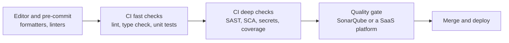

# Code Quality

Automated code quality checks catch bugs, vulnerabilities, leaked secrets, and untested changes before a human reviewer spends time on them. This section maps the tools, then takes you from a fresh SonarQube server to a quality gate that blocks a failing pull request.

## What You'll Learn

- Where linters, security scanners, SonarQube, and paid platforms each fit
- How to install, configure, and secure a SonarQube server
- How to design a quality gate that judges new code without blocking the team
- How to enforce that gate in Jenkins, GitHub Actions, and GitLab CI

## Layers of Automated Quality

Fast, cheap checks run earliest. SonarQube sits at the end as the aggregated verdict. It doesn't replace linters that give developers feedback in seconds.

## Read in This Order

1. [Open-Source Tools](code-quality-ecosystem.md) — ruff, ESLint, Checkstyle, SpotBugs, Semgrep, Gitleaks, Trivy, JaCoCo, and how to wire them into CI
2. [Paid Platforms](paid-platforms.md) — SonarQube Cloud, GitHub Advanced Security, Snyk, Codacy, Qlty, DeepSource, Codecov, Veracode, and Checkmarx
3. [SonarQube Installation](installation.md) — editions, requirements, kernel settings, and Docker Compose or native Ubuntu installs
4. [SonarQube Configuration](configuration.md) — `sonar.properties`, JVM memory, systemd, HTTPS with Nginx, first-login hardening, backups, and upgrades
5. [Quality Gates and Profiles](quality-gates.md) — rules, issues and hotspots, the new code period, and custom gates
6. [Jenkins Integration](jenkins-integration.md) — tokens, credentials, the scanner plugin, and the webhook
7. [Pipeline Examples](pipeline-example.md) — complete Jenkins, GitHub Actions, and GitLab CI pipelines with coverage and a failing gate

## Start Here, Based on Where You Are

| You want to… | Start at |
|---|---|
| Add fast checks to an existing pipeline today | [Open-Source Tools](code-quality-ecosystem.md) |
| Decide between self-hosting and a SaaS platform | [Paid Platforms](paid-platforms.md) |
| Stand up a SonarQube server | [Installation](installation.md) |
| Fix a gate that fails on legacy code | [Quality Gates and Profiles](quality-gates.md) |
| Make a pipeline fail on a bad gate | [Pipeline Examples](pipeline-example.md) |

## Terms You'll See

| Term | Meaning |
|---|---|
| **SAST** | Static application security testing — analyzes your source code for vulnerabilities |
| **SCA** | Software composition analysis — finds known vulnerabilities and license issues in dependencies |
| **Secrets scanning** | Finds credentials committed to code or history |
| **Quality profile** | The set of rules applied to a language |
| **Quality gate** | Pass/fail conditions, usually on new code |
| **Clean as You Code** | Hold every change to the standard, and let old issues get fixed as files are touched |

## Useful Links

- [SonarQube documentation](https://docs.sonarsource.com/)
- [SonarQube Community Build releases](https://github.com/SonarSource/sonarqube/releases)

## Common Mistakes

- Gating on overall code metrics instead of new code, so legacy debt blocks every change.
- Treating SonarQube as the only check instead of running fast linters locally and in CI first.
- Ignoring security hotspots because they aren't marked as bugs.
- Leaving the default admin password, anonymous access, and no database backups on a server that holds private code.

## Interview Questions

- What is a quality gate, and what should it check?
- What does "Clean as You Code" mean, and why does it work better than fixing everything first?
- What's the difference between SAST, SCA, and secrets scanning?

## Next

Continue to [Open-Source Code Quality Tools](code-quality-ecosystem.md).
