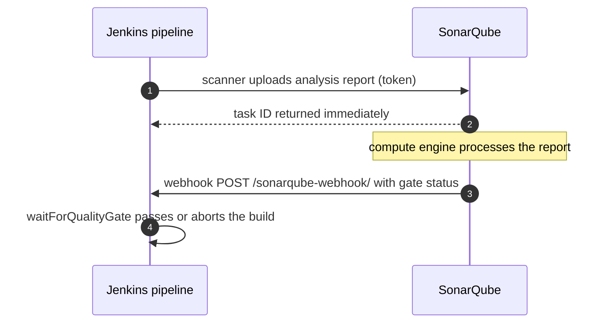

# SonarQube and Jenkins Integration

## What You'll Learn

- How Jenkins and SonarQube talk to each other, in both directions
- How to create a scoped analysis token and store it as a Jenkins credential
- How to install the plugin, register the server, and install scanner tools
- Why the webhook is required for `waitForQualityGate`, and how to verify the setup

## How the Integration Works



Analysis is **asynchronous**. The scanner finishes before SonarQube has computed the result, so Jenkins needs the webhook (step 5) to learn whether the gate passed.

## Step 1: Create an Analysis Token

Use the narrowest token that works:

| Token type | Scope | Use for |
|---|---|---|
| **Project analysis token** | Analyze one project | One Jenkins job per project — preferred |
| Global analysis token | Analyze any project | A shared pipeline library that scans many projects |
| User token | Everything that user can do | Scripts that call admin APIs — not CI analysis |

In SonarQube: **(avatar) → My Account → Security → Generate Tokens**, choose **Project Analysis Token**, select the project, and set an expiry. Copy the token — it's shown only once.

## Step 2: Store the Token in Jenkins

**Manage Jenkins → Credentials → System → Global credentials → Add Credentials**:

- **Kind:** Secret text
- **Secret:** the token
- **ID:** `sonarqube-token`

Never paste the token into a `Jenkinsfile` or job configuration field. Credentials are masked in logs and can be rotated in one place.

## Step 3: Install the Plugin and Register the Server

1. **Manage Jenkins → Plugins → Available plugins**, search for **SonarQube Scanner**, install, and restart if prompted.
2. **Manage Jenkins → System → SonarQube servers**:
    - Tick **Environment variables** so pipelines can use the server.
    - **Name:** `SonarQube` — pipelines refer to this exact name.
    - **Server URL:** `https://sonar.example.com`
    - **Server authentication token:** select `sonarqube-token`.
3. Save.

## Step 4: Install Scanner Tools

Which scanner you need depends on the build:

| Project type | Scanner | Jenkins setup |
|---|---|---|
| Maven | `sonar-maven-plugin`, run as `mvn sonar:sonar` | None beyond Maven itself |
| Gradle | `org.sonarqube` Gradle plugin, run as `gradle sonar` | None beyond Gradle itself |
| .NET | SonarScanner for .NET | Install the tool on agents |
| Everything else (Python, JavaScript, Go, …) | SonarScanner CLI | Configure it as a Jenkins tool (below) |

For the CLI: **Manage Jenkins → Tools → SonarQube Scanner installations → Add SonarQube Scanner**, name it `SonarScanner`, and tick **Install automatically**. Pipelines then load it with `tool 'SonarScanner'`.

## Step 5: Add the Webhook in SonarQube

**Administration → Configuration → Webhooks → Create**:

- **Name:** `Jenkins`
- **URL:** `https://jenkins.example.com/sonarqube-webhook/` — the trailing slash matters
- **Secret:** optional but recommended; if you set one, add the same value in the Jenkins SonarQube server configuration under **Webhook Secret**

SonarQube must be able to reach Jenkins over the network. If Jenkins is behind a firewall SonarQube can't cross, `waitForQualityGate` will wait until its timeout.

## Step 6: Verify

Run a minimal pipeline:

```groovy title="Jenkinsfile"
pipeline {
    agent any
    stages {
        stage('SonarQube connectivity') {
            steps {
                withSonarQubeEnv('SonarQube') {
                    sh 'curl -sf "$SONAR_HOST_URL/api/system/status"'
                }
            }
        }
    }
}
```

`withSonarQubeEnv` injects `SONAR_HOST_URL` and the token into the scanner's environment, so scanners pick them up without any credentials in the `Jenkinsfile`. A `{"status":"UP"}` response proves the server name and URL are right.

After the first real analysis, check **Project Settings → Webhooks** in SonarQube: the last delivery should show a `200` response.

## Common Mistakes

- Pasting the token into a `Jenkinsfile` or a plain job parameter instead of a Secret text credential.
- Forgetting the webhook, or omitting the trailing slash in `/sonarqube-webhook/`, so `waitForQualityGate` hangs until its timeout.
- Using an admin user token for analysis, so a leaked CI log exposes full server access.
- Naming the server `SonarQube` in Jenkins but calling `withSonarQubeEnv('sonarqube')` — the name is case-sensitive.
- Installing the SonarScanner CLI for a Maven project instead of using the Maven plugin, which understands modules and compiled classes.

## Interview Questions

- Why does Jenkins need a webhook from SonarQube if it just ran the analysis itself?
- Which SonarQube token type would you use for CI, and why?
- What does `withSonarQubeEnv` do?
- `waitForQualityGate` times out on every build but analyses appear in SonarQube. What do you check?

## Next

Continue to the [Pipeline Examples](pipeline-example.md) for complete Jenkins, GitHub Actions, and GitLab CI configurations.
