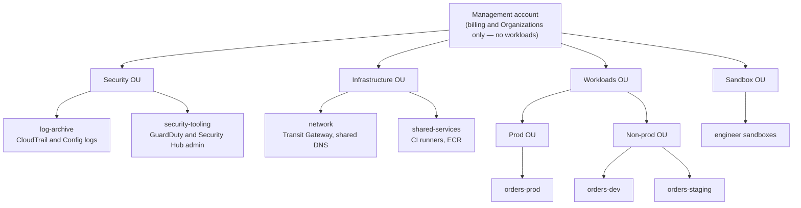

# Accounts, CLI, and Organizations

To see which AWS account and identity the CLI is using, run `aws sts get-caller-identity`. For just the account ID, add `--query Account --output text`. This page covers that, plus how to structure many accounts with AWS Organizations and manage them and IAM Identity Center (formerly AWS SSO) from the CLI.

## What You'll Learn

- How regions and Availability Zones affect availability, latency, and cost
- Why production workloads use many AWS accounts, and how to structure them
- How to give people access through IAM Identity Center instead of IAM users
- How to configure the AWS CLI with SSO profiles, and set budget alerts on day one
- The CLI commands for account identity, Organizations, and IAM Identity Center

## Regions and Availability Zones

| Concept | What it is | Design implication |
|---|---|---|
| **Region** | A geographic area such as `us-east-1` or `eu-west-1`, fully isolated from other regions | Choose for latency to users, data residency rules, and service availability. Most resources are regional. |
| **Availability Zone (AZ)** | One or more data centers in a region with independent power and networking | Spread production across at least two, usually three, AZs |
| **Global services** | IAM, Route 53, CloudFront, Organizations | Configured once, not per region |

AZ names like `us-east-1a` are mapped differently for each account. To line up AZs across accounts, use AZ IDs (`use1-az1`), shown by `aws ec2 describe-availability-zones`.

Data transfer **between** AZs costs money, and transfer between regions costs more. Chatty services split across AZs can surprise you on the bill.

## Why Multiple Accounts

An AWS account is the strongest isolation boundary AWS offers: separate resources, separate IAM, separate quotas, separate bill line. Mixing everything in one account means a mistake in development can affect production, and least-privilege IAM becomes very hard.

A typical structure using **AWS Organizations**:


```mermaid
flowchart TD
  M["Management account<br/>(billing and Organizations only — no workloads)"]
  M --> SEC["Security OU"]
  M --> INFRA["Infrastructure OU"]
  M --> WL["Workloads OU"]
  M --> SBX["Sandbox OU"]
  SEC --> LOG["log-archive<br/>CloudTrail and Config logs"]
  SEC --> AUD["security-tooling<br/>GuardDuty and Security Hub admin"]
  INFRA --> NET["network<br/>Transit Gateway, shared DNS"]
  INFRA --> SHARED["shared-services<br/>CI runners, ECR"]
  WL --> PRODOU["Prod OU"]
  WL --> NONPROD["Non-prod OU"]
  PRODOU --> P1["orders-prod"]
  NONPROD --> D1["orders-dev"]
  NONPROD --> S1["orders-staging"]
  SBX --> SB["engineer sandboxes"]
```

- **Organizational units (OUs)** group accounts so policies apply to all of them.
- The **management account** should contain nothing but Organizations and billing, because policies can't restrict it.
- **AWS Control Tower** automates this landing zone setup, including baseline guardrails and account vending.

### Service control policies

SCPs set the **maximum** permissions for every account in an OU. They don't grant anything; they cap what IAM policies can allow, even for administrators.

```json title="deny-leaving-approved-regions.json"
{
  "Version": "2012-10-17",
  "Statement": [
    {
      "Sid": "DenyOutsideApprovedRegions",
      "Effect": "Deny",
      "NotAction": [
        "iam:*", "organizations:*", "route53:*", "cloudfront:*", "sts:*",
        "support:*", "budgets:*", "ce:*", "health:*"
      ],
      "Resource": "*",
      "Condition": {
        "StringNotEquals": { "aws:RequestedRegion": ["us-east-1", "eu-west-1"] }
      }
    }
  ]
}
```

Other common guardrails: deny disabling CloudTrail or GuardDuty, deny leaving the organization, and deny creating IAM users with access keys. **Resource control policies (RCPs)** complement SCPs by capping what can be done **to** resources, such as preventing S3 buckets from being accessed by identities outside the organization.

Test SCPs on a sandbox OU first — a mistake can lock out every account beneath it.

## IAM Identity Center for People

Don't create IAM users for humans. Use **IAM Identity Center** (formerly AWS SSO), connected to your identity provider (Okta, Microsoft Entra ID, Google Workspace) or its built-in directory.

- **Permission sets** define what a role can do, such as `ReadOnly`, `PowerUserNoIAM`, or `AdministratorAccess`.
- **Assignments** map groups to permission sets in specific accounts: the `platform-engineers` group gets `AdministratorAccess` in dev and `ReadOnly` in prod.
- People sign in once and receive **short-lived credentials** for the account and role they choose. Leaving the company in the identity provider removes AWS access everywhere.

## The AWS CLI v2

```bash
# Install on Linux
curl -fsSL "https://awscli.amazonaws.com/awscli-exe-linux-x86_64.zip" -o awscliv2.zip
unzip -q awscliv2.zip && sudo ./aws/install
aws --version

# macOS: brew install awscli
```

### Configure SSO profiles

```bash
aws configure sso
```

This writes profiles like:

```ini title="~/.aws/config"
[sso-session acme]
sso_start_url = https://acme.awsapps.com/start
sso_region = us-east-1
sso_registration_scopes = sso:account:access

[profile orders-dev]
sso_session = acme
sso_account_id = 111111111111
sso_role_name = PowerUserNoIAM
region = eu-west-1
output = json

[profile orders-prod-readonly]
sso_session = acme
sso_account_id = 222222222222
sso_role_name = ReadOnly
region = eu-west-1
```

```bash
aws sso login --sso-session acme
aws sts get-caller-identity --profile orders-dev
export AWS_PROFILE=orders-dev          # default profile for this shell
```

### Useful CLI habits

```bash
# Always confirm where you are before changing anything
aws sts get-caller-identity --query '[Account, Arn]' --output text

# Filter server-side with --filters, shape output client-side with --query (JMESPath)
aws ec2 describe-instances \
  --filters Name=instance-state-name,Values=running Name=tag:Environment,Values=prod \
  --query 'Reservations[].Instances[].[InstanceId, InstanceType, Tags[?Key==`Name`].Value | [0]]' \
  --output table

# The CLI paginates automatically; limit what you fetch with --max-items
aws s3api list-objects-v2 --bucket acme-logs --prefix alb/ --max-items 20

# Wait for a state change instead of polling by hand
aws ec2 wait instance-running --instance-ids i-0abc1234def567890

# Preview a CLI command's API request body
aws ec2 run-instances --generate-cli-skeleton
```

Show the current profile in your shell prompt. Running a destructive command in the wrong account is one of the most common — and most avoidable — AWS incidents.

### Find your account ID, identity, and alias

```bash
# Who am I? Returns UserId, Account, and Arn
aws sts get-caller-identity

# Just the 12-digit account ID, for scripts
aws sts get-caller-identity --query Account --output text

# The friendly alias shown on the sign-in page, if one is set
aws iam list-account-aliases --query 'AccountAliases[0]' --output text

# Which profile and region the CLI resolved, and where each value came from
aws configure list
```

`get-caller-identity` needs no IAM permissions, so it works with any valid credentials. That also makes it the fastest test of whether your credentials work at all. With SSO profiles, the `Arn` looks like `arn:aws:sts::111111111111:assumed-role/AWSReservedSSO_PowerUserNoIAM_abc123/jane`. The role name tells you which permission set you're using.

### AWS Organizations from the CLI

Organizations commands work only from the management account or a delegated administrator account.

```bash
# The organization itself: ID, management account, enabled features
aws organizations describe-organization

# Every account in the organization
aws organizations list-accounts \
  --query 'Accounts[].[Id, Name, Email]' --output table

# Name and details of one account
aws organizations describe-account --account-id 111111111111

# Walk the OU tree: root, then OUs, then accounts in an OU
aws organizations list-roots --query 'Roots[0].Id' --output text
aws organizations list-organizational-units-for-parent --parent-id r-ab12
aws organizations list-accounts-for-parent --parent-id ou-ab12-34cd56ef

# Create a member account (asynchronous: poll the request until it succeeds)
aws organizations create-account --email orders-dev@acme.example --account-name orders-dev
aws organizations describe-create-account-status --create-account-request-id car-0123456789abcdef

# Move an account between OUs
aws organizations move-account --account-id 111111111111 \
  --source-parent-id r-ab12 --destination-parent-id ou-ab12-34cd56ef

# List SCPs and attach one to an OU
aws organizations list-policies --filter SERVICE_CONTROL_POLICY
aws organizations attach-policy --policy-id p-0123abcd --target-id ou-ab12-34cd56ef
```

### IAM Identity Center from the CLI

IAM Identity Center has two CLI namespaces: `sso-admin` manages permission sets and assignments, and `identitystore` manages users and groups. Most calls need the instance ARN and identity store ID, which you get first:

```bash
aws sso-admin list-instances \
  --query 'Instances[0].[InstanceArn, IdentityStoreId]' --output text

# Permission sets in this instance
aws sso-admin list-permission-sets --instance-arn arn:aws:sso:::instance/ssoins-0123456789abcdef

# Look up a group's ID by name
aws identitystore get-group-id --identity-store-id d-0123456789 \
  --alternate-identifier '{"UniqueAttribute":{"AttributePath":"displayName","AttributeValue":"platform-engineers"}}'

# Give that group a permission set in one account
aws sso-admin create-account-assignment \
  --instance-arn arn:aws:sso:::instance/ssoins-0123456789abcdef \
  --target-id 111111111111 --target-type AWS_ACCOUNT \
  --permission-set-arn arn:aws:sso:::permissionSet/ssoins-0123456789abcdef/ps-0123456789abcdef \
  --principal-type GROUP --principal-id 906702d8-0011-70e1-1234-0123456789ab
```

`create-account-assignment` is asynchronous too: check it with `describe-account-assignment-creation-status`. For anything beyond a few assignments, manage Identity Center with Terraform rather than one-off CLI calls, so access is reviewed in pull requests.

## Set a Budget Before Anything Else

```bash
aws budgets create-budget \
  --account-id 111111111111 \
  --budget '{"BudgetName":"monthly-total","BudgetLimit":{"Amount":"100","Unit":"USD"},"TimeUnit":"MONTHLY","BudgetType":"COST"}' \
  --notifications-with-subscribers '[
    {"Notification":{"NotificationType":"ACTUAL","ComparisonOperator":"GREATER_THAN","Threshold":80,"ThresholdType":"PERCENTAGE"},
     "Subscribers":[{"SubscriptionType":"EMAIL","Address":"platform-alerts@example.com"}]},
    {"Notification":{"NotificationType":"FORECASTED","ComparisonOperator":"GREATER_THAN","Threshold":100,"ThresholdType":"PERCENTAGE"},
     "Subscribers":[{"SubscriptionType":"EMAIL","Address":"platform-alerts@example.com"}]}
  ]'
```

Also enable **Cost Anomaly Detection**, which learns normal spend and alerts on unusual jumps — such as a forgotten GPU instance or a runaway data transfer. Budgets alert; they don't stop spending.

## Protect the Root User

Every account has a root user that can do anything, including closing the account.

- Enable MFA on the root user of every account (hardware or passkey MFA for the management account).
- Delete any root access keys.
- Don't use root for daily work. With AWS Organizations, you can centrally manage root access for member accounts and remove their root credentials entirely.

## Service Quotas

Every account has limits, such as vCPUs per instance family or Elastic IPs per region. Hitting one during a scale-up event causes launch failures.

```bash
aws service-quotas list-service-quotas --service-code ec2 \
  --query "Quotas[?contains(QuotaName, 'On-Demand')].[QuotaName, Value]" --output table
```

Request increases **before** launches and migrations, not during an incident.

## Common Mistakes

- Running development, staging, and production in one account.
- Creating IAM users with long-lived access keys for people instead of using IAM Identity Center.
- Running workloads in the management account, where SCPs don't apply.
- No budget or anomaly alerts, and finding out about a runaway resource from the monthly invoice.
- Running CLI commands without checking `get-caller-identity`, in the wrong account or region.
- Root user without MFA, or with access keys.

## Interview Questions

- Why do organizations use many AWS accounts? How would you structure them?
- What's the difference between a service control policy and an IAM policy?
- How should engineers authenticate to AWS from their laptops?
- What's the difference between a region and an Availability Zone, and how does it affect architecture?
- How do you stop a sandbox account from generating an unexpected bill?

## Next

Continue to [IAM](02-iam.md).
