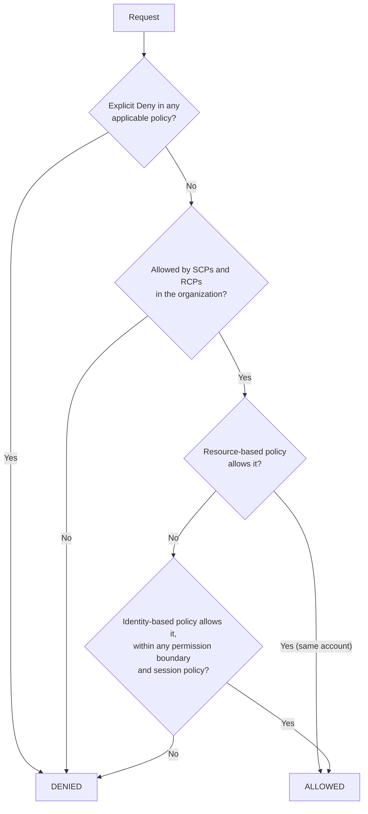

# IAM

## What You'll Learn

- The building blocks: principals, policies, roles, and trust policies
- How AWS decides whether a request is allowed
- How to write least-privilege policies and find unused permissions
- How workloads and CI pipelines get credentials without long-lived keys

## Mental Model

> Every AWS API call is a request by a **principal** to perform an **action** on a **resource** under certain **conditions**. IAM evaluates every policy that applies and allows the request only if something explicitly allows it and nothing explicitly denies it.

| Term | Meaning |
|---|---|
| **Principal** | Who is making the request: an IAM role session, a user, an AWS service, or a federated identity |
| **Identity-based policy** | Attached to a user, group, or role: "this principal can do X" |
| **Resource-based policy** | Attached to a resource such as an S3 bucket, KMS key, or SQS queue: "these principals can do X to me" |
| **Role** | An identity with permissions but no permanent credentials; principals **assume** it to get temporary credentials |
| **Trust policy** | The resource-based policy on a role saying who may assume it |

## Anatomy of a Policy

```json
{
  "Version": "2012-10-17",
  "Statement": [
    {
      "Sid": "ReadOrderExports",
      "Effect": "Allow",
      "Action": ["s3:GetObject", "s3:ListBucket"],
      "Resource": [
        "arn:aws:s3:::acme-order-exports",
        "arn:aws:s3:::acme-order-exports/daily/*"
      ],
      "Condition": {
        "StringEquals": { "aws:PrincipalTag/team": "orders" },
        "Bool": { "aws:SecureTransport": "true" }
      }
    }
  ]
}
```

- `Action` and `Resource` must match the API call. `s3:ListBucket` applies to the **bucket** ARN; `s3:GetObject` applies to **object** ARNs (`bucket/key`). Getting this wrong is the most common "why is this denied?" cause.
- `Condition` narrows when the statement applies: tags, source VPC endpoint, MFA, IP ranges, encryption, and more.
- Use `"Version": "2012-10-17"` — the older version doesn't support policy variables.

## Roles and Trust Policies

A role has two policies:

```json title="Trust policy — who can assume the role"
{
  "Version": "2012-10-17",
  "Statement": [
    {
      "Effect": "Allow",
      "Principal": { "Service": "ecs-tasks.amazonaws.com" },
      "Action": "sts:AssumeRole",
      "Condition": {
        "StringEquals": { "aws:SourceAccount": "111111111111" }
      }
    }
  ]
}
```

```json title="Permissions policy — what the role can do"
{
  "Version": "2012-10-17",
  "Statement": [
    {
      "Effect": "Allow",
      "Action": ["secretsmanager:GetSecretValue"],
      "Resource": "arn:aws:secretsmanager:eu-west-1:111111111111:secret:orders/prod/*"
    }
  ]
}
```

Where roles are used:

| Workload | How it gets the role |
|---|---|
| EC2 instance | Instance profile — credentials from the instance metadata service |
| Lambda function | Execution role |
| ECS task | Task role (for the app) and task execution role (for pulling images and writing logs) |
| EKS pod | EKS Pod Identity or IAM Roles for Service Accounts (IRSA) |
| Another account | `sts:AssumeRole` with a trust policy naming that account or role |
| GitHub Actions, GitLab CI | OIDC web identity federation (below) |
| People | IAM Identity Center permission sets (which are roles underneath) |

## How Policy Evaluation Works



Key rules:

1. **Default deny.** Nothing is allowed unless a policy allows it.
2. **Explicit deny always wins**, wherever it appears.
3. **Guardrails cap permissions.** SCPs, RCPs, permission boundaries, and session policies don't grant anything — they limit what other policies can grant.
4. **Cross-account access needs both sides.** The caller's identity policy must allow the action, **and** the resource policy (or the role's trust policy) must allow the caller.

## Least Privilege in Practice

Nobody writes a perfect policy on the first try. A practical loop:

1. **Start from managed policies scoped to a service**, or broad permissions in a sandbox.
2. **Generate a policy from real activity** with IAM Access Analyzer, which reads CloudTrail logs and produces a policy of what the role actually used.
3. **Tighten resources and add conditions**: specific ARNs, tags, regions.
4. **Review unused access** periodically — Access Analyzer reports unused roles, access keys, and permissions.

```bash
# Test what a principal can do before deploying
aws iam simulate-principal-policy \
  --policy-source-arn arn:aws:iam::111111111111:role/orders-api-task \
  --action-names secretsmanager:GetSecretValue s3:DeleteObject \
  --resource-arns "arn:aws:secretsmanager:eu-west-1:111111111111:secret:orders/prod/db-AbCdEf"

# Validate a policy for errors and security warnings
aws accessanalyzer validate-policy --policy-type IDENTITY_POLICY --policy-document file://policy.json
```

### Attribute-based access control (ABAC)

Instead of listing every resource, match tags on the principal and the resource:

```json
{
  "Effect": "Allow",
  "Action": ["ec2:StartInstances", "ec2:StopInstances", "ec2:RebootInstances"],
  "Resource": "arn:aws:ec2:*:111111111111:instance/*",
  "Condition": {
    "StringEquals": { "aws:ResourceTag/team": "${aws:PrincipalTag/team}" }
  }
}
```

One policy lets every team manage only their own instances, and it keeps working as new instances are created.

### Permission boundaries

Let teams create roles for their own services without being able to escalate privileges:

```json title="Allow creating roles only with the boundary attached"
{
  "Effect": "Allow",
  "Action": ["iam:CreateRole", "iam:PutRolePolicy", "iam:AttachRolePolicy"],
  "Resource": "arn:aws:iam::111111111111:role/app/*",
  "Condition": {
    "StringEquals": {
      "iam:PermissionsBoundary": "arn:aws:iam::111111111111:policy/AppWorkloadBoundary"
    }
  }
}
```

Any role they create can never exceed `AppWorkloadBoundary`, whatever policies they attach.

## OIDC Roles for CI/CD

CI pipelines should never store AWS access keys. GitHub Actions, GitLab CI, and others issue a signed OIDC token per job, which AWS exchanges for short-lived credentials.

### 1. Create the identity provider (once per account)

```hcl title="Terraform"
resource "aws_iam_openid_connect_provider" "github" {
  url            = "https://token.actions.githubusercontent.com"
  client_id_list = ["sts.amazonaws.com"]
}
```

### 2. A role that only one repository and branch can assume

```hcl
data "aws_iam_policy_document" "github_trust" {
  statement {
    actions = ["sts:AssumeRoleWithWebIdentity"]
    principals {
      type        = "Federated"
      identifiers = [aws_iam_openid_connect_provider.github.arn]
    }
    condition {
      test     = "StringEquals"
      variable = "token.actions.githubusercontent.com:aud"
      values   = ["sts.amazonaws.com"]
    }
    condition {
      test     = "StringEquals"
      variable = "token.actions.githubusercontent.com:sub"
      values   = ["repo:acme/orders-api:environment:production"]
    }
  }
}

resource "aws_iam_role" "deploy_orders" {
  name                 = "github-deploy-orders-api"
  assume_role_policy   = data.aws_iam_policy_document.github_trust.json
  max_session_duration = 3600
}
```

!!! danger "Always restrict the `sub` claim"
    A trust policy that checks only the audience lets **any repository on GitHub** assume your role. Pin the organization, repository, and a branch or environment.

### 3. Use it in the workflow

```yaml title=".github/workflows/deploy.yml (excerpt)"
permissions:
  id-token: write      # allow the job to request an OIDC token
  contents: read

jobs:
  deploy:
    runs-on: ubuntu-latest
    environment: production
    steps:
      - uses: aws-actions/configure-aws-credentials@v6
        with:
          role-to-assume: arn:aws:iam::222222222222:role/github-deploy-orders-api
          aws-region: eu-west-1
      - run: aws sts get-caller-identity
```

## Debugging Access Denied

```text
An error occurred (AccessDeniedException) when calling the GetSecretValue operation:
User: arn:aws:sts::111111111111:assumed-role/orders-api-task/9f1c... is not authorized to perform:
secretsmanager:GetSecretValue on resource: arn:aws:secretsmanager:eu-west-1:111111111111:secret:orders/prod/db-AbCdEf
because no identity-based policy allows the secretsmanager:GetSecretValue action
```

Work through it:

1. **Who is calling?** The message names the role session. Is it the role you expected?
2. **What does the message say is missing?** Recent error messages name the policy type that denied the request — identity policy, resource policy, SCP, or boundary.
3. **Check the ARN pattern.** Secrets Manager ARNs end in a random six-character suffix, so `secret:orders/prod/db` doesn't match — use `secret:orders/prod/db-*`.
4. **Check encryption.** Reading an object or secret encrypted with a customer-managed KMS key also needs `kms:Decrypt` on that key, and the key policy must allow it.
5. **Check CloudTrail** for the denied event and its `errorCode`.

## Common Mistakes

- IAM users with long-lived access keys for applications and CI instead of roles.
- `"Action": "*", "Resource": "*"` policies "for now" that never get tightened.
- OIDC trust policies without a `sub` condition, trusting every repository on GitHub.
- Confusing bucket and object ARNs in S3 policies.
- Forgetting the KMS key policy when a resource uses a customer-managed key.
- Granting `iam:PassRole` on `*`, letting a principal hand any role — including admin — to a service it controls.

## Interview Questions

- What's the difference between an identity-based policy and a resource-based policy?
- Walk through how AWS evaluates whether a request is allowed.
- How does a GitHub Actions workflow get AWS credentials without storing keys? What must the trust policy check?
- What is a permission boundary, and when would you use one?
- Why is `iam:PassRole` a sensitive permission?

## Next

Continue to [VPC Networking](03-vpc-networking.md).
