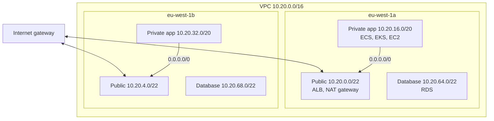

# VPC Networking

## What You'll Learn

- How to plan VPC and subnet CIDR ranges that won't box you in later
- What makes a subnet public or private, and how route tables, internet gateways, and NAT gateways work
- The difference between security groups and network ACLs
- How to reach AWS services privately, connect VPCs, and debug traffic with flow logs

## The Standard Three-Tier VPC



A third AZ follows the same pattern. Only load balancers and NAT gateways sit in public subnets; everything else is private.

## Plan CIDR Ranges

- Use a private range (`10.0.0.0/8` is the usual choice) and give each VPC its own non-overlapping block, such as a `/16` per VPC.
- Keep a registry of allocations across every account, region, and on-premises network. Overlapping CIDRs can't be peered or routed through Transit Gateway without NAT.
- Size **app subnets generously**. EKS pods, ECS tasks in `awsvpc` mode, and Lambda functions in a VPC each consume an IP address. A `/24` fills up fast.
- AWS reserves five addresses in every subnet.

## What Makes a Subnet Public

A subnet is **public** when its route table has a route to an **internet gateway**. There's no "public" checkbox — it's all routing.

| Route table | Routes | Used by |
|---|---|---|
| Public | `10.20.0.0/16 → local`, `0.0.0.0/0 → igw-…` | Public subnets |
| Private (per AZ) | `10.20.0.0/16 → local`, `0.0.0.0/0 → nat-…` (NAT in the same AZ) | App subnets |
| Database | `10.20.0.0/16 → local` only | Database subnets — no internet at all |

An instance in a public subnet also needs a **public IP** to be reachable from the internet. An instance in a private subnet can reach out through NAT but can't receive inbound connections from the internet.

## NAT Gateways

A NAT gateway lets private resources initiate outbound connections — to download packages or call external APIs — while staying unreachable from outside.

- Deploy **one NAT gateway per AZ**, and route each private subnet to the NAT in its own AZ. A single shared NAT is a single point of failure, and cross-AZ traffic to it costs extra.
- NAT gateways charge **per hour and per GB processed**. Large traffic to S3, ECR, or DynamoDB through NAT is a classic surprise cost — use VPC endpoints instead.

## Security Groups vs Network ACLs

| | Security group | Network ACL |
|---|---|---|
| Attached to | Network interfaces (instances, load balancers, tasks, RDS) | Subnets |
| State | **Stateful** — return traffic is allowed automatically | **Stateless** — return traffic needs its own rule |
| Rules | Allow only | Allow and deny |
| Evaluation | All rules together | In number order; first match wins |
| Typical use | The primary traffic control for every workload | Coarse subnet-level blocks, such as denying a known-bad range |

### Reference security groups, not CIDRs

```hcl title="Terraform"
resource "aws_security_group" "alb" {
  name   = "orders-alb"
  vpc_id = aws_vpc.main.id
}

resource "aws_vpc_security_group_ingress_rule" "alb_https" {
  security_group_id = aws_security_group.alb.id
  cidr_ipv4         = "0.0.0.0/0"
  from_port         = 443
  to_port           = 443
  ip_protocol       = "tcp"
}

resource "aws_security_group" "app" {
  name   = "orders-app"
  vpc_id = aws_vpc.main.id
}

# The app accepts traffic only from the load balancer's security group
resource "aws_vpc_security_group_ingress_rule" "app_from_alb" {
  security_group_id            = aws_security_group.app.id
  referenced_security_group_id = aws_security_group.alb.id
  from_port                    = 8080
  to_port                      = 8080
  ip_protocol                  = "tcp"
}

resource "aws_vpc_security_group_ingress_rule" "db_from_app" {
  security_group_id            = aws_security_group.db.id
  referenced_security_group_id = aws_security_group.app.id
  from_port                    = 5432
  to_port                      = 5432
  ip_protocol                  = "tcp"
}
```

Referencing a security group means "any network interface in that group," so the rule keeps working as tasks scale, IPs change, and new subnets are added.

If NACLs are used, remember the **ephemeral port range** (1024–65535) for return traffic, or connections will hang.

## VPC Endpoints: Reach AWS Services Privately

| Type | Services | Cost | How it works |
|---|---|---|---|
| **Gateway endpoint** | S3 and DynamoDB | No charge | A route table entry sends service traffic directly, bypassing NAT |
| **Interface endpoint** (PrivateLink) | Most other services: ECR, Secrets Manager, STS, CloudWatch Logs, SSM | Per hour per AZ, plus per GB | A network interface with a private IP in your subnet |

```hcl
resource "aws_vpc_endpoint" "s3" {
  vpc_id            = aws_vpc.main.id
  service_name      = "com.amazonaws.eu-west-1.s3"
  vpc_endpoint_type = "Gateway"
  route_table_ids   = aws_route_table.private[*].id
}
```

Add a gateway endpoint for S3 to every VPC — it's free and cuts NAT data charges. Add interface endpoints for ECR, STS, and CloudWatch Logs when workloads pull many images or ship heavy logs, or when subnets have no internet route at all.

Endpoint policies and `aws:SourceVpce` conditions in bucket policies can restrict an S3 bucket so it's only reachable from your VPC.

## Connecting VPCs and Networks

| Option | Topology | Use when |
|---|---|---|
| **VPC peering** | One-to-one, non-transitive | A few VPCs that need to talk |
| **Transit Gateway** | Hub and spoke, transitive, with route tables | Many VPCs and accounts, plus VPN or Direct Connect |
| **PrivateLink** | Expose one service, not a whole network | Offering a service to other VPCs or accounts, even with overlapping CIDRs |
| **Site-to-Site VPN** | Encrypted tunnels over the internet | Connecting an office or data center quickly |
| **Direct Connect** | A private physical connection | Consistent, high-throughput hybrid connectivity |

## DNS Inside a VPC

- The VPC resolver lives at the VPC CIDR base plus two (for example `10.20.0.2`).
- **Route 53 private hosted zones** associated with a VPC answer internal names such as `orders.internal.acme.com` only inside that VPC.
- **Route 53 Resolver endpoints** forward queries between a VPC and on-premises DNS.

## Debugging With VPC Flow Logs

```hcl
resource "aws_flow_log" "main" {
  vpc_id               = aws_vpc.main.id
  traffic_type         = "REJECT"      # or ALL; REJECT is cheaper and answers "what's being blocked?"
  log_destination_type = "cloud-watch-logs"
  log_destination      = aws_cloudwatch_log_group.flow.arn
  iam_role_arn         = aws_iam_role.flow_logs.arn
}
```

A flow log record:

```text
2 111111111111 eni-0a1b2c3d 10.20.17.44 10.20.65.10 51522 5432 6 3 180 1757840400 1757840460 REJECT OK
```

That's a TCP (`6`) connection from an app task to PostgreSQL (`5432`) being **rejected** — check the database security group. Query many records at once with CloudWatch Logs Insights:

```text
fields @timestamp, srcAddr, dstAddr, dstPort, action
| filter action = "REJECT" and dstPort = 5432
| stats count() by srcAddr
| sort count() desc
```

**VPC Reachability Analyzer** checks a path between two resources and names the exact security group, NACL, or route blocking it, without sending any traffic.

## Common Mistakes

- Overlapping VPC CIDRs across accounts, blocking peering or Transit Gateway later.
- App subnets sized `/24` for EKS or ECS, running out of IPs during a scale-out.
- One NAT gateway for all AZs, creating a single point of failure and cross-AZ charges.
- Heavy S3 or ECR traffic through NAT instead of VPC endpoints.
- Security group rules with `0.0.0.0/0` on database or SSH ports.
- Stateless NACL rules that forget ephemeral return ports, so connections silently hang.
- Putting application instances in public subnets with public IPs "for convenience".

## Interview Questions

- What makes a subnet public in AWS?
- Compare security groups and network ACLs.
- Why deploy a NAT gateway per Availability Zone?
- How would you let private instances access S3 without going through a NAT gateway?
- An ECS task can't connect to RDS. How do you troubleshoot it?
- When would you choose Transit Gateway over VPC peering?

## Next

Continue to [EC2 and Auto Scaling](04-ec2-and-auto-scaling.md).
