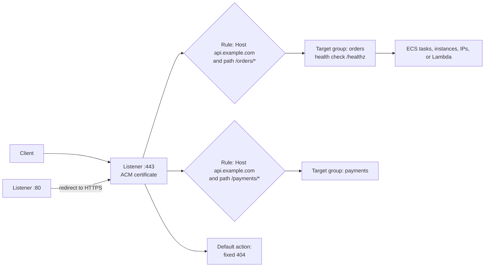

# Load Balancing and Route 53

## What You'll Learn

- When to use an Application Load Balancer or a Network Load Balancer
- How listeners, rules, target groups, and health checks fit together
- How to issue and attach free TLS certificates with ACM
- How Route 53 alias records and routing policies send users to healthy endpoints

## ALB or NLB?

| | Application Load Balancer | Network Load Balancer |
|---|---|---|
| Layer | 7 — HTTP, HTTPS, gRPC, WebSockets | 4 — TCP, UDP, TLS |
| Routing | Host, path, headers, query strings, methods, source IP | Port only |
| TLS | Terminates | Terminates (TLS listener) or passes through (TCP listener) |
| Static IPs | No — use DNS names | Yes — one per AZ, or your own Elastic IPs |
| Client IP at target | In `X-Forwarded-For` | Preserved (for instance and IP targets), or via PROXY protocol |
| Extra features | Redirects, fixed responses, authentication with OIDC or Cognito, WAF | Very high throughput, low latency, PrivateLink endpoint services |
| Typical use | Web apps and APIs | Non-HTTP protocols, static IPs for allow-lists, extreme scale |

The concepts behind these choices are in [Load Balancers and Reverse Proxies](../../foundations/networking/04-load-balancers-and-reverse-proxies.md).

## How an ALB Is Put Together



```hcl title="Terraform"
resource "aws_lb" "public" {
  name               = "public-web"
  load_balancer_type = "application"
  subnets            = aws_subnet.public[*].id
  security_groups    = [aws_security_group.alb.id]
  drop_invalid_header_fields = true

  access_logs {
    bucket  = aws_s3_bucket.lb_logs.id
    enabled = true
  }
}

resource "aws_lb_target_group" "orders" {
  name        = "orders"
  port        = 8080
  protocol    = "HTTP"
  vpc_id      = aws_vpc.main.id
  target_type = "ip"                        # ECS on Fargate and EKS pods use IP targets

  health_check {
    path                = "/healthz"
    matcher             = "200"
    interval            = 15
    healthy_threshold   = 2
    unhealthy_threshold = 3
    timeout             = 5
  }

  deregistration_delay = 30                  # drain in-flight requests before removing a target
}

resource "aws_lb_listener" "https" {
  load_balancer_arn = aws_lb.public.arn
  port              = 443
  protocol          = "HTTPS"
  ssl_policy        = "ELBSecurityPolicy-TLS13-1-2-2021-06"
  certificate_arn   = aws_acm_certificate_validation.api.certificate_arn

  default_action {
    type = "fixed-response"
    fixed_response {
      content_type = "text/plain"
      status_code  = "404"
    }
  }
}

resource "aws_lb_listener_rule" "orders" {
  listener_arn = aws_lb_listener.https.arn
  priority     = 10
  action {
    type             = "forward"
    target_group_arn = aws_lb_target_group.orders.arn
  }
  condition {
    host_header { values = ["api.example.com"] }
  }
  condition {
    path_pattern { values = ["/orders/*"] }
  }
}

resource "aws_lb_listener" "http_redirect" {
  load_balancer_arn = aws_lb.public.arn
  port              = 80
  protocol          = "HTTP"
  default_action {
    type = "redirect"
    redirect {
      port        = "443"
      protocol    = "HTTPS"
      status_code = "HTTP_301"
    }
  }
}
```

## Health Checks and Idle Timeouts

- A target is taken out of rotation after `unhealthy_threshold` consecutive failures, and returned after `healthy_threshold` successes.
- If **every** target in a group is unhealthy, an ALB **fails open** and sends traffic to all of them anyway, on the basis that some responses beat none. Don't rely on it — alert on `UnHealthyHostCount`.
- The ALB's **idle timeout** defaults to 60 seconds. Application keep-alive timeouts must be **longer**, or you'll get intermittent `502` errors. See [Timeouts](../../foundations/networking/04-load-balancers-and-reverse-proxies.md#timeouts-the-most-common-source-of-mystery-errors).

### Reading ALB errors

| Metric or code | Source | Meaning |
|---|---|---|
| `HTTPCode_ELB_5XX_Count` with `502` | The load balancer | Target closed the connection or returned an invalid response |
| `HTTPCode_ELB_5XX_Count` with `503` | The load balancer | No registered or healthy targets for the rule |
| `HTTPCode_ELB_5XX_Count` with `504` | The load balancer | Target didn't respond before the idle timeout |
| `HTTPCode_Target_5XX_Count` | Your application | The app itself returned a 5xx |
| `TargetResponseTime` | | Latency measured from the load balancer |

The split between ELB and target 5xx codes tells you immediately whether to look at infrastructure or application logs. ALB access logs record the target, status codes from both sides, and timings for each request.

## TLS Certificates With ACM

AWS Certificate Manager issues public certificates **at no charge** for use with load balancers, CloudFront, and API Gateway, and renews them automatically.

```hcl
resource "aws_acm_certificate" "api" {
  domain_name               = "api.example.com"
  subject_alternative_names = ["*.api.example.com"]
  validation_method         = "DNS"
  lifecycle { create_before_destroy = true }
}

resource "aws_route53_record" "api_validation" {
  for_each = {
    for o in aws_acm_certificate.api.domain_validation_options : o.domain_name => o
  }
  zone_id = data.aws_route53_zone.main.zone_id
  name    = each.value.resource_record_name
  type    = each.value.resource_record_type
  records = [each.value.resource_record_value]
  ttl     = 300
}

resource "aws_acm_certificate_validation" "api" {
  certificate_arn         = aws_acm_certificate.api.arn
  validation_record_fqdns = [for r in aws_route53_record.api_validation : r.fqdn]
}
```

Keep the DNS validation records in place permanently — ACM uses them for every automatic renewal. CloudFront requires certificates in `us-east-1`.

## Route 53

### Alias records

Point a domain — including the zone apex — at an AWS resource:

```hcl
resource "aws_route53_record" "api" {
  zone_id = data.aws_route53_zone.main.zone_id
  name    = "api.example.com"
  type    = "A"
  alias {
    name                   = aws_lb.public.dns_name
    zone_id                = aws_lb.public.zone_id
    evaluate_target_health = true
  }
}
```

Alias records follow the load balancer's changing IP addresses automatically, work at the apex where CNAMEs can't, and don't incur query charges for AWS targets.

### Routing policies

| Policy | Behavior | Use for |
|---|---|---|
| Simple | One answer | Most records |
| **Weighted** | Split traffic by weight | Blue-green and canary migrations between stacks |
| **Latency** | The region with the lowest latency for the user | Multi-region active-active |
| **Failover** | Primary while healthy, otherwise secondary | Active-passive disaster recovery |
| Geolocation | By user's country or continent | Data residency, localized content |
| Geoproximity | By distance, with adjustable bias | Shifting load between regions gradually |
| Multivalue answer | Up to eight healthy records | Simple client-side load distribution |
| IP-based | By the client's source network | Routing specific ISPs or networks |

### Failover between regions

```hcl
resource "aws_route53_health_check" "primary" {
  fqdn              = "api-eu.example.com"
  type              = "HTTPS"
  resource_path     = "/healthz"
  request_interval  = 10
  failure_threshold = 3
}

resource "aws_route53_record" "api_primary" {
  zone_id         = data.aws_route53_zone.main.zone_id
  name            = "api.example.com"
  type            = "A"
  set_identifier  = "primary-eu-west-1"
  health_check_id = aws_route53_health_check.primary.id
  failover_routing_policy { type = "PRIMARY" }
  alias {
    name                   = aws_lb.eu.dns_name
    zone_id                = aws_lb.eu.zone_id
    evaluate_target_health = true
  }
}

resource "aws_route53_record" "api_secondary" {
  zone_id        = data.aws_route53_zone.main.zone_id
  name           = "api.example.com"
  type           = "A"
  set_identifier = "secondary-us-east-1"
  failover_routing_policy { type = "SECONDARY" }
  alias {
    name                   = aws_lb.us.dns_name
    zone_id                = aws_lb.us.zone_id
    evaluate_target_health = true
  }
}
```

DNS failover depends on clients honoring TTLs, so it takes a minute or more. The secondary region must actually be able to serve — test failover regularly.

## Common Mistakes

- Choosing an NLB for an HTTP service and losing path routing, redirects, and per-request metrics — or an ALB when partners need static IPs.
- Health check paths that hit the database, draining every target during a dependency blip.
- Application keep-alive timeouts shorter than the ALB idle timeout.
- Deleting ACM DNS validation records after issuance, so automatic renewal fails months later.
- CNAME records at the apex or to load balancer IPs instead of alias records.
- DNS failover configured but never tested, pointing at a secondary region that can't take the load.
- No access logs, so a spike of `502`s can't be traced to specific targets.

## Interview Questions

- When would you choose an NLB over an ALB?
- An ALB is returning `503`. What are the likely causes, and how do the CloudWatch metrics help?
- How does ACM renew certificates automatically, and what can break it?
- What's the advantage of a Route 53 alias record over a CNAME?
- Design active-passive failover between two regions using Route 53.

## Next

Continue to [S3 and Storage](06-s3-and-storage.md).
