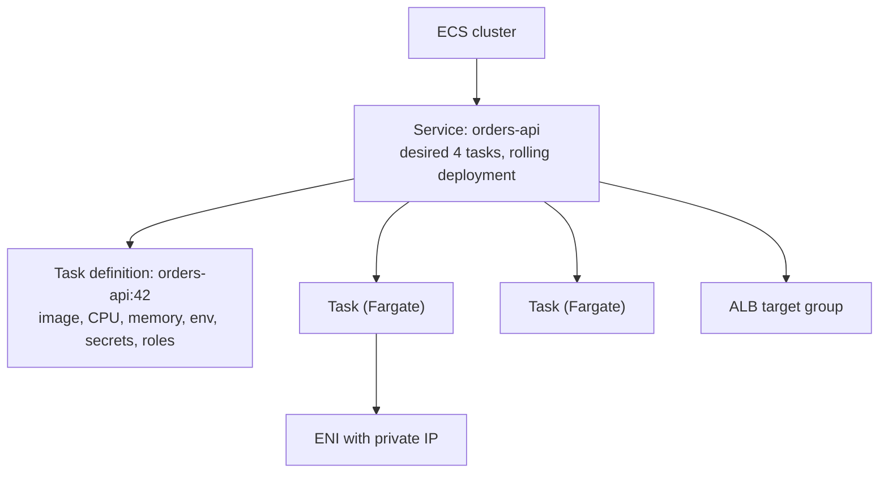

# Containers: ECS and EKS

## What You'll Learn

- How to store images in ECR with scanning and lifecycle rules
- How ECS task definitions, services, and Fargate run containers without managing servers
- What EKS adds, and the add-ons most clusters need
- How workloads get AWS permissions, and how to choose between ECS and EKS

## Amazon ECR

```bash
aws ecr create-repository --repository-name orders-api \
  --image-tag-mutability IMMUTABLE \
  --image-scanning-configuration scanOnPush=true \
  --encryption-configuration encryptionType=KMS

aws ecr get-login-password --region eu-west-1 \
  | docker login --username AWS --password-stdin 111111111111.dkr.ecr.eu-west-1.amazonaws.com

docker buildx build --platform linux/arm64 \
  -t 111111111111.dkr.ecr.eu-west-1.amazonaws.com/orders-api:3f9c2d1 --push .
```

- **Immutable tags** stop someone overwriting `v2.14.0` with different content. Tag images with the Git commit SHA.
- **Enhanced scanning** with Amazon Inspector continuously rescans images as new vulnerabilities are published.
- **Lifecycle policies** delete old untagged images so repositories don't grow forever.
- **Pull-through cache** rules mirror public registries such as Docker Hub into ECR, avoiding rate limits and outside dependencies at deploy time.

```json title="lifecycle-policy.json"
{
  "rules": [
    {
      "rulePriority": 1,
      "description": "Expire untagged images after 7 days",
      "selection": { "tagStatus": "untagged", "countType": "sinceImagePushed", "countUnit": "days", "countNumber": 7 },
      "action": { "type": "expire" }
    },
    {
      "rulePriority": 2,
      "description": "Keep the last 200 tagged images",
      "selection": { "tagStatus": "any", "countType": "imageCountMoreThan", "countNumber": 200 },
      "action": { "type": "expire" }
    }
  ]
}
```

## ECS Concepts



| Concept | What it is |
|---|---|
| **Cluster** | A logical grouping of services and tasks |
| **Task definition** | A versioned blueprint: containers, image, CPU and memory, ports, environment, secrets, logging, IAM roles |
| **Task** | A running instance of a task definition |
| **Service** | Keeps N tasks running, integrates with load balancers, and performs rolling or blue-green deployments |
| **Launch type / capacity provider** | **Fargate** (serverless — no instances to manage) or EC2 instances you run |

### A task definition

```json title="task-definition.json"
{
  "family": "orders-api",
  "requiresCompatibilities": ["FARGATE"],
  "networkMode": "awsvpc",
  "cpu": "512",
  "memory": "1024",
  "runtimePlatform": { "cpuArchitecture": "ARM64", "operatingSystemFamily": "LINUX" },
  "executionRoleArn": "arn:aws:iam::111111111111:role/orders-api-execution",
  "taskRoleArn": "arn:aws:iam::111111111111:role/orders-api-task",
  "containerDefinitions": [
    {
      "name": "app",
      "image": "111111111111.dkr.ecr.eu-west-1.amazonaws.com/orders-api:3f9c2d1",
      "essential": true,
      "portMappings": [{ "containerPort": 8080, "protocol": "tcp" }],
      "environment": [{ "name": "APP_ENV", "value": "prod" }],
      "secrets": [
        { "name": "DATABASE_URL", "valueFrom": "arn:aws:secretsmanager:eu-west-1:111111111111:secret:orders/prod/db-AbCdEf" }
      ],
      "healthCheck": {
        "command": ["CMD-SHELL", "curl -fsS http://localhost:8080/healthz || exit 1"],
        "interval": 15, "timeout": 5, "retries": 3, "startPeriod": 30
      },
      "logConfiguration": {
        "logDriver": "awslogs",
        "options": {
          "awslogs-group": "/ecs/orders-api",
          "awslogs-region": "eu-west-1",
          "awslogs-stream-prefix": "app"
        }
      },
      "stopTimeout": 30
    }
  ]
}
```

Two roles, two jobs:

- **Execution role** — used by ECS itself to pull the image from ECR, fetch `secrets`, and write logs.
- **Task role** — used by your application code to call AWS APIs (S3, SQS, DynamoDB).

### Services and deployments

```hcl title="Terraform"
resource "aws_ecs_service" "orders" {
  name            = "orders-api"
  cluster         = aws_ecs_cluster.main.id
  task_definition = aws_ecs_task_definition.orders.arn
  desired_count   = 4
  launch_type     = "FARGATE"

  network_configuration {
    subnets         = aws_subnet.app[*].id
    security_groups = [aws_security_group.app.id]
  }

  load_balancer {
    target_group_arn = aws_lb_target_group.orders.arn
    container_name   = "app"
    container_port   = 8080
  }

  deployment_minimum_healthy_percent = 100
  deployment_maximum_percent         = 200

  deployment_circuit_breaker {
    enable   = true
    rollback = true      # automatically roll back a deployment whose tasks keep failing
  }

  enable_execute_command = true   # `aws ecs execute-command` for debugging, logged via SSM
}
```

```bash
aws ecs update-service --cluster prod --service orders-api --force-new-deployment
aws ecs describe-services --cluster prod --services orders-api \
  --query 'services[0].deployments[].[status,rolloutState,runningCount,desiredCount]' --output table
aws ecs execute-command --cluster prod --task <task-id> --container app --interactive --command "/bin/sh"
```

Scale services with **Application Auto Scaling** target tracking on CPU, memory, or `ALBRequestCountPerTarget`. For service-to-service calls inside ECS, **Service Connect** provides discovery, retries, and traffic metrics.

## EKS

EKS runs a managed, highly available Kubernetes control plane. You're responsible for worker capacity, add-ons, upgrades, and everything inside the cluster. Everything in the [Kubernetes section](../../kubernetes/index.md) applies.

### Compute options

| Option | You manage | Good for |
|---|---|---|
| **Managed node groups** | Instance types and scaling settings; AWS handles node lifecycle | Steady, predictable workloads |
| **Karpenter** | NodePool constraints; Karpenter picks and launches right-sized instances per pending pod | Varied workloads, Spot, bin-packing, cost efficiency |
| **Fargate profiles** | Nothing per node — one pod per micro-VM | Low-ops batch or isolated workloads; no DaemonSets |
| **EKS Auto Mode** | Very little — AWS runs Karpenter-style compute, core add-ons, and node upgrades | Teams that want less cluster operations work |

### Add-ons almost every cluster needs

| Add-on | Purpose |
|---|---|
| Amazon VPC CNI | Gives pods VPC IP addresses |
| CoreDNS, kube-proxy | Cluster DNS and Service networking |
| EKS Pod Identity Agent | IAM credentials for pods |
| EBS CSI driver | Persistent volumes on EBS |
| AWS Load Balancer Controller | Creates ALBs and NLBs from Ingress, Gateway API, and Service resources |
| Metrics Server | `kubectl top` and HPA on CPU and memory |
| Karpenter or Cluster Autoscaler | Node scaling |

### IAM for pods: EKS Pod Identity

```bash
aws eks create-pod-identity-association \
  --cluster-name prod \
  --namespace orders \
  --service-account orders-api \
  --role-arn arn:aws:iam::111111111111:role/orders-api-pod
```

```yaml
apiVersion: v1
kind: ServiceAccount
metadata:
  name: orders-api
  namespace: orders
```

Pods using that ServiceAccount receive temporary credentials for the role — no keys in Secrets, and no reliance on the node's instance role, which every pod on the node could otherwise use. The role's trust policy allows the `pods.eks.amazonaws.com` service principal. IRSA (IAM Roles for Service Accounts with an OIDC provider) is the older mechanism and still widely used.

### Cluster access

Use **EKS access entries** to map IAM roles to Kubernetes permissions, managed through the EKS API rather than editing the legacy `aws-auth` ConfigMap:

```bash
aws eks create-access-entry --cluster-name prod \
  --principal-arn arn:aws:iam::111111111111:role/AWSReservedSSO_PlatformAdmin_abc123
aws eks associate-access-policy --cluster-name prod \
  --principal-arn arn:aws:iam::111111111111:role/AWSReservedSSO_PlatformAdmin_abc123 \
  --policy-arn arn:aws:eks::aws:cluster-access-policy/AmazonEKSClusterAdminPolicy \
  --access-scope type=cluster

aws eks update-kubeconfig --name prod --region eu-west-1
```

### Upgrades

EKS supports each Kubernetes minor version for a limited standard support window, after which clusters enter paid extended support and are eventually upgraded. Plan an upgrade path every few months: check deprecated APIs, upgrade the control plane one minor version at a time, then add-ons, then nodes. See [Cluster Upgrades](../../kubernetes/cluster-administration/04-cluster-upgrades.md).

## ECS or EKS?

| Choose **ECS** when… | Choose **EKS** when… |
|---|---|
| You run on AWS only and want the least operational work | You need Kubernetes portability, APIs, or its ecosystem (Helm, operators, service meshes, GitOps controllers) |
| The team is small, or new to containers | The team already has Kubernetes expertise |
| Services are straightforward web APIs, workers, and scheduled tasks | You run many teams on a shared platform with namespaces, policies, and custom controllers |
| You want deep native integration with minimal moving parts | You need workloads Kubernetes handles well: stateful operators, batch frameworks, ML platforms |

Both are production-grade. The deciding factor is usually the operational capacity and existing skills of the team, not features.

## Common Mistakes

- Mutable image tags such as `latest` in task definitions or Deployments, making rollbacks and audits unreliable.
- Putting application AWS permissions on the ECS execution role or the EKS node role instead of a task role or Pod Identity.
- Secrets in plain `environment` variables instead of the `secrets` field or a secrets operator.
- No deployment circuit breaker, so a broken image keeps cycling failing tasks.
- EKS clusters left on old Kubernetes versions until they fall out of standard support.
- `/24` subnets for EKS with the VPC CNI, running out of pod IP addresses.
- Building `amd64` images and deploying to Graviton capacity, or the reverse.

## Interview Questions

- What's the difference between an ECS task execution role and a task role?
- How does an ECS service perform a rolling deployment, and how does the circuit breaker help?
- How do pods on EKS get AWS credentials securely?
- Compare managed node groups, Karpenter, and Fargate for EKS compute.
- A new team asks whether to use ECS or EKS. What questions do you ask, and what do you recommend?

## Next

Continue to [Databases](08-databases.md).
