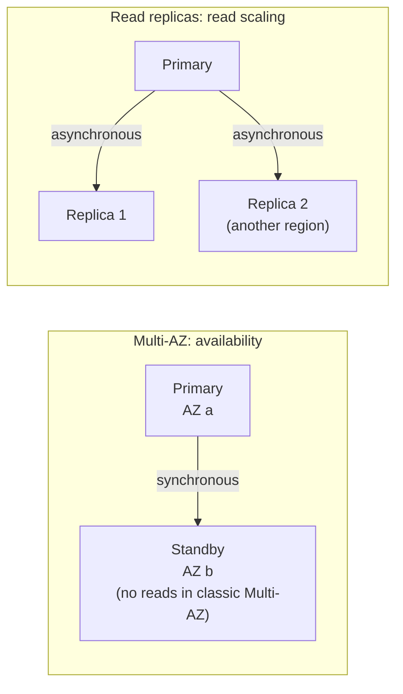

# Databases

## What You'll Learn

- The differences between RDS and Aurora, and how Multi-AZ and read replicas differ
- How backups, snapshots, and point-in-time recovery work — and how to restore
- How to tune, secure, upgrade, and connect to relational databases safely
- When DynamoDB or ElastiCache is the better choice, and how to design for them

## What "Managed" Means

| AWS handles | You still handle |
|---|---|
| Hardware, OS, and database engine installation | Schema design, indexes, and query performance |
| Automated backups and patching windows | Choosing instance size, storage, and Multi-AZ |
| Replication and failover mechanics | Testing restores and failover |
| Encryption at rest with KMS | Network access, credentials, and IAM |
| Monitoring metrics | Alerting on them, and capacity planning |
| Major version availability | Planning and testing major version upgrades |

## RDS vs Aurora

| | Amazon RDS | Amazon Aurora |
|---|---|---|
| Engines | PostgreSQL, MySQL, MariaDB, SQL Server, Oracle, Db2 | PostgreSQL- and MySQL-compatible |
| Storage | EBS volumes attached to the instance | Distributed storage replicated six ways across three AZs, grows automatically |
| Read replicas | Up to 15, asynchronous | Up to 15 in the cluster, sharing storage with typically very low lag |
| Failover | Multi-AZ standby, usually a minute or two | Promote a replica, typically faster |
| Serverless option | No | Aurora Serverless v2 scales capacity in fine-grained steps |
| Global | Cross-region read replicas | Aurora Global Database with fast cross-region replication and managed failover |
| Cost | Lower for small, steady workloads | Higher baseline; I/O-Optimized configuration for I/O-heavy workloads |

Start with RDS PostgreSQL for small services. Choose Aurora when you need fast failover, many readers, very large storage, global databases, or Serverless v2.

## Multi-AZ vs Read Replicas

These solve different problems and are often used together:



| | Multi-AZ | Read replica |
|---|---|---|
| Purpose | Survive an instance or AZ failure | Offload reads; cross-region DR |
| Replication | Synchronous | Asynchronous — replicas lag |
| Serves traffic | Standby doesn't (a Multi-AZ **DB cluster** deployment has two readable standbys) | Yes, reads only |
| Failover | Automatic; the endpoint DNS name moves to the standby | Manual promotion (automatic within an Aurora cluster) |

Applications must reconnect after failover. Use the cluster or instance **endpoint name**, keep DNS TTL caching short in the client, and make connection pools retry.

## Backups and Recovery

| Mechanism | What it gives you |
|---|---|
| **Automated backups** | Daily snapshots plus transaction logs, retained 1–35 days, enabling **point-in-time recovery** to any second in the window |
| **Manual snapshots** | Kept until you delete them; copy to other regions or accounts |
| **AWS Backup** | Central policies, cross-account and cross-region copies, and vault lock for immutability |

Restores always create a **new** database instance or cluster:

```bash
aws rds restore-db-instance-to-point-in-time \
  --source-db-instance-identifier orders-prod \
  --target-db-instance-identifier orders-restore-20260914-1015 \
  --restore-time 2026-09-14T10:15:00Z \
  --db-subnet-group-name db-private \
  --vpc-security-group-ids sg-0db1234567890abcd
```

Then verify the data, and either point the application at the new endpoint or copy the recovered rows back. **Test restores on a schedule** — record how long they take, because that's your real recovery time.

!!! warning "Deletion protection"
    Enable `deletion_protection` on every production database, and set `skip_final_snapshot = false` in Terraform. A mistaken `terraform destroy` shouldn't be able to remove production data.

## Configuration and Operations

### Parameter groups

Engine settings live in parameter groups, not config files:

```hcl
resource "aws_db_parameter_group" "orders_pg16" {
  name   = "orders-pg16"
  family = "postgres16"

  parameter {
    name  = "log_min_duration_statement"
    value = "500"                              # log queries slower than 500 ms
  }
  parameter {
    name  = "rds.force_ssl"
    value = "1"
  }
  parameter {
    name         = "shared_preload_libraries"
    value        = "pg_stat_statements"
    apply_method = "pending-reboot"
  }
}
```

Static parameters need a reboot to apply. Always use a custom parameter group — you can't modify the default one later.

### Monitoring

| Tool | Shows |
|---|---|
| CloudWatch metrics | CPU, `FreeableMemory`, `FreeStorageSpace`, `DatabaseConnections`, `ReadLatency`, `ReplicaLag` |
| Enhanced Monitoring | OS-level metrics per process, at up to 1-second granularity |
| Performance Insights / Database Insights | Database load by wait event, SQL statement, host, and user |
| Logs to CloudWatch | PostgreSQL logs, slow query logs, error logs |

Alert at least on storage space, CPU, memory, connection count near `max_connections`, replica lag, and failed backups.

### Connections and RDS Proxy

Serverless functions and autoscaled containers can open more connections than a database can handle. **RDS Proxy** pools and multiplexes connections, speeds up failover for clients, and can authenticate with IAM while holding database credentials in Secrets Manager.

### Credentials

- Let RDS **manage the master user password in Secrets Manager** (`manage_master_user_password = true`), with automatic rotation.
- Give applications their own least-privilege database users, not the master user.
- **IAM database authentication** lets roles generate short-lived connection tokens instead of passwords.

### Upgrades

Minor versions can be applied automatically in the maintenance window. **Major version upgrades** (for example, PostgreSQL 16 to 17) change behavior: test them on a restored snapshot first, and use **blue/green deployments**, which create a synchronized copy running the new version and switch over with minimal downtime.

## DynamoDB

A fully managed key-value and document database that scales to very high request rates with single-digit-millisecond latency — if the data model fits.

### Design around access patterns

Unlike relational databases, you design the table from the **queries** you need:

| Access pattern | Key design |
|---|---|
| Get an order by ID | Partition key `PK = ORDER#<id>` |
| List a customer's orders, newest first | `PK = CUSTOMER#<id>`, sort key `SK = ORDER#<timestamp>` |
| Find orders by status | Global secondary index on `status` and `created_at` |

```bash
aws dynamodb query --table-name orders \
  --key-condition-expression "PK = :c AND begins_with(SK, :o)" \
  --expression-attribute-values '{":c":{"S":"CUSTOMER#8812"},":o":{"S":"ORDER#2026-09"}}' \
  --scan-index-forward false --limit 20
```

- Avoid `Scan` in application paths — it reads the whole table.
- Choose high-cardinality partition keys so load spreads evenly and no "hot partition" throttles.

### Capacity and protection

| Setting | Recommendation |
|---|---|
| Capacity mode | **On-demand** for unpredictable or spiky traffic; **provisioned with auto scaling** for steady, high traffic |
| Point-in-time recovery | Enable for every production table |
| Deletion protection | Enable |
| TTL | Expire temporary items (sessions, idempotency keys) automatically |
| Streams | React to changes with Lambda or replicate data |

## ElastiCache

ElastiCache runs **Valkey**, Redis OSS, or Memcached for caching, sessions, rate limiting, leaderboards, and queues.

- Use **cluster mode with replicas across AZs** and automatic failover for production.
- Enable encryption in transit and authentication.
- Set a `maxmemory-policy` (such as `allkeys-lru` for pure caches), and alert on evictions, memory usage, and CPU.
- Design the application to survive a cache miss or a cold cache after failover — a cache is not a database.

## Common Mistakes

- Treating read replicas as a high-availability solution, or Multi-AZ as a way to scale reads.
- Never testing a restore, then discovering the real recovery time during an incident.
- No deletion protection on production databases managed by Terraform.
- Serverless or autoscaled applications exhausting `max_connections` without RDS Proxy or pooling.
- Applications that cache the database IP address and never reconnect after failover.
- Major version upgrades performed in place on production without testing.
- Modeling DynamoDB like a relational schema and relying on `Scan`.

## Interview Questions

- What's the difference between Multi-AZ and a read replica in RDS?
- Walk through restoring an RDS database to a point in time before a bad migration.
- When would you choose Aurora over RDS PostgreSQL?
- How would you stop a Lambda-based API from exhausting database connections?
- How do you design a DynamoDB table? Why does the partition key matter?
- How would you upgrade PostgreSQL major versions on RDS with minimal downtime?

## Next

Continue to [Observability](09-observability-cloudwatch.md).
