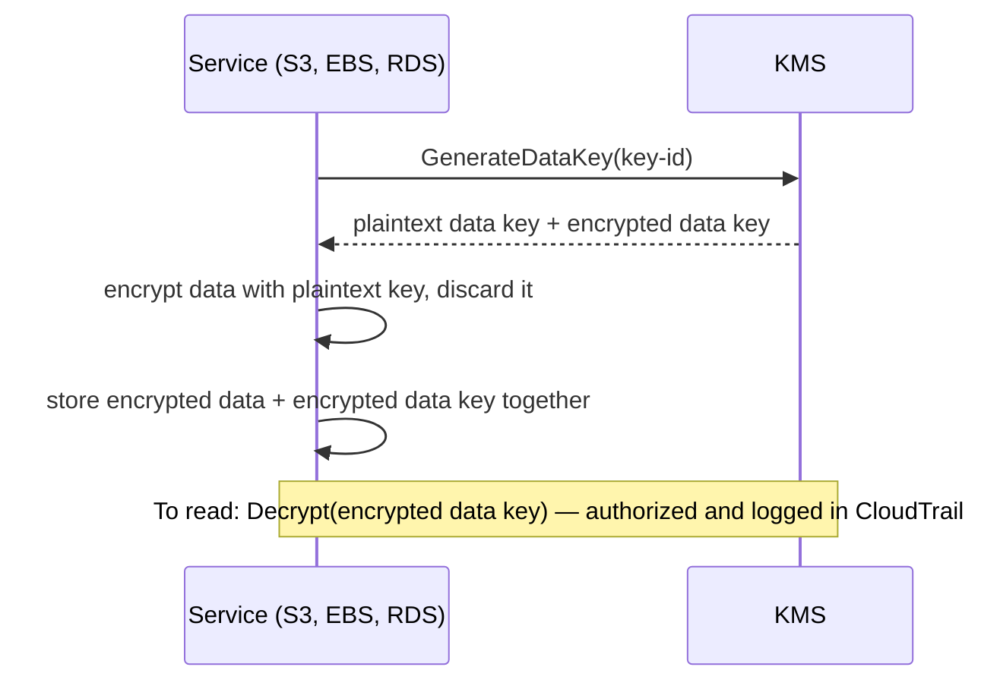

# Security and Secrets

## What You'll Learn

- How KMS encryption works, and how key policies control access
- When to use Secrets Manager or Parameter Store, and how workloads read secrets safely
- Which managed detection services to enable in every account
- How WAF and Shield protect public endpoints, and what a baseline security setup looks like

## The Shared Responsibility Model

AWS secures the **cloud itself** — facilities, hardware, hypervisors, and managed service infrastructure. You secure what you put **in** the cloud: identities and permissions, network exposure, data encryption and classification, operating systems on EC2, application code, and configurations. Most AWS security incidents are on the customer side: leaked credentials, public buckets, and overly broad IAM.

## KMS: Key Management

AWS KMS creates and controls encryption keys that never leave its hardware security modules unencrypted. Services use **envelope encryption**: KMS protects a small data key, and the data key encrypts your data.



### Key types

| Type | Managed by | Control | Use when |
|---|---|---|---|
| **AWS owned** | AWS, invisible to you | None | Default for some services |
| **AWS managed** (`aws/s3`, `aws/ebs`) | AWS | Can't change the key policy | Simple encryption at rest with CloudTrail visibility |
| **Customer managed** | You | Key policy, grants, rotation, disabling, deletion | Cross-account access, strict access control, compliance, or the ability to revoke access to data |

### Key policies

Every KMS key has a key policy. IAM policies alone can't grant access to a key unless the key policy allows the account to delegate to IAM.

```json title="Key policy excerpt"
{
  "Sid": "AllowOrdersAppToDecrypt",
  "Effect": "Allow",
  "Principal": { "AWS": "arn:aws:iam::111111111111:role/orders-api-task" },
  "Action": ["kms:Decrypt", "kms:GenerateDataKey"],
  "Resource": "*",
  "Condition": {
    "StringEquals": { "kms:ViaService": "secretsmanager.eu-west-1.amazonaws.com" }
  }
}
```

The `kms:ViaService` condition means the role can use the key **only through Secrets Manager**, not by calling KMS directly.

- Enable **automatic key rotation** on customer managed keys; old data stays readable.
- Deleting a key makes everything encrypted with it permanently unreadable, so deletion requires a 7–30 day waiting period. **Disable** a key instead when you're unsure.

## Secrets Manager vs Parameter Store

| | Secrets Manager | SSM Parameter Store |
|---|---|---|
| Built for | Secrets: database passwords, API keys | Configuration, plus `SecureString` secrets |
| Automatic rotation | Yes — built-in for RDS, Redshift, DocumentDB; Lambda for anything else | No |
| Cross-account access | Resource policies | Advanced tier sharing only |
| Versioning | Staging labels (`AWSCURRENT`, `AWSPREVIOUS`) for safe rotation | Parameter versions |
| Cost | Per secret per month, plus API calls | Standard parameters free; advanced tier paid |

A common pattern: **Secrets Manager for credentials that should rotate**, and **Parameter Store for non-secret configuration** such as feature settings and endpoint URLs.

### Reading secrets in workloads

| Platform | How |
|---|---|
| ECS | `secrets` in the task definition — injected as environment variables at task start |
| EKS | External Secrets Operator or the Secrets Store CSI Driver with the AWS provider |
| Lambda | The Parameters and Secrets Lambda extension, which caches values locally |
| EC2 / scripts | SDK or CLI calls using the instance role |

```python
import json
import boto3

secret = boto3.client("secretsmanager").get_secret_value(SecretId="orders/prod/db")
creds = json.loads(secret["SecretString"])
```

Cache secrets in the application and refresh periodically or on authentication failure — fetching on every request adds latency and cost, and breaks during an API throttling event. With rotation, applications must handle the moment a password changes: retry with a freshly fetched secret when authentication fails.

See [Secrets Management](../../security/02-secrets-management-with-vault.md) for multi-cloud approaches with HashiCorp Vault.

## Detection Services to Enable Everywhere

Enable these **organization-wide**, with a delegated administrator in the security account:

| Service | Detects |
|---|---|
| **GuardDuty** | Threats from CloudTrail, VPC flow logs, DNS logs, and runtime monitoring: compromised credentials used from unusual locations, crypto-mining, communication with known malicious IPs, suspicious S3 access, EKS and ECS runtime threats |
| **Security Hub** | Aggregates findings from GuardDuty, Inspector, Config, Macie, and IAM Access Analyzer, and runs security standard checks (AWS Foundational Security Best Practices, CIS) |
| **Inspector** | Software vulnerabilities in EC2 instances, ECR images, and Lambda functions, continuously |
| **IAM Access Analyzer** | Resources shared outside your organization, and unused access |
| **Macie** | Sensitive data such as personal information in S3 |

Route high-severity findings through EventBridge to your paging or ticketing system. Findings nobody reviews don't improve security.

## Protecting Public Endpoints

### AWS WAF

A web application firewall in front of CloudFront, ALB, API Gateway, and AppSync:

```hcl title="Terraform (excerpt)"
resource "aws_wafv2_web_acl" "public" {
  name  = "public-web"
  scope = "REGIONAL"

  default_action {
    allow {}
  }

  rule {
    name     = "aws-common"
    priority = 1
    override_action {
      none {}
    }
    statement {
      managed_rule_group_statement {
        vendor_name = "AWS"
        name        = "AWSManagedRulesCommonRuleSet"
      }
    }
    visibility_config {
      cloudwatch_metrics_enabled = true
      metric_name                = "aws-common"
      sampled_requests_enabled   = true
    }
  }

  rule {
    name     = "rate-limit-per-ip"
    priority = 2
    action {
      block {}
    }
    statement {
      rate_based_statement {
        limit              = 2000          # requests per 5 minutes per IP
        aggregate_key_type = "IP"
      }
    }
    visibility_config {
      cloudwatch_metrics_enabled = true
      metric_name                = "rate-limit"
      sampled_requests_enabled   = true
    }
  }

  visibility_config {
    cloudwatch_metrics_enabled = true
    metric_name                = "public-web"
    sampled_requests_enabled   = true
  }
}
```

Roll out new rules in **count** mode first, review what they would block, then switch to block — managed rules can reject legitimate traffic for some applications.

### Shield

**Shield Standard** protects every AWS customer against common network and transport-layer DDoS attacks at no extra charge. **Shield Advanced** adds application-layer DDoS protection, a response team, and cost protection for scaling during an attack, for high-profile targets.

## An Account Security Baseline

| Area | Baseline |
|---|---|
| Identity | IAM Identity Center for people; no IAM users with access keys; root MFA and no root keys |
| Guardrails | SCPs denying unused regions, disabling security services, and leaving the organization |
| Logging | Organization CloudTrail to a locked bucket in a separate account; Config enabled everywhere |
| Detection | GuardDuty, Security Hub, Inspector, and Access Analyzer organization-wide, with alerts routed |
| Data | S3 account-level Block Public Access; EBS encryption by default; customer managed KMS keys for sensitive data |
| Network | No SSH or RDP open to the internet; Session Manager for access; VPC flow logs |
| Compute | IMDSv2 required; images scanned; patching or image replacement automated |
| Secrets | Secrets Manager with rotation; secret scanning with push protection in Git |
| Response | Runbooks for leaked credentials and compromised instances; tested regularly |

### If an access key leaks

1. **Deactivate** the key immediately (`aws iam update-access-key --status Inactive`), then delete it.
2. Review CloudTrail for everything that key did, and look for new users, roles, keys, and resources in **every region**.
3. Revoke active sessions for affected roles, and rotate any secrets the principal could read.
4. Remove the key from its source (repository history, logs, CI settings) and find out how it leaked.
5. Replace long-lived keys with roles so it can't happen the same way again.

## Common Mistakes

- Using AWS managed keys when you'll later need cross-account access or the ability to revoke, which requires customer managed keys.
- Scheduling a KMS key for deletion without confirming nothing still depends on it.
- Secrets in plain environment variables in Terraform code, AMIs, or CloudFormation templates.
- Rotation enabled, but applications that cache credentials forever and fail on the next rotation.
- Enabling GuardDuty and Security Hub without anyone reviewing or routing findings.
- WAF managed rules deployed straight to block mode, rejecting legitimate customer traffic.
- Detection enabled in the main region only, while attackers launch resources in regions nobody watches.

## Interview Questions

- Explain envelope encryption and how KMS key policies control access.
- When would you use Secrets Manager instead of Parameter Store?
- How should an ECS or EKS workload read a database password?
- Which security services would you enable in every AWS account, and why?
- An AWS access key was committed to a public repository. Walk through your response.

## Next

Continue to [Cost Optimization](11-cost-optimization.md).
