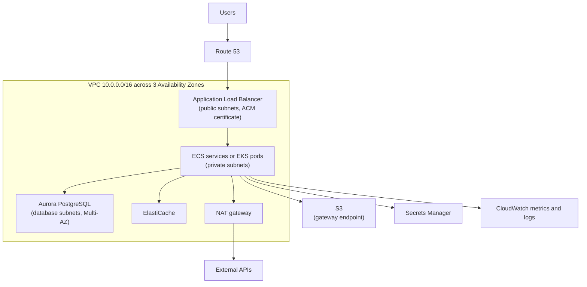

# AWS

This track covers the AWS services that DevOps and SRE engineers work with every week, focusing on how they fit together, what the safe defaults are, and where the sharp edges are. It isn't a certification course; it's the working knowledge you need to build, operate, and debug real systems.

## What You'll Learn

- How to organize accounts and grant access without long-lived keys
- How to design a VPC with public and private subnets, and why traffic does or doesn't flow
- How to run and scale compute on EC2, ECS, and EKS behind load balancers
- How to store data safely in S3 and managed databases
- How to observe, secure, and control the cost of an AWS environment

## A Reference Architecture

Most chapters build toward this common production shape:

## Read in This Order

1. [Accounts, CLI, and Organizations](01-accounts-cli-and-organizations.md) — regions and AZs, multi-account structure, IAM Identity Center, CLI profiles, and budgets
2. [IAM](02-iam.md) — policies, roles, trust policies, policy evaluation, least privilege, and OIDC for CI
3. [VPC Networking](03-vpc-networking.md) — subnets, route tables, internet and NAT gateways, security groups, NACLs, endpoints, and connectivity
4. [EC2 and Auto Scaling](04-ec2-and-auto-scaling.md) — instance types, AMIs, launch templates, IMDSv2, Session Manager, Auto Scaling groups, and Spot
5. [Load Balancing and Route 53](05-load-balancing-and-route53.md) — ALB vs NLB, target groups, health checks, ACM certificates, and DNS routing policies
6. [S3 and Storage](06-s3-and-storage.md) — bucket security, encryption, versioning, lifecycle, storage classes, EBS, and EFS
7. [Containers: ECS and EKS](07-containers-ecs-and-eks.md) — ECR, ECS on Fargate, EKS, workload identity, and how to choose
8. [Databases](08-databases.md) — RDS and Aurora, Multi-AZ and replicas, backups, DynamoDB, and ElastiCache
9. [Observability](09-observability-cloudwatch.md) — CloudWatch metrics, alarms, and Logs Insights, CloudTrail, EventBridge, and Config
10. [Security and Secrets](10-security-and-secrets.md) — KMS, Secrets Manager and Parameter Store, GuardDuty, Security Hub, and WAF
11. [Cost Optimization](11-cost-optimization.md) — visibility, tagging, rightsizing, Savings Plans, Spot, Graviton, and common waste

## Practice Safely

- **Use a dedicated sandbox account** in an organization, never the account that holds production.
- **Set a budget alert before creating anything** — see [Budgets](01-accounts-cli-and-organizations.md#set-a-budget-before-anything-else).
- **Tag everything** you create with `Owner` and `Purpose`, and delete lab resources the same day.
- **Use Terraform** for anything you'll recreate: see [Terraform](../../terraform/index.md). [LocalStack](../../terraform/overview.md#practicing-aws-locally-with-localstack) can emulate many services locally.

!!! warning "Some resources cost money even when idle"
    NAT gateways, load balancers, EKS control planes, RDS instances, and public IPv4 addresses all bill by the hour whether or not they receive traffic. Delete them when a lab is done.

## Further Reading

- [AWS Documentation](https://docs.aws.amazon.com/)
- [AWS Well-Architected Framework](https://aws.amazon.com/architecture/well-architected/)
- [AWS Free Tier](https://aws.amazon.com/free/)

## Next

Start with [Accounts, CLI, and Organizations](01-accounts-cli-and-organizations.md).
