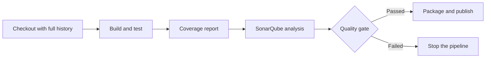

# SonarQube Pipeline Examples

## What You'll Learn

- A complete Jenkins pipeline for Maven and for projects using the SonarScanner CLI
- How to wait for the quality gate without hanging a build agent
- Equivalent pipelines for GitHub Actions and GitLab CI
- How to pass coverage reports so the gate evaluates real numbers

## The Shape of Every Pipeline



Tests run **before** analysis so coverage reports exist when the scanner reads them. The gate runs **before** packaging so a failing change never produces an artifact.

## Jenkins: Maven Project

```groovy title="Jenkinsfile"
pipeline {
    agent any

    tools {
        maven 'Maven-3'
        jdk 'JDK-21'
    }

    options {
        timeout(time: 30, unit: 'MINUTES')
    }

    stages {
        stage('Build and test') {
            steps {
                // verify runs unit tests; the jacoco plugin writes target/site/jacoco/jacoco.xml
                sh 'mvn -B clean verify'
            }
        }

        stage('SonarQube analysis') {
            steps {
                withSonarQubeEnv('SonarQube') {
                    sh 'mvn -B sonar:sonar -Dsonar.projectKey=acme-orders-api'
                }
            }
        }

        stage('Quality gate') {
            steps {
                timeout(time: 10, unit: 'MINUTES') {
                    waitForQualityGate abortPipeline: true
                }
            }
        }

        stage('Package') {
            steps {
                sh 'mvn -B -DskipTests package'
                archiveArtifacts artifacts: 'target/*.jar', fingerprint: true
            }
        }
    }
}
```

The JaCoCo plugin must be in `pom.xml` for coverage to exist:

```xml title="pom.xml (excerpt)"
<plugin>
  <groupId>org.jacoco</groupId>
  <artifactId>jacoco-maven-plugin</artifactId>
  <version>0.8.13</version>
  <executions>
    <execution>
      <goals><goal>prepare-agent</goal></goals>
    </execution>
    <execution>
      <id>report</id>
      <phase>verify</phase>
      <goals><goal>report</goal></goals>
    </execution>
  </executions>
</plugin>
```

## Jenkins: Python Project With the SonarScanner CLI

Keep analysis settings in the repository, not in the pipeline:

```properties title="sonar-project.properties"
sonar.projectKey=acme-inventory-service
sonar.projectName=Inventory Service
sonar.sources=src
sonar.tests=tests
sonar.python.version=3.13
sonar.python.coverage.reportPaths=coverage.xml
sonar.exclusions=**/migrations/**
```

```groovy title="Jenkinsfile"
pipeline {
    agent any

    stages {
        stage('Test') {
            steps {
                sh '''
                    python3 -m venv .venv
                    . .venv/bin/activate
                    pip install -r requirements.txt pytest pytest-cov
                    pytest --cov=src --cov-report=xml
                '''
            }
        }

        stage('SonarQube analysis') {
            steps {
                script {
                    def scannerHome = tool 'SonarScanner'
                    withSonarQubeEnv('SonarQube') {
                        sh "${scannerHome}/bin/sonar-scanner"
                    }
                }
            }
        }

        stage('Quality gate') {
            steps {
                timeout(time: 10, unit: 'MINUTES') {
                    waitForQualityGate abortPipeline: true
                }
            }
        }
    }
}
```

No token or URL appears anywhere — `withSonarQubeEnv` provides both.

!!! tip "Don't hold an agent while waiting"
    In a scripted pipeline, or when agents are scarce, run the quality gate step outside a `node` block (for example `agent none` on that stage). Waiting for a webhook doesn't need an executor.

## GitHub Actions

Add `SONAR_TOKEN` as a repository secret and `SONAR_HOST_URL` as a repository variable.

```yaml title=".github/workflows/sonarqube.yml"
name: SonarQube
on:
  push:
    branches: [main]
  pull_request:

permissions:
  contents: read

jobs:
  analyze:
    runs-on: ubuntu-latest
    steps:
      - uses: actions/checkout@v7
        with:
          fetch-depth: 0          # full history for accurate new-code detection and blame

      - uses: actions/setup-python@v7
        with:
          python-version: "3.13"

      - name: Test with coverage
        run: |
          pip install -r requirements.txt pytest pytest-cov
          pytest --cov=src --cov-report=xml

      - name: SonarQube scan and quality gate
        uses: SonarSource/sonarqube-scan-action@v8
        env:
          SONAR_TOKEN: ${{ secrets.SONAR_TOKEN }}
          SONAR_HOST_URL: ${{ vars.SONAR_HOST_URL }}
        with:
          args: >
            -Dsonar.qualitygate.wait=true
            -Dsonar.qualitygate.timeout=300
```

`sonar.qualitygate.wait=true` makes the scanner poll for the gate result and exit non-zero on failure, so no webhook is needed. SonarQube must be reachable from GitHub's runners — use a self-hosted runner for a server on a private network.

## GitLab CI

Add `SONAR_TOKEN` (masked) and `SONAR_HOST_URL` as CI/CD variables.

```yaml title=".gitlab-ci.yml"
stages: [test, analyze]

test:
  stage: test
  image: python:3.13
  script:
    - pip install -r requirements.txt pytest pytest-cov
    - pytest --cov=src --cov-report=xml
  artifacts:
    paths: [coverage.xml]

sonarqube:
  stage: analyze
  image:
    name: sonarsource/sonar-scanner-cli:latest
    entrypoint: [""]
  variables:
    GIT_DEPTH: "0"
    SONAR_USER_HOME: "${CI_PROJECT_DIR}/.sonar"
  cache:
    key: sonar
    paths: [.sonar/cache]
  script:
    - sonar-scanner -Dsonar.qualitygate.wait=true
  rules:
    - if: $CI_COMMIT_BRANCH == $CI_DEFAULT_BRANCH
```

The `rules` limit analysis to the default branch, which matches what Community Build can analyze. Paid editions add merge request analysis.

## Common Mistakes

- Calling `waitForQualityGate` without a surrounding `timeout`, so a missing webhook blocks the build forever.
- Running analysis before tests, so the gate sees 0% coverage and fails on every change.
- Shallow clones in CI (`fetch-depth: 1`), which break new-code detection and issue assignment.
- Scanning `node_modules`, `target`, `dist`, or vendored code — set `sonar.exclusions` or `sonar.sources` precisely.
- Expecting pull request analysis on Community Build, which analyzes only the main branch.
- Using `sonarsource/sonar-scanner-cli:latest` in regulated pipelines — pin a version when builds must be reproducible.

## Interview Questions

- Why must tests run before the SonarQube scan in a pipeline?
- What's the difference between `waitForQualityGate` and `sonar.qualitygate.wait=true`?
- Why does the checkout need full Git history?
- How would you analyze pull requests before merge, and what does that require?

## Next

Continue to [CI/CD Pipelines](../cicd/index.md) to build the rest of the delivery pipeline around these quality checks.
