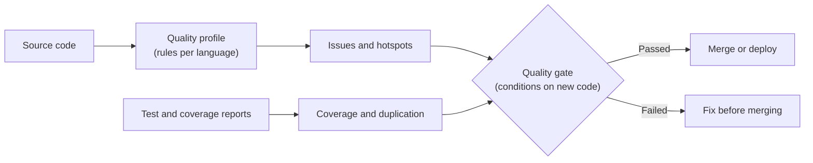

# Quality Gates, Quality Profiles, and New Code

## What You'll Learn

- The difference between a quality profile (which rules run) and a quality gate (pass or fail)
- Why gates should focus on **new code**, and how to define the new code period
- How issues, security hotspots, coverage, and duplication feed the gate
- How to create a custom gate and assign it to projects

## Mental Model

> A **quality profile** decides *what counts as a problem*. A **quality gate** decides *whether this change is good enough to ship*. The **new code period** decides *which changes the gate judges*.



## Quality Profiles: Which Rules Run

Each language has a built-in **Sonar way** profile, maintained by SonarSource and updated with new versions. It's a sensible default.

When a team needs changes, don't edit a built-in profile — **extend** it:

1. **Quality Profiles → (language) → Sonar way → ⋮ → Extend**.
2. Name it, for example `Acme Java`.
3. Activate extra rules or deactivate ones that don't fit.
4. **Set as Default**, or assign it to specific projects.

Extending keeps you inheriting SonarSource's rule updates while your changes stay on top. Copying a profile freezes it, and it drifts out of date.

## Issues and Security Hotspots

| Finding | What it means | Action |
|---|---|---|
| **Issue** | Code that breaks a rule — a bug risk, a vulnerability, or a maintainability problem — rated by impact on security, reliability, and maintainability | Fix it, or mark it *accepted* / *false positive* with a comment |
| **Security hotspot** | Security-sensitive code that *might* be fine, such as a hard-coded IP, a weak hash used for a non-security checksum, or a permissive CORS setting | A human reviews it and marks it *safe* or *to fix* |

Hotspots aren't bugs until someone decides. A gate that requires hotspots to be reviewed forces that decision to happen before merge.

## Why Gate on New Code

A ten-year-old codebase might have 4,000 existing issues. A gate that says "zero issues overall" fails forever, so people stop looking at it.

**Clean as You Code** flips the question: *is the code changed recently clean?* Old issues get fixed naturally as files are touched, and every change is held to a standard it can actually meet.

### Define the new code period

**Project Settings → New Code** (or globally under **Administration → Configuration → New Code**):

| Definition | New code is… | Good for |
|---|---|---|
| **Previous version** | Everything since the `sonar.projectVersion` changed | Projects with versioned releases |
| **Number of days** | Changes in the last *N* days (for example 30) | Continuous delivery with no version numbers |
| **Reference branch** | Differences from a branch such as `main` | Feature branches and pull requests (paid editions) |
| **Specific analysis** | Everything after a chosen baseline analysis | A clean start after onboarding a legacy project |

Set the project version from your build so "previous version" moves forward with each release:

```properties title="sonar-project.properties"
sonar.projectKey=acme-orders-api
sonar.projectVersion=2.14.0
```

## The Default Gate: Sonar Way

The built-in **Sonar way** gate passes when, on new code:

- No new issues are introduced
- All new security hotspots are reviewed
- Test coverage is at least 80%
- Duplicated lines are at most 3%

Very small changes are treated leniently for coverage and duplication, so a two-line fix isn't blocked by a percentage.

## Build a Custom Gate

Tighten or relax conditions per team without editing Sonar way. **Quality Gates → Create**:

| Condition (on new code) | Operator | Value | Why |
|---|---|---|---|
| Issues with high security impact | is greater than | 0 | Never ship a new vulnerability |
| Issues with high reliability impact | is greater than | 0 | Never ship a new likely bug |
| Security hotspots reviewed | is less than | 100% | Force a human decision |
| Coverage | is less than | 70% | Achievable for a legacy service; raise it over time |
| Duplicated lines (%) | is greater than | 3% | Stop copy-paste growth |

Then assign it: **Quality Gates → (gate) → Projects**, or make it the default.

You can also manage gates as code with the Web API, which keeps settings reviewable:

```bash
TOKEN=squ_xxx   # a user token with Administer Quality Gates permission
HOST=https://sonar.example.com

curl -s -u "$TOKEN:" -X POST "$HOST/api/qualitygates/create" -d name="Acme Services"

curl -s -u "$TOKEN:" -X POST "$HOST/api/qualitygates/create_condition" \
  -d gateName="Acme Services" -d metric=new_coverage -d op=LT -d error=70

curl -s -u "$TOKEN:" -X POST "$HOST/api/qualitygates/select" \
  -d gateName="Acme Services" -d projectKey=acme-orders-api
```

## Coverage Only Counts If You Send It

SonarQube doesn't run tests. It reads coverage reports your build already produced:

| Language | Generate with | Tell SonarQube with |
|---|---|---|
| Java | JaCoCo (`jacoco:report`) | `sonar.coverage.jacoco.xmlReportPaths=target/site/jacoco/jacoco.xml` |
| Python | `pytest --cov --cov-report=xml` | `sonar.python.coverage.reportPaths=coverage.xml` |
| JavaScript / TypeScript | Jest or Vitest with an `lcov` reporter | `sonar.javascript.lcov.reportPaths=coverage/lcov.info` |

If coverage shows 0% on a project with tests, the report path is wrong or the tests ran after the scan.

## Common Mistakes

- Editing or copying the built-in Sonar way profile instead of extending it, and silently missing years of rule updates.
- Gating on overall metrics, so legacy debt fails every build and developers learn to ignore the gate.
- Leaving the new code period at a default that doesn't match how the team releases, so "new code" covers months of history.
- Treating security hotspots as noise because they aren't marked as bugs.
- Setting coverage to 90% on day one for a legacy service, then disabling the gate when nothing passes.

## Interview Questions

- What's the difference between a quality profile and a quality gate?
- Why should a quality gate evaluate new code rather than the whole codebase?
- What is a security hotspot, and how is it different from a vulnerability issue?
- A project with good tests shows 0% coverage in SonarQube. What do you check?

## Next

Continue to [Jenkins Integration](jenkins-integration.md) to enforce the gate in a pipeline.
