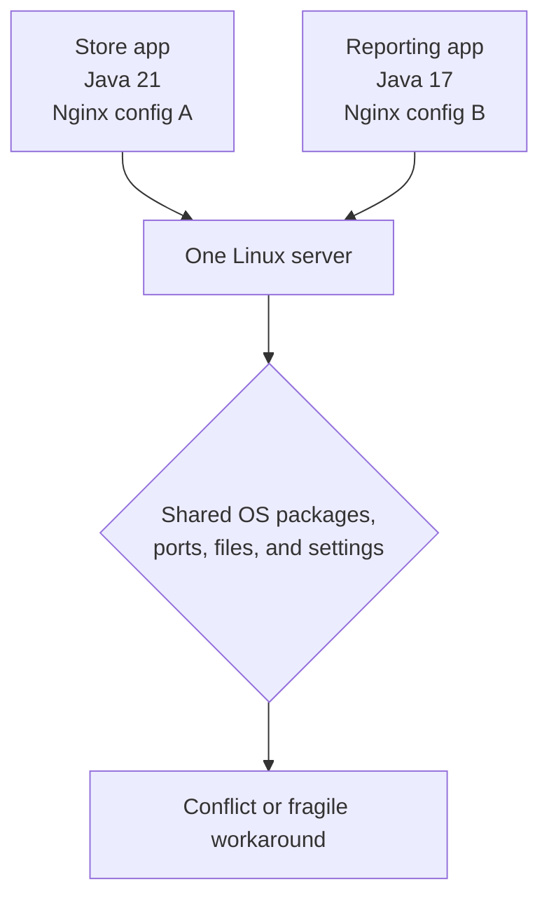

# 1. How Applications Used to Run

Before learning Docker, it helps to understand the operating model it changed. For much of software history, deploying an application meant installing everything it needed directly onto a server.

## A realistic server

Imagine an online-store team with one Linux server:

```text
Physical server
└── Linux
    ├── Nginx (accepts web requests)
    ├── Java runtime
    ├── Tomcat (runs the application)
    ├── Store application
    ├── MySQL (stores orders and customers)
    └── Monitoring agent
```

Each item is part of the deployed system. The application does not run in isolation: it depends on a particular Java version, library versions, files, permissions, configuration values, a listening port, and a reachable database.

## What an application needs

An application is more than its source code or executable. At runtime it commonly needs:

| Need | Example | Why it matters |
| --- | --- | --- |
| Runtime | Java 21, Python 3.12, Node.js 22 | The application code needs an interpreter or VM. |
| Libraries | OpenSSL, database driver, npm package | Missing or incompatible versions can prevent startup. |
| Configuration | database host, log level, API URL | The same build should behave differently by environment. |
| Filesystem | uploads directory, certificates, templates | Paths and permissions must exist where the app expects them. |
| Network | port 8080, DNS, database connection | A server process must listen and communicate correctly. |
| Data | MySQL files and backups | Stateful data must survive an application restart or replacement. |

On a traditional server, these pieces are installed and managed together. That can be perfectly reasonable for a small system, but it becomes difficult as the number of applications and environments grows.

## Deployment conflicts

Now a second team wants to deploy another application on the same server. It needs a different Java version and an Nginx configuration that conflicts with the first application.



The teams may work around this with careful package management, separate users, custom paths, or a second server. Those techniques are useful, but each adds operational knowledge and makes the system less uniform.

!!! example "A port conflict"
    Two processes cannot both listen on the same IP address and TCP port in the same network environment. If both web applications are configured to listen on port `8080`, the second process normally fails to start. A reverse proxy can route requests, but it also becomes another shared component to configure and maintain.

## Monolithic deployment

A **monolith** is an application deployed as one unit. It may contain a web interface, business logic, authentication, ordering, and payment integration in the same codebase and runtime process.

Monoliths are not inherently bad. They are often the simplest way to start. The difficulty appears when independently changing, scaling, or recovering one part requires changing, scaling, or recovering the whole deployment.

For example, a busy order-processing feature may need more CPU while the rest of the application does not. With one large deployment unit, the usual response is to make the whole server bigger or add another whole copy of the application.

## Why physical-server scaling hurts

Buying or allocating another server takes more than CPU and RAM. It also creates work around:

- hardware or cloud procurement;
- operating-system installation, patching, and access control;
- backup and disaster-recovery planning;
- monitoring, log collection, and incident response;
- networking, firewall rules, DNS, and load balancing; and
- keeping development, test, staging, and production environments consistent.

Utilization is often uneven. One server can have unused CPU and memory while another is overloaded, yet moving a tightly installed application between them may require repeating a long and error-prone setup process.

## The core problem: environment drift

Over time, servers diverge. One has a manually installed library, one has a changed configuration file, and one has an old package that was never upgraded. The application may work on a developer laptop but fail after deployment because the runtime environment is not identical.

This is the beginning of the familiar statement:

> “It works on my machine.”

Containers address this problem by packaging an application with its **userspace** dependencies in a reproducible form. They do not remove the need for good configuration, networking, security, backups, or monitoring—but they give those concerns a more consistent deployment unit.

## Check your understanding

1. Why is an application’s runtime environment more than its source code?
2. Which resources can conflict when two applications share one server?
3. Why does adding another physical server create operational work even when it has plenty of spare capacity?

## Next

Next, we will see why virtual machines became the standard way to separate workloads before containers—and why sharing a host kernel later changed the trade-offs.
