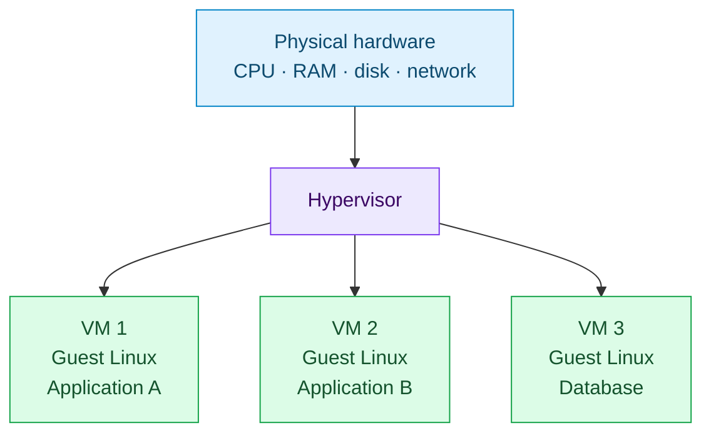
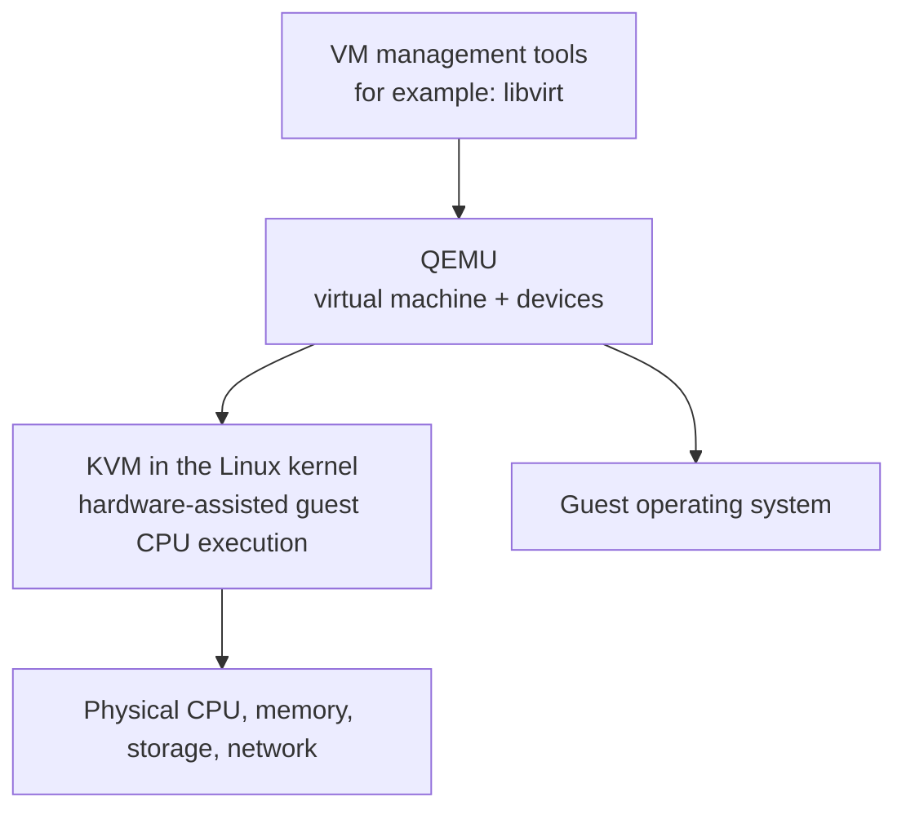

# Virtual Machines and KVM

The first answer to application conflicts was usually not containers. It was **virtualization**: run separate computers in software on the same physical machine.

Virtual machines made it practical to give each application its own operating-system environment without buying one physical server for every workload.

## From one machine to many virtual machines

With virtualization, a physical server runs a **hypervisor**. The hypervisor creates and manages virtual machines (VMs). Each VM behaves like an independent computer from the guest operating system's point of view.



Each VM normally has its own:

- **virtual CPU (vCPU)** — scheduled onto real CPU time by the hypervisor;
- **virtual memory** — a controlled portion of the host's memory;
- **virtual disk** — often a file or logical volume that appears as a disk to the guest;
- **virtual network interface (vNIC)** — an interface connected to virtual switching or networking; and
- **guest operating system** — its own Linux or Windows kernel, userspace, packages, and configuration.

That guest OS is the key distinction. A VM boots its own kernel just as a physical computer does.

## Why virtualization was a major improvement

The store application and reporting application from the previous chapter can now run in separate guests. One guest can use Java 21 while another uses Java 17; each can have its own Nginx configuration, users, files, and ports.

```text
Physical server
├── VM: store application
│   ├── Guest Linux
│   ├── Nginx :443
│   └── Java 21 application
└── VM: reporting application
    ├── Guest Linux
    ├── Nginx :443
    └── Java 17 application
```

Both applications can listen on port `443` because they have separate network stacks. A failure or package upgrade inside one guest is also less likely to alter the other guest.

Virtualization improved server utilization and made placement, migration, snapshots, backup, and recovery easier to standardize. It remains an excellent isolation boundary and a fundamental building block of cloud infrastructure.

## What is a hypervisor?

A hypervisor is the software layer that creates, runs, and isolates virtual machines while sharing physical resources between them.

| Hypervisor type | Where it runs | Common examples | Practical meaning |
| --- | --- | --- | --- |
| Type 1 (bare metal) | Directly on server hardware | VMware ESXi, Microsoft Hyper-V, Xen | The hypervisor is the primary system layer. |
| Type 2 (hosted) | As an application on a host OS | VirtualBox, VMware Workstation | Convenient for desktops and local labs. |

The labels are useful shorthand, but real products can blur the boundary. The important question is architectural: which software controls the hardware resources, and where does the guest OS run?

## Linux KVM and QEMU

Linux can provide virtualization through **KVM** (Kernel-based Virtual Machine). When the CPU supports hardware virtualization and KVM is enabled, the Linux kernel can use CPU features such as Intel VT-x or AMD-V to run guest operating systems efficiently.

**QEMU** is commonly paired with KVM. QEMU provides machine emulation and virtual devices—such as disk, network, and display hardware. With KVM acceleration available, QEMU delegates much of guest CPU execution to the kernel instead of fully emulating it in software.



This diagram is intentionally simplified. Production virtualization also involves firmware, device drivers, storage backends, virtual switches, and management software. The essential idea is that KVM helps Linux host complete guest operating systems.

## The cost of a full guest OS

VM isolation is valuable, but every VM carries an operating system:

- a kernel must boot and be patched;
- system services consume memory and CPU;
- disk images contain duplicated OS files; and
- startup is usually slower than starting a single application process.

These costs are often acceptable, particularly where strong isolation, different kernels, or different operating systems are needed. Containers do not replace VMs everywhere.

## Physical server, VM, and container

| Property | Physical server | Virtual machine | Linux container |
| --- | --- | --- | --- |
| Isolation unit | Whole machine | Guest operating system | Process or process group |
| Kernel | One host kernel | One kernel per guest | Shared host kernel |
| Startup | Hardware/OS boot | Guest OS boot | Process start |
| Package conflicts | Shared unless separated manually | Isolated by guest OS | Isolated userspace and configuration |
| Typical overhead | Entire server per workload | Guest OS per workload | Lower; no guest kernel |
| Can run a different OS kernel? | Yes, by choosing the host OS | Usually yes | No; it uses the host kernel |

“Lower overhead” does not mean “no overhead,” and “container” does not automatically mean “more secure.” The strength of the boundary depends on the runtime configuration, the host, kernel vulnerabilities, privileges, and operational controls.

## The bridge to containers

Virtual machines isolate whole operating systems. Containers take a different approach: Linux can isolate a process's view of process IDs, networking, mounts, hostnames, and users while applying resource limits to that process.

That lets several workloads share one kernel without sharing the same complete userspace environment. Before we study those kernel features, we need to look carefully at what an application actually depends on.

## Check your understanding

1. Why can two VMs use the same port number without conflicting?
2. What does each VM include that a Linux container normally does not?
3. What roles do KVM and QEMU commonly play on a Linux virtualization host?
4. When might a VM still be a better choice than a container?

## Next

Next: application runtimes, libraries, configuration, and the practical causes of “it works on my machine.”
