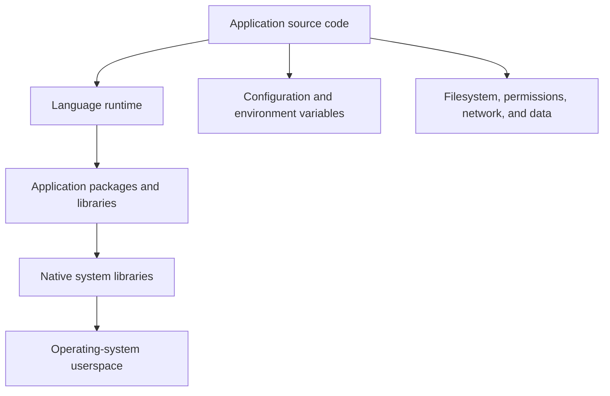
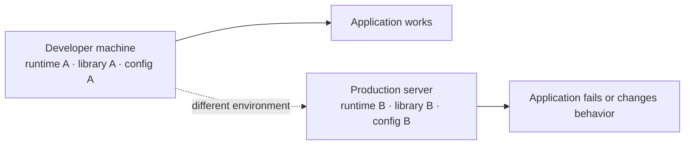

# What Is Actually Inside an Application?

An application is not only a folder of source code. To run successfully, it needs a compatible **runtime environment**: the programs, libraries, configuration, files, permissions, and network access it expects.

This chapter explains why copying code to a server is often not enough—and why containers package more than an executable.

## The runtime stack

Consider a small web API. Its source code may be only a few files, but its runtime environment has several layers.



If one required layer differs from what the developer tested, the application can fail during startup or behave differently under load.

## Python example

A Python application often needs:

```text
Python application
├── Python interpreter (for example, Python 3.12)
├── pip-installed packages (for example, Flask or Django)
├── Native libraries used by some packages
├── Application source code
├── Configuration and environment variables
└── Filesystem permissions and network access
```

The Python package list is commonly recorded in a `requirements.txt` or project dependency file. That records an important part of the environment, but it may not capture every operating-system library required by a package.

For example, a package that uses cryptography, image processing, or a database driver may depend on native libraries and build tools outside the Python package manager. An application can therefore install successfully on a developer laptop yet fail on a minimal production server.

## Node.js example

Node.js applications have a similar structure:

```text
Node.js application
├── Node.js runtime
├── npm or pnpm packages
├── node_modules dependencies
├── Native system libraries used by native modules
├── Application source code
└── Configuration, files, permissions, and network access
```

`package.json` describes dependencies and a lockfile records an exact dependency graph. Both are essential for repeatable installs. But the selected Node.js version, underlying Linux distribution, CPU architecture, and native dependencies still matter.

!!! example "A subtle Node.js difference"
    A native module may be compiled for one operating system or CPU architecture. Copying its built files from a macOS laptop to a Linux server can fail even when the JavaScript source code is identical. Dependencies should be installed or built for the environment that will run them.

## Java example

Java shifts some packaging details but does not remove environment dependencies:

```text
Java application
├── JVM (for example, Java 21)
├── JAR or WAR application artifact
├── Java libraries packaged with or beside the artifact
├── Optional application server or web server
├── Configuration and certificates
└── Filesystem permissions and network access
```

A JAR file may include many application libraries, but it still needs a compatible JVM. A Java application can also depend on system certificates, a time zone database, fonts, native libraries, or operating-system configuration. “Write once, run anywhere” is helpful, not a promise that every environment detail disappears.

## Configuration is part of the environment

An application build should not need a separate copy for development, test, and production. What changes is usually configuration:

| Configuration concern | Development example | Production example |
| --- | --- | --- |
| Database address | `localhost` | managed database hostname |
| Log level | `debug` | `info` or `warn` |
| Credentials | local test secret | managed secret store or injected secret |
| Port | `3000` | service-specific port behind a proxy |
| Feature flag | experimental enabled | controlled rollout |

Environment variables are a common way to pass non-secret configuration at runtime. They are not inherently secure: anyone with sufficient access to the process or its deployment configuration may be able to read them. Secrets need deliberate handling regardless of whether an application runs in a container.

## Filesystem and permissions

Applications make assumptions about files and identities:

- a configuration file exists at a particular path;
- a certificate is readable by the process;
- an upload directory is writable;
- the application runs as a particular user or group; or
- a temporary directory has enough space.

These assumptions often go unnoticed on a developer machine, where the developer account owns the files. On a server, a service account may correctly have fewer permissions. The failure then looks like an application bug even though it is an environment mismatch.

## “It works on my machine”

This phrase usually means the environments are different—not that one person made a mistake.



Common sources of drift include:

- different operating-system distribution or release;
- different runtime or package versions;
- missing native libraries or CA certificates;
- changed environment variables and configuration files;
- filesystem paths, ownership, or permissions;
- different DNS, network policy, or database access; and
- different CPU architectures.

Version control captures the application source. Dependency manifests capture some package choices. Neither automatically reproduces the whole runtime environment.

## Packaging userspace dependencies together

The natural next step is to package an application with the userspace files it needs: its runtime, libraries, application code, and a known filesystem layout. Run-time configuration and persistent data still need separate treatment, but the application environment becomes more repeatable.

That is the packaging idea behind container images. Before introducing an image format or a Docker command, we need to understand the Linux isolation mechanisms that allow a normal process to run with its own view of the system.

## Check your understanding

1. Why does a dependency file not always describe every requirement of an application?
2. Name two differences between a developer laptop and a server that can cause an application failure.
3. Why should configuration usually be separate from the application build?
4. What is meant by packaging an application's *userspace* dependencies?

## Next

Next: containers without Docker—Linux processes, namespaces, cgroups, and a root filesystem.
