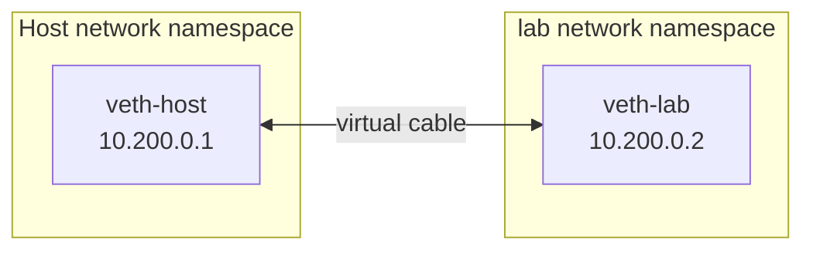

# Build Container-Style Isolation Without Docker

Docker did not invent Linux process isolation. It made isolation, packaging, distribution, storage, networking, and lifecycle management usable together. This lab assembles the underlying pieces by hand so that every later Docker command maps to something you've already seen.

## What You'll Learn

- How a root filesystem, namespaces, a network pair, and a cgroup combine into "a container"
- What each piece contributes, by adding them one at a time
- Why real runtimes do far more than this lab, and why you shouldn't hand-build production isolation

!!! danger "Use a disposable Linux VM"
    Mount, network, and cgroup operations require root and can break host connectivity or processes if used carelessly. Use a throwaway VM (for example Ubuntu 24.04 in Multipass, Vagrant, or a cloud instance). Do not run this lab on a shared or production machine.

## The Recipe

```text
prepared root filesystem
        + mount, PID, UTS, IPC namespaces
        + network namespace and veth pair
        + cgroup resource limits
        + one foreground process
        = container-style isolated workload
```

## Step 0 — Prerequisites

```bash
sudo apt-get update
sudo apt-get install -y debootstrap iproute2 util-linux
stat -fc %T /sys/fs/cgroup      # expect: cgroup2fs
```

## Step 1 — A Root Filesystem

A container image is, at its core, a directory tree that looks like a Linux system. Build a minimal Ubuntu one:

```bash
mkdir -p ~/lab && cd ~/lab
sudo debootstrap --variant=minbase noble ./rootfs http://archive.ubuntu.com/ubuntu
ls rootfs
# bin  boot  dev  etc  home  lib  ... usr  var
du -sh rootfs
```

This directory is the "userspace" an image would carry. There's no kernel inside it: whatever runs here uses the host's kernel.

## Step 2 — A Different Root: chroot

```bash
sudo chroot ./rootfs /bin/bash
cat /etc/os-release | head -2
ps aux | head -5          # fails or shows nothing useful: /proc isn't mounted
exit
```

`chroot` changes what `/` means for one process. But the process still sees the host's process list (once `/proc` is mounted), hostname, and network. `chroot` is **not** a security boundary; real runtimes use `pivot_root` inside a mount namespace instead.

## Step 3 — Namespaces: A Private View

```bash
sudo unshare --pid --fork --mount --uts --ipc chroot ./rootfs /bin/bash
```

Inside:

```bash
mount -t proc proc /proc
hostname lab-container
ps -ef
# UID   PID  PPID  C STIME TTY   TIME     CMD
# root    1     0  0 10:00 ?     00:00:00 /bin/bash
# root    3     1  0 10:00 ?     00:00:00 ps -ef
hostname                     # lab-container
```

- `--pid --fork`: bash is **PID 1** in its own process tree.
- `--mount`: mounting `/proc` here doesn't affect the host. `unshare` makes mount propagation private by default.
- `--uts`: the hostname change stays inside.
- `--ipc`: shared memory and message queues are private.

From a **second host terminal**, prove it's still an ordinary process:

```bash
ps -ef | grep '[c]hroot ./rootfs'
sudo lsns -p "$(pgrep -f 'chroot ./rootfs' | tail -1)"
```

`lsns` lists the new namespaces the process holds. Exit the container shell with `exit`.

## Step 4 — Networking: A veth Pair

Without a network namespace, the process shares the host's interfaces. Create a private network and connect it with a virtual Ethernet cable (**veth pair**):

```bash
sudo ip netns add lab
sudo ip link add veth-host type veth peer name veth-lab
sudo ip link set veth-lab netns lab

sudo ip addr add 10.200.0.1/24 dev veth-host
sudo ip link set veth-host up

sudo ip netns exec lab ip addr add 10.200.0.2/24 dev veth-lab
sudo ip netns exec lab ip link set veth-lab up
sudo ip netns exec lab ip link set lo up
sudo ip netns exec lab ip route add default via 10.200.0.1

sudo ip netns exec lab ip addr     # only lo and veth-lab exist in here
ping -c 2 10.200.0.2               # host → namespace works
```



Docker does the same thing, attaching `veth-host`-style ends to a Linux bridge (`docker0`) and adding NAT rules for internet access and published ports — which you'll see in [Docker Networking](13-docker-networking.md).

## Step 5 — Resource Limits: A cgroup

Create a cgroup with a 100 MiB memory limit and half a CPU:

```bash
sudo mkdir /sys/fs/cgroup/lab
echo 100M          | sudo tee /sys/fs/cgroup/lab/memory.max
echo 0             | sudo tee /sys/fs/cgroup/lab/memory.swap.max
echo "50000 100000" | sudo tee /sys/fs/cgroup/lab/cpu.max
```

`cpu.max` means "50,000 microseconds of CPU per 100,000 microsecond period" — half a core. If writing fails with "No such file," enable the controllers on the parent first: `echo "+cpu +memory" | sudo tee /sys/fs/cgroup/cgroup.subtree_control`.

## Step 6 — Put It All Together

Start a shell that moves **itself** into the cgroup, then enters the network namespace, the other namespaces, and the root filesystem. Every child inherits all of it:

```bash
sudo bash -c '
  echo $$ > /sys/fs/cgroup/lab/cgroup.procs
  exec ip netns exec lab \
       unshare --pid --fork --mount --uts --ipc \
       chroot ./rootfs /bin/bash
'
```

Inside the "container":

```bash
mount -t proc proc /proc
hostname lab-container
ps -ef                        # PID 1 is bash
ip addr                       # only lo and veth-lab (from /proc, via the tools in rootfs if installed)
cat /proc/self/cgroup         # 0::/lab
```

Trigger the memory limit — `tail` buffers the whole newline-free stream in memory:

```bash
head -c 300M /dev/zero | tail
# Killed
```

On the host, confirm the kernel's OOM killer acted inside this cgroup only:

```bash
cat /sys/fs/cgroup/lab/memory.events
# ... oom 1
# ... oom_kill 1
```

That's the same evidence you'll look for when a Docker container exits with code 137 in [Production Troubleshooting](24-production-troubleshooting.md).

!!! tip "The systemd shortcut"
    On systemd hosts, `sudo systemd-run --scope -p MemoryMax=100M -p CPUQuota=50% <command>` creates and applies a transient cgroup for you — the same kernel feature with less typing.

## Step 7 — Clean Up

```bash
exit                                   # leave the container shell
sudo ip netns delete lab               # also removes the veth pair
sudo rmdir /sys/fs/cgroup/lab
sudo umount ./rootfs/proc 2>/dev/null || true
```

## What Each Piece Contributed

| Piece | Gave the process | Docker equivalent |
|---|---|---|
| Root filesystem | Its own userspace: `/bin`, `/etc`, libraries | Image layers |
| `chroot` / `pivot_root` | A different `/` | Container root filesystem |
| PID namespace | PID 1 and a private process list | `docker top`, container PID 1 |
| Mount namespace | Private mounts such as `/proc` | Volumes and bind mounts |
| UTS namespace | Its own hostname | `--hostname` |
| Network namespace + veth | Its own interfaces and IP | Bridge networks, `-p` |
| cgroup | Memory and CPU limits, OOM containment | `--memory`, `--cpus` |

## What a Real Runtime Adds

This lab skipped nearly everything that makes containers safe and practical: dropping Linux **capabilities**, **seccomp** system-call filtering, AppArmor/SELinux profiles, **user namespaces** so root inside isn't root outside, read-only and masked paths under `/proc` and `/sys`, device access rules, signal handling and zombie reaping for PID 1, log capture, image layer management, and reliable cleanup on failure. That engineering is why using a runtime is safer than hand-assembling production isolation.

## Common Mistakes

- Treating `chroot` as isolation — a root process can escape it, and it hides nothing else.
- Forgetting `--fork` with `--pid`, so the shell isn't actually PID 1 in the new namespace.
- Running the lab on a workstation and breaking host networking with a typo in `ip` commands.
- Setting a memory limit and expecting a clean "out of memory" error instead of the process being killed.

## Check Your Understanding

1. Which namespace makes `ps` inside the container show only a few processes?
2. Why does `hostname lab-container` not change the host's hostname?
3. What connects the network namespace to the host, and what does Docker add on top of that?
4. Where would you look to prove a process was killed by its cgroup memory limit?

## Next

Continue to [OCI Standards](07-oci-standards.md) to see how the root filesystem and configuration you just assembled by hand are standardized into portable images and runtime bundles.
