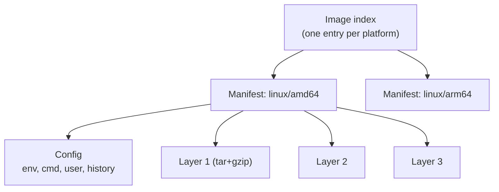

# OCI: Container Standards

## What You'll Learn

- The three Open Container Initiative (OCI) specifications and what each one standardizes
- How to read a real image index, manifest, and config
- What an OCI runtime bundle looks like, using `runc spec`
- Why interoperability is real, and where it stops

## Why Standards Matter

In the previous chapter you built isolation from a directory and a handful of kernel calls. If every tool invented its own format for "that directory plus how to run it," an image built with one tool couldn't run anywhere else. The **Open Container Initiative (OCI)** defines open specifications so compatible tools agree on the artifacts in between.

| Specification | Defines | You interact with it when... |
| --- | --- | --- |
| **Image** | Image index, manifest, config, and layer formats | Building, pulling, or inspecting images |
| **Runtime** | The bundle (root filesystem + `config.json`) and how a runtime starts it | A runtime like `runc` or `crun` starts a container |
| **Distribution** | The HTTP API registries implement for push and pull | Pushing to or pulling from any registry |

```text
Dockerfile → build tool → OCI image → registry (Distribution spec)
          → pull → unpack layers → runtime bundle (Runtime spec) → OCI runtime → process
```

## The Image Specification

An image is a small graph of JSON documents pointing at content by **digest** (a SHA-256 hash).



### Inspect one yourself

```bash
docker buildx imagetools inspect nginx:stable
```

```text
Name:      docker.io/library/nginx:stable
MediaType: application/vnd.oci.image.index.v1+json
Digest:    sha256:4f7c...

Manifests:
  Name:      docker.io/library/nginx:stable@sha256:9a1b...
  MediaType: application/vnd.oci.image.manifest.v1+json
  Platform:  linux/amd64

  Name:      docker.io/library/nginx:stable@sha256:c2d3...
  MediaType: application/vnd.oci.image.manifest.v1+json
  Platform:  linux/arm64/v8
```

See the raw JSON:

```bash
docker buildx imagetools inspect nginx:stable --raw | jq .
```

A manifest looks like this (trimmed):

```json
{
  "schemaVersion": 2,
  "mediaType": "application/vnd.oci.image.manifest.v1+json",
  "config": {
    "mediaType": "application/vnd.oci.image.config.v1+json",
    "digest": "sha256:7e2b...",
    "size": 8123
  },
  "layers": [
    { "mediaType": "application/vnd.oci.image.layer.v1.tar+gzip", "digest": "sha256:a1f0...", "size": 29153221 },
    { "mediaType": "application/vnd.oci.image.layer.v1.tar+gzip", "digest": "sha256:5b8d...", "size": 41379811 }
  ]
}
```

| Piece | Purpose |
|---|---|
| **Index** | Lets one tag serve several CPU architectures; the client picks its platform |
| **Manifest** | Lists the config and ordered layers for one platform |
| **Config** | Default command, environment, working directory, user, exposed ports, and layer history |
| **Layers** | Filesystem changes, stacked in order to form the root filesystem |

Because everything is addressed by digest, content is verifiable: if a byte changes, the digest changes. That's why `image@sha256:...` identifies exact content while a tag like `stable` can move. More on this in [Container Images](16-container-images.md).

## The Runtime Specification

A runtime doesn't understand images. It understands a **bundle**: a root filesystem directory plus a `config.json` describing the process, namespaces, mounts, capabilities, and cgroup limits — the same ingredients you set by hand in [the previous lab](06-build-a-container-with-linux.md).

```bash
sudo apt-get install -y runc
mkdir -p ~/bundle/rootfs && cd ~/bundle
docker export "$(docker create busybox)" | tar -C rootfs -x   # borrow a root filesystem
runc spec                                                     # generate a default config.json
jq '.process.args, .linux.namespaces, .process.capabilities.bounding' config.json
```

```json
["sh"]
[
  {"type": "pid"}, {"type": "network"}, {"type": "ipc"},
  {"type": "uts"}, {"type": "mount"}, {"type": "cgroup"}
]
["CAP_AUDIT_WRITE", "CAP_KILL", "CAP_NET_BIND_SERVICE"]
```

Run it with nothing but the OCI runtime:

```bash
sudo runc run lab-bundle
# / # ps
# PID   USER     TIME  COMMAND
#     1 root      0:00 sh
exit
```

Notice the default capability list: a runtime drops almost all root privileges by default — one of the things the hand-built lab didn't do.

## The Distribution Specification

Registries implement a standard HTTP API, so `docker`, `podman`, `crane`, `skopeo`, and Kubernetes nodes can all pull from the same registry:

```text
GET  /v2/<name>/manifests/<tag-or-digest>     fetch a manifest or index
GET  /v2/<name>/blobs/<digest>                fetch a config or layer
POST /v2/<name>/blobs/uploads/                start a layer upload
PUT  /v2/<name>/manifests/<tag>               publish a manifest under a tag
```

The spec also supports **artifacts** that aren't container images — Helm charts, signatures, SBOMs — stored alongside images and linked to them. That's how tools attach a signature to an image without changing the image itself; see [Image and Supply Chain Security](../kubernetes/security/05-image-and-supply-chain-security.md).

## Interoperability, and Its Limits

OCI compatibility means:

- An image built with Docker BuildKit runs on containerd, CRI-O, and Podman.
- Any compliant registry stores and serves it.
- Any compliant runtime (`runc`, `crun`, `youki`, gVisor's `runsc`, Kata Containers) can start the bundle.

It doesn't mean every tool behaves identically. Build caches, networking implementations, volume drivers, logging, security policy defaults, and Compose or CLI extensions differ between tools. Portability is about the **artifacts**, not the whole developer experience.

## Common Mistakes

- Treating a tag as an identity — tags are mutable pointers; digests identify content.
- Assuming a "Docker image" is a proprietary format that only Docker can run.
- Pulling a single-architecture image onto a different CPU (for example an amd64-only image on an ARM laptop) and misreading the `exec format error` as a broken application.
- Confusing the image config's default `Cmd` with a runtime bundle's `config.json` — the runtime config is generated from the image config plus everything passed at run time.

## Check Your Understanding

1. Which OCI specification does a registry implement?
2. What lets a single tag like `nginx:stable` work on both amd64 and arm64 machines?
3. What two things make up a runtime bundle?
4. Why does changing one file in a layer change the image digest?

## Next

Continue to [runc, containerd, and Docker Architecture](08-runc-containerd-and-docker.md) to see which component handles each of these artifacts when you type `docker run`.
