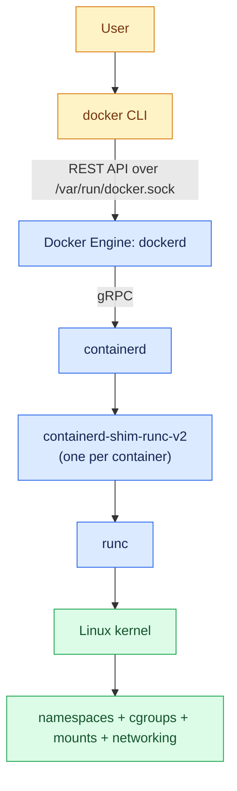

# runc, containerd, and Docker Architecture

## What You'll Learn

- The job of each layer: Docker CLI, Docker Engine, containerd, the shim, and runc
- What happens, step by step, during `docker run nginx`
- How to see every one of those components on a running host
- Why containers can survive a Docker daemon restart

## The Stack



| Component | Responsibility | Lifetime |
|---|---|---|
| `docker` CLI | Turns commands into API calls | One command |
| `dockerd` | User-facing API, builds, networks, volumes, logging drivers, Compose integration | Long-running daemon |
| `containerd` | Image content and snapshots, container lifecycle, runtime integration | Long-running daemon |
| `containerd-shim-runc-v2` | Parent of the container process; holds its stdio and exit status | As long as the container runs |
| `runc` | Creates namespaces and cgroups, sets up the root filesystem, starts the process — then exits | Seconds |

`containerd` is also what Kubernetes nodes use directly, without `dockerd` — see [Kubernetes Container Runtimes](21-kubernetes-runtimes.md).

## `docker run nginx`, Step by Step

1. **CLI → dockerd.** The CLI sends "create" and "start" API requests over the Unix socket (or the selected [context](10-installation-and-engine.md#contexts-talking-to-other-engines)).
2. **Image.** `dockerd` asks containerd whether `nginx` is present; if not, containerd pulls the index, picks the manifest for this platform, and downloads the layers by digest.
3. **Snapshot.** containerd's snapshotter (usually `overlayfs`) stacks the read-only layers and adds a writable layer on top.
4. **Configuration.** `dockerd` builds the OCI runtime spec: process arguments from the image config and your flags, environment, mounts, network namespace, capabilities, seccomp profile, cgroup limits.
5. **Network.** `dockerd` creates a veth pair, attaches one end to the `docker0` bridge, and programs NAT and port-forwarding rules.
6. **Start.** containerd starts a **shim**, which invokes `runc create` and `runc start`. runc sets up isolation and `exec`s nginx as PID 1 in the container, then **runc exits**.
7. **Supervise.** The shim stays as nginx's parent, collecting stdout/stderr (which becomes `docker logs`) and the exit code.

## See It on a Real Host

```bash
docker run -d --name web nginx:stable
```

The process tree:

```bash
ps -ef --forest | grep -A3 '[c]ontainerd-shim'
```

```text
root   2381     1  /usr/bin/containerd-shim-runc-v2 -namespace moby -id 5e1f... -address /run/containerd/containerd.sock
root   2402  2381   \_ nginx: master process nginx -g daemon off;
101    2451  2402       \_ nginx: worker process
```

nginx's parent is the shim, not `dockerd`, and there's no `runc` process left. nginx is an ordinary host process with its own namespaces:

```bash
pid=$(docker inspect -f '{{.State.Pid}}' web)
sudo lsns -p "$pid"
cat /proc/"$pid"/cgroup
```

containerd has its own view of the same container, in the `moby` namespace Docker uses:

```bash
sudo ctr --namespace moby containers list
sudo ctr --namespace moby tasks list
```

And Docker tells you which runtime and storage it's using:

```bash
docker info --format '{{.DefaultRuntime}} | {{.Driver}}'
# runc | overlayfs
```

Newer Docker Engine releases store images in containerd's image store by default on fresh installs, which is why `Driver` may show `overlayfs` (a containerd snapshotter) rather than the older `overlay2` graph driver.

## Why the Shim Exists

Because the shim, not `dockerd`, is the container's parent, the daemon can restart or upgrade without killing workloads. Enable **live restore** so Docker reattaches to running containers after a daemon restart:

```json title="/etc/docker/daemon.json"
{
  "live-restore": true
}
```

```bash
sudo systemctl reload docker        # applies live-restore
sudo systemctl restart docker
docker ps                           # web is still running
```

## Swapping the Low-Level Runtime

Because runc is just an OCI runtime, others can replace it for specific containers:

| Runtime | Why you'd use it |
|---|---|
| `runc` | Default reference implementation |
| `crun` | Written in C; faster start and lower memory, default on some Podman distributions |
| `runsc` (gVisor) | Intercepts system calls in a user-space kernel for stronger isolation |
| Kata Containers | Runs each container inside a lightweight VM |

```bash
docker run --rm --runtime=runsc alpine uname -a     # after installing and registering gVisor
```

## Common Mistakes

- Believing `dockerd` is the parent of every container, and that restarting it always kills them.
- Looking for a long-running `runc` process — it exits as soon as the container starts.
- Using `ctr` to create or delete containers Docker manages, which leaves Docker's state inconsistent. Use it to inspect only.
- Assuming "Docker" and "containerd" are competitors; Docker Engine is built on containerd.

## Check Your Understanding

1. Which component pulls image layers and prepares the writable snapshot?
2. After a container starts, which process is its parent, and why does that matter?
3. What does `live-restore` change?
4. Why can a Kubernetes node run containers without `dockerd` installed?

## Next

Continue to [What Docker Actually Solves](09-what-docker-solves.md) to connect this architecture to the day-to-day workflow Docker gives you.
