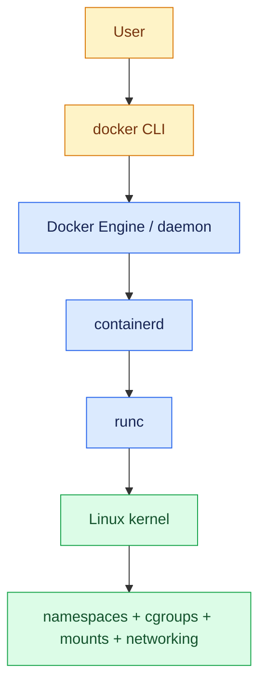

# runc, containerd, and Docker Architecture

This is a useful simplification, not a claim that every call is a straight line. Docker Engine manages the user-facing API and workflows. `containerd` manages image content, snapshots, container lifecycle, and runtime integration. `runc` is a small OCI runtime that creates and starts the isolated process according to an OCI runtime specification.

## `docker run nginx`, conceptually

1. The CLI asks the Docker daemon to create and start a container.
2. Docker ensures the requested image is available, pulling layers when required.
3. Containerd prepares a snapshot/root filesystem and runtime metadata.
4. Networking, mounts, environment, resource settings, and process configuration are assembled.
5. `runc` creates the requested Linux isolation and starts Nginx as the container's main process.
6. Docker exposes lifecycle state, logs, and network/volume management through its API.

The process is still Nginx on the host kernel. Docker's value is the repeatable workflow around that kernel machinery.
