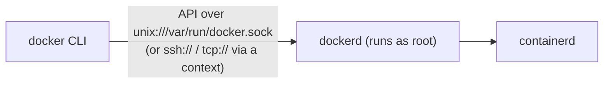

# Docker Installation and Engine

## What You'll Learn

- How to install Docker Engine on Ubuntu from Docker's repository, and verify it
- How the CLI, daemon, and socket relate, and why `docker` group membership is a big deal
- The daemon settings worth changing on day one
- How contexts let one CLI talk to several engines
- Rootless mode, and how Docker Desktop works on macOS and Windows

## The Client-Server Model



The `docker` command is only a client. Everything happens in `dockerd`, which runs as **root**. Whoever can write to its socket can ask it to do anything root can do.

## Install on Ubuntu (Docker Engine)

Remove conflicting distribution packages first:

```bash
for pkg in docker.io docker-doc docker-compose podman-docker containerd runc; do
  sudo apt-get remove -y "$pkg" 2>/dev/null
done
```

Add Docker's repository and install:

```bash
sudo apt-get update
sudo apt-get install -y ca-certificates curl
sudo install -m 0755 -d /etc/apt/keyrings
sudo curl -fsSL https://download.docker.com/linux/ubuntu/gpg -o /etc/apt/keyrings/docker.asc
sudo chmod a+r /etc/apt/keyrings/docker.asc

echo "deb [arch=$(dpkg --print-architecture) signed-by=/etc/apt/keyrings/docker.asc] \
https://download.docker.com/linux/ubuntu $(. /etc/os-release && echo "${UBUNTU_CODENAME:-$VERSION_CODENAME}") stable" \
  | sudo tee /etc/apt/sources.list.d/docker.list > /dev/null

sudo apt-get update
sudo apt-get install -y docker-ce docker-ce-cli containerd.io docker-buildx-plugin docker-compose-plugin
```

For other distributions, follow Docker's [official install guide](https://docs.docker.com/engine/install/); the package names are the same.

## Verify

```bash
sudo systemctl status docker --no-pager
sudo docker run --rm hello-world
docker version
```

`docker version` prints two sections. If `Server:` is missing or errors, the CLI can't reach the daemon:

```text
Client: Docker Engine - Community
 Version:           29.x.x
 ...
Server: Docker Engine - Community
 Engine:
  Version:          29.x.x
 containerd:
  Version:          2.x.x
 runc:
  Version:          1.x.x
```

```bash
docker info          # storage driver, cgroup version, runtimes, registries, warnings
```

Read the `WARNING:` lines at the bottom of `docker info` — they flag missing kernel features and insecure settings.

## Running Docker Without sudo — and What It Costs

```bash
sudo usermod -aG docker "$USER"
newgrp docker          # or log out and back in
docker ps
```

!!! warning "The docker group is root-equivalent"
    Any member can run `docker run -v /:/host --privileged ...` and get full control of the host. Only add people who should have root on that machine. On shared or production hosts, prefer `sudo`, rootless mode, or no interactive Docker access at all.

## Day-One Daemon Settings

```json title="/etc/docker/daemon.json"
{
  "log-driver": "local",
  "log-opts": {
    "max-size": "20m",
    "max-file": "5"
  },
  "live-restore": true,
  "default-address-pools": [
    { "base": "172.30.0.0/16", "size": 24 }
  ]
}
```

```bash
sudo systemctl restart docker
docker info --format '{{.LoggingDriver}} live-restore={{.LiveRestoreEnabled}}'
```

| Setting | Why |
|---|---|
| `log-driver: local` with rotation | The default `json-file` driver without `max-size` grows until the disk is full |
| `live-restore` | Containers keep running while the daemon restarts or upgrades — see [Architecture](08-runc-containerd-and-docker.md#why-the-shim-exists) |
| `default-address-pools` | Avoids Docker networks overlapping your corporate or VPN ranges |

## Contexts: Talking to Other Engines

A context tells the CLI which daemon to use:

```bash
docker context ls
docker context create build01 --docker "host=ssh://deploy@build01.internal"
docker --context build01 ps
docker context use build01        # make it the default
docker context use default
```

SSH contexts reuse your SSH keys and don't require exposing the daemon on a TCP port. Never expose `tcp://0.0.0.0:2375` without TLS — it's unauthenticated root access over the network.

## Rootless Mode

Rootless Docker runs `dockerd` as your normal user inside a user namespace, so a container escape lands as that user, not root:

```bash
sudo apt-get install -y uidmap docker-ce-rootless-extras
dockerd-rootless-setuptool.sh install
export DOCKER_HOST=unix://$XDG_RUNTIME_DIR/docker.sock
docker run --rm alpine id
```

Trade-offs: binding ports below 1024 needs extra configuration, some storage and network features are limited, and file ownership on bind mounts uses mapped UIDs. [Podman](20-podman.md) takes a rootless-first approach by design.

## macOS and Windows: Docker Desktop

Linux containers need a Linux kernel. Docker Desktop runs a small Linux VM and connects the CLI to the daemon inside it:

| Platform | How Linux containers run |
|---|---|
| macOS | A Linux VM using Apple's Virtualization framework; file sharing and port forwarding bridge the VM and the Mac |
| Windows | The WSL 2 backend runs a Linux distribution managed by Docker Desktop |

Consequences you'll notice: bind-mounted file I/O is slower than native Linux, `localhost` ports are forwarded from the VM, and the VM has its own memory and CPU limits in Desktop settings. Docker Desktop also has licensing terms for larger organizations — check them before rolling it out. Details in [macOS Containers](22-macos-containers.md).

## Common Mistakes

- Installing the distribution's `docker.io` package and Docker's `docker-ce` side by side.
- Adding users to the `docker` group on shared servers without realizing it grants root.
- Leaving the default logging configuration until a disk fills with container logs.
- Exposing the Docker API on TCP without TLS to "make remote access easy."
- Debugging "Cannot connect to the Docker daemon" by reinstalling, instead of checking `systemctl status docker` and the active context.

## Check Your Understanding

1. Why can `docker version` show a client but no server?
2. What makes the `docker` group equivalent to root access?
3. Which two `daemon.json` settings prevent common production incidents?
4. How does Docker Desktop run Linux containers on a Mac?

## Next

Continue to [Essential Docker Commands](11-essential-docker-commands.md).
