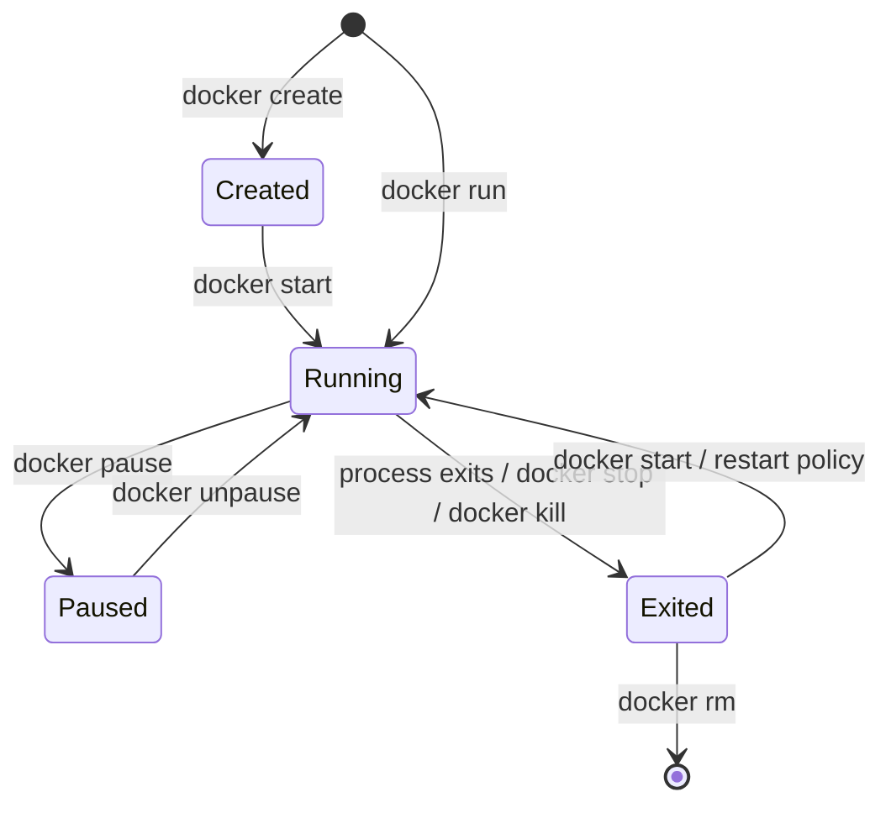

# Essential Docker Commands

## What You'll Learn

- The container lifecycle, and which command moves a container between states
- A hands-on lab covering run, inspect, logs, exec, stop, and cleanup
- How to read exit codes and choose a restart policy
- How to reclaim disk space safely

## The Lifecycle



A container is **running** exactly as long as its PID 1 process runs. When that process exits, the container exits — there's no separate "container OS" keeping it alive.

## Lab: One Container, End to End

### Run

```bash
docker pull nginx:stable
docker run -d --name web -p 8080:80 nginx:stable
```

| Flag | Meaning |
|---|---|
| `-d` | Detached: return immediately, run in the background |
| `--name web` | A stable name instead of a random one |
| `-p 8080:80` | Host port 8080 → container port 80 |
| `nginx:stable` | Image and tag |

```bash
curl -I http://localhost:8080
docker port web          # 80/tcp -> 0.0.0.0:8080
```

### Observe

```bash
docker ps                                   # running only
docker ps -a                                # include exited containers
docker ps --format 'table {{.Names}}\t{{.Status}}\t{{.Ports}}'
docker logs web                             # stdout/stderr since start
docker logs -f --since 5m web               # follow recent output
docker top web                              # processes, as seen from the host
docker stats --no-stream web                # CPU, memory, network, block I/O
```

### Inspect

`docker inspect` returns the full JSON configuration and state. Use Go templates to pull out what you need:

```bash
docker inspect web | less
docker inspect -f '{{.State.Status}} pid={{.State.Pid}} started={{.State.StartedAt}}' web
docker inspect -f '{{range .NetworkSettings.Networks}}{{.IPAddress}}{{end}}' web
docker inspect -f '{{json .Mounts}}' web | jq
```

### Get inside

```bash
docker exec -it web sh                       # a new process in the container's namespaces
# inside:
cat /etc/nginx/conf.d/default.conf
exit

docker exec web nginx -t                     # run one command without a shell
```

Minimal images may have `sh` but not `bash`, and distroless images have no shell at all. For those, attach a debugging container to the same namespaces:

```bash
docker run --rm -it --pid container:web --network container:web busybox sh
```

### See what changed

```bash
docker exec web sh -c 'echo hello > /usr/share/nginx/html/test.html'
docker diff web
# C /usr/share/nginx/html
# A /usr/share/nginx/html/test.html
docker cp web:/etc/nginx/nginx.conf ./nginx.conf
```

Changes made with `exec` live only in this container's writable layer. They vanish with `docker rm` and never reach the image — fix the Dockerfile instead.

### Stop and remove

```bash
docker stop web          # SIGTERM, then SIGKILL after 10 s
docker ps -a --filter name=web
docker start web         # same container, same writable layer
docker rm -f web         # stop and remove in one step
```

## Exit Codes

```bash
docker run --name crash alpine sh -c 'exit 3'
docker inspect -f '{{.State.ExitCode}} OOMKilled={{.State.OOMKilled}}' crash
```

| Exit code | Usually means |
|---|---|
| `0` | The process finished successfully (fine for a job, suspicious for a server) |
| `1`, other small numbers | The application reported an error — read its logs |
| `125` | Docker itself failed to create the container (bad flag, name conflict) |
| `126` | The command exists but couldn't be executed (permissions, wrong format) |
| `127` | The command wasn't found in the image |
| `137` | Killed with SIGKILL: `docker kill`, a stop timeout, or the OOM killer — check `OOMKilled` |
| `139` | Segmentation fault |
| `143` | Terminated with SIGTERM, typically a normal `docker stop` |

Codes above 128 are 128 plus the signal number.

## Restart Policies

```bash
docker run -d --name api --restart unless-stopped registry.example.com/orders:1.4.0
docker update --restart on-failure:5 api
```

| Policy | Restarts when |
|---|---|
| `no` (default) | Never |
| `on-failure[:N]` | The process exits non-zero, up to N times |
| `unless-stopped` | Always, including after a host reboot, unless you stopped it manually |
| `always` | Always, even if you stopped it manually (after the daemon restarts) |

A restart policy hides crashes. Pair it with log monitoring, or a crash loop runs silently for weeks.

## Cleaning Up

```bash
docker system df                     # what's using space
docker container prune               # remove stopped containers
docker image prune                   # remove dangling (untagged) images
docker image prune -a --filter "until=168h"   # unused images older than a week
docker volume ls -f dangling=true    # review before removing any volume
docker builder prune                 # build cache
```

!!! warning "Volumes hold data"
    `docker system prune --volumes` and `docker volume prune` delete volumes not attached to a container — including a database volume whose container you just removed to upgrade it. List and review first.

## Quick Reference

| Goal | Command | Common mistake |
| --- | --- | --- |
| Pull | `docker pull nginx:stable` | Assuming `latest` is fixed |
| Run | `docker run -d --name web -p 8080:80 nginx:stable` | Publishing the wrong container port |
| State | `docker ps -a` | Looking only at running containers |
| Logs | `docker logs -f web` | Expecting log files inside the container |
| Debug | `docker exec -it web sh` | Assuming Bash exists |
| Metadata | `docker inspect web` | Reading JSON by eye instead of `-f` |
| Metrics | `docker stats`, `docker top web` | Confusing host and container metrics |
| Files | `docker cp`, `docker diff` | "Fixing" production with in-container edits |

The complete cheat sheet is in the [Docker Quick Reference](docker.md).

## Common Mistakes

- Running a server image without `-d` and killing it by closing the terminal.
- Ignoring exited containers, then hitting "name already in use."
- Editing files with `docker exec` and expecting the change to survive a redeploy.
- Using `docker kill` routinely, skipping the application's graceful shutdown.
- Pruning volumes without checking what they contain.

## Check Your Understanding

1. Why does a container exit when its main process exits?
2. A container exited with code 137. What two checks tell you whether memory was the cause?
3. What's the difference between `docker exec` and `docker run --pid container:web`?
4. When would you choose `on-failure:5` over `unless-stopped`?

## Next

Continue to [Networking Foundations](12-networking-fundamentals.md).
