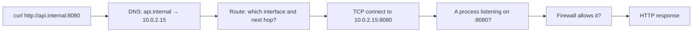

# Networking Foundations

## What You'll Learn

- The path a request takes: name → address → route → port → listening process
- What loopback, subnets, gateways, and NAT mean in practice
- The single most common container networking bug: listening on `127.0.0.1`
- Linux commands to observe every stage

## Why Start Here

Almost every "my container isn't reachable" problem is a plain networking problem with one extra layer. Understand the path first, and Docker networking becomes a short step.

## The Path of a Request



When something fails, find **which stage** failed before changing anything.

## Addresses and Interfaces

```bash
ip -brief addr
```

```text
lo        UNKNOWN  127.0.0.1/8 ::1/128
eth0      UP       10.0.2.15/24
docker0   DOWN     172.17.0.1/16
```

| Term | Meaning |
|---|---|
| **Interface** | A network device, physical (`eth0`) or virtual (`docker0`, `veth…`) |
| **IP address** | Identifies an interface on a network |
| **Private ranges** | `10.0.0.0/8`, `172.16.0.0/12`, `192.168.0.0/16` — not routed on the internet |
| **Loopback** (`127.0.0.1`) | "This network namespace." Traffic never leaves it |
| **Subnet** (`/24`) | The prefix shared by addresses on the same local network; `/24` = 256 addresses |

!!! note "Loopback is per network namespace"
    Inside a container, `127.0.0.1` is the **container**, not the host. That's why an app in one container can't reach a database in another via `localhost`.

## Routes and Gateways

```bash
ip route
```

```text
default via 10.0.2.1 dev eth0
10.0.2.0/24 dev eth0 proto kernel scope link src 10.0.2.15
172.17.0.0/16 dev docker0 proto kernel scope link src 172.17.0.1
```

- Destinations in `10.0.2.0/24` are reached directly on `eth0`.
- Everything else goes to the **gateway** `10.0.2.1`, the next hop toward other networks.
- `ip route get 1.1.1.1` shows the exact route for one destination.

**NAT** (network address translation) rewrites addresses as traffic passes a router. Home routers and cloud NAT gateways use it so private addresses can reach the internet — and Docker uses it so containers on `172.17.0.0/16` can too.

## DNS

```bash
getent hosts github.com           # what the system resolver returns (honors /etc/hosts)
dig +short github.com             # ask DNS directly
cat /etc/resolv.conf              # which resolver this namespace uses
```

`getent` follows the same lookup order applications use; `dig` bypasses `/etc/hosts`. When they disagree, `/etc/hosts` or search domains are involved.

## Ports and Listening Sockets

A **port** is a numbered TCP or UDP endpoint on an address. A **listener** is a process waiting for connections on one.

```bash
sudo ss -tlnp
```

```text
State   Recv-Q Send-Q  Local Address:Port   Peer Address:Port  Process
LISTEN  0      511         0.0.0.0:80           0.0.0.0:*      users:(("nginx",pid=812,fd=6))
LISTEN  0      4096      127.0.0.1:5432         0.0.0.0:*      users:(("postgres",pid=640,fd=5))
```

The **bind address** decides who can connect:

| Bind address | Reachable from |
|---|---|
| `0.0.0.0` (or `::`) | Every interface — other hosts, and published container ports |
| `127.0.0.1` | Only processes in the same network namespace |
| A specific IP | Only via that interface |

Here nginx accepts connections from anywhere; PostgreSQL only from the same machine.

## Lab: The 127.0.0.1 Trap

Start a server bound to loopback, then to all interfaces, and test from another namespace:

```bash
# Terminal 1: bound to loopback
python3 -m http.server 8000 --bind 127.0.0.1

# Terminal 2
curl -s -o /dev/null -w '%{http_code}\n' http://127.0.0.1:8000     # 200
curl -s -o /dev/null -w '%{http_code}\n' http://10.0.2.15:8000     # connection refused
```

Restart with `--bind 0.0.0.0` and both work. Inside a container, the same rule applies: an app listening on `127.0.0.1` **can't** be reached through `-p 8080:8000`, because the forwarded traffic arrives on the container's `eth0`, not its loopback.

```bash
docker run --rm -p 8000:8000 python:3.12-slim python -m http.server 8000 --bind 127.0.0.1 &
sleep 3; curl -m 3 http://localhost:8000      # fails: reset or empty reply
```

Fix it in the application's configuration (`--host 0.0.0.0`, `server.address=0.0.0.0`) — not by changing Docker flags.

## Testing Each Stage

```bash
getent hosts api.internal                        # 1. name resolves?
ip route get 10.0.2.20                           # 2. route exists?
nc -vz 10.0.2.20 8080                            # 3. TCP port open?
curl -v http://10.0.2.20:8080/healthz            # 4. application answers?
sudo ss -tlnp | grep 8080                        # on the server: listening, on which address?
```

"Connection refused" means the host answered but nothing listens on that port. A **timeout** usually means a firewall or routing problem — packets aren't getting an answer at all.

## Common Mistakes

- Using `localhost` inside a container to reach another container or the host.
- An application bound to `127.0.0.1` inside a container, published with `-p`, and "Docker networking is broken."
- Treating "connection refused" and "timeout" as the same failure.
- Testing DNS with `dig` and forgetting `/etc/hosts` entries the application actually sees.

## Check Your Understanding

1. What does `127.0.0.1` refer to inside a container?
2. What's the difference between binding to `0.0.0.0` and `127.0.0.1`?
3. A request times out, but another fails with "connection refused." What does each suggest?
4. Which command shows which process listens on a port, and on which address?

## Next

Continue to [Docker Networking and Service Discovery](13-docker-networking.md).
