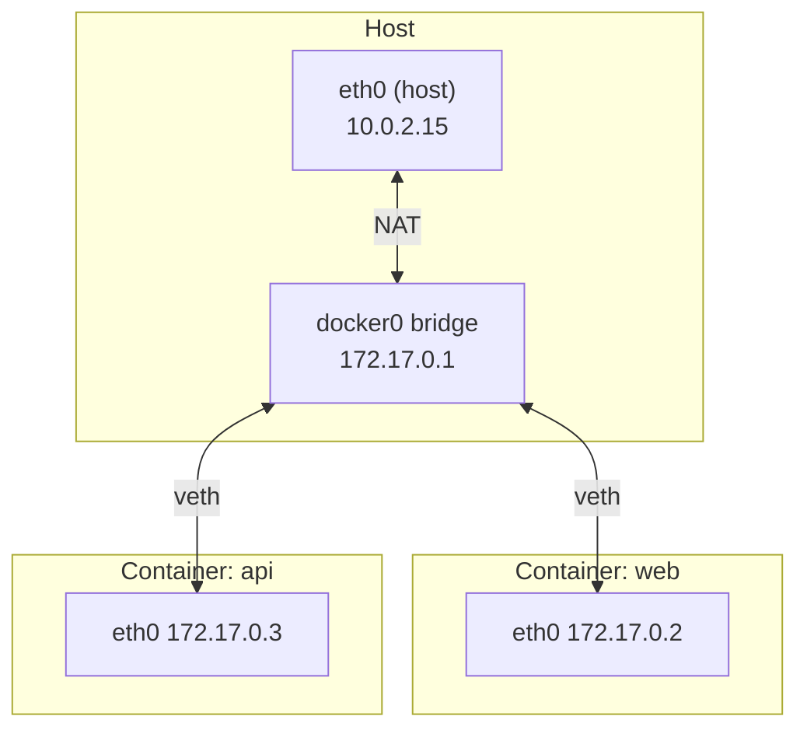

# Docker Networking and Service Discovery

## What You'll Learn

- What the default bridge network actually is, in terms of the veth pairs and NAT from earlier chapters
- How `-p` port publishing works, and how to publish safely
- Why user-defined networks give you DNS by container name, and the default bridge doesn't
- The other network drivers, and when each is appropriate
- A troubleshooting sequence for "container can't reach X"

## The Default Bridge, Unpacked

When Docker starts, it creates a Linux bridge called `docker0`. Every container on the default network gets a veth pair: one end becomes `eth0` inside the container, the other plugs into `docker0` — the same wiring you built by hand in [the Linux container lab](06-build-a-container-with-linux.md#step-4-networking-a-veth-pair).



See it:

```bash
docker run -d --name web nginx:stable
ip -brief link show type veth                        # one veth per container
bridge link                                          # attached to docker0
docker exec web cat /etc/resolv.conf
docker inspect -f '{{.NetworkSettings.IPAddress}}' web
```

Outbound traffic from containers is **masqueraded** (NAT) to the host's address, which is how `apt-get update` works inside a container.

## Port Publishing

```bash
docker run -d --name web -p 8080:80 nginx:stable
```

```text
browser → host 0.0.0.0:8080 → DNAT rule → 172.17.0.2:80 → nginx listening on 0.0.0.0:80
```

Docker programs packet-filter rules to forward the host port. You can see them:

```bash
sudo iptables -t nat -L DOCKER -n
# DNAT  tcp  --  0.0.0.0/0  0.0.0.0/0  tcp dpt:8080 to:172.17.0.2:80
```

### Publish only where you mean to

| Flag | Listens on |
|---|---|
| `-p 8080:80` | Every host interface, IPv4 and IPv6 — reachable from the network |
| `-p 127.0.0.1:8080:80` | Loopback only — reachable only from the host itself |
| `-p 10.0.2.15:8080:80` | One specific host address |
| `-p 80` | A random free host port (see `docker port`) |
| `-P` | Random host ports for every `EXPOSE`d port |

!!! warning "Published ports can bypass host firewalls like ufw"
    Docker inserts its forwarding rules ahead of the rules tools like `ufw` manage, so `ufw deny 8080` does **not** block a port published with `-p 8080:80`. Publish databases and admin UIs on `127.0.0.1` only, put a reverse proxy in front of public services, and add filtering rules to the `DOCKER-USER` chain, which Docker leaves for you to control.

## User-Defined Networks and DNS

On the **default** bridge, containers can reach each other only by IP address, and IPs change when containers are recreated. On a **user-defined** bridge, Docker runs an embedded DNS server, so containers find each other by name:

```bash
docker network create app-net
docker run -d --name db  --network app-net -e POSTGRES_PASSWORD=lab postgres:16
docker run -d --name api --network app-net --network-alias orders-api nginx:stable

docker run --rm --network app-net busybox nslookup db
# Server:    127.0.0.11
# Name:      db
# Address 1: 172.18.0.2 db.app-net

docker run --rm --network app-net busybox wget -qO- http://orders-api >/dev/null && echo reachable
```

| | Default `bridge` | User-defined bridge |
|---|---|---|
| DNS by container name | No | Yes, via `127.0.0.11` |
| Network aliases | No | Yes (`--network-alias`) |
| Isolation between apps | All containers share one network | Only containers on the same network can talk |
| Attach/detach running containers | No | `docker network connect/disconnect` |

Always create a network per application (Compose does this for you).

## Segmenting With Several Networks

A container can join multiple networks. Keep the database off the network the proxy uses:

```bash
docker network create frontend
docker network create --internal backend        # --internal: no route to the outside world

docker run -d --name db    --network backend  -e POSTGRES_PASSWORD=lab postgres:16
docker run -d --name api   --network backend  nginx:stable
docker network connect frontend api
docker run -d --name proxy --network frontend -p 80:80 nginx:stable
```

`proxy` can reach `api`, `api` can reach `db`, and `proxy` can't reach `db` at all. The [Caddy lab](14-caddy-web-app-lab.md) builds exactly this layout.

## Other Network Drivers

| Driver | What it does | Use it when |
|---|---|---|
| `bridge` | Private network on one host with NAT | The default for almost everything |
| `host` | No network namespace — the container uses the host's interfaces | Rare: very high packet rates, or tools that must see host interfaces. Port conflicts and no isolation |
| `none` | Only loopback | Batch jobs that must have no network access |
| `macvlan` / `ipvlan` | Containers get addresses directly on the physical network | Legacy apps that must appear as separate hosts on the LAN |
| `overlay` | A network spanning several Docker hosts (Swarm) | Multi-host Swarm services |

## Reaching the Host From a Container

`localhost` inside a container is the container. To reach a service on the host:

```bash
# Docker Desktop provides this name automatically. On Linux, add it:
docker run --rm --add-host=host.docker.internal:host-gateway curlimages/curl \
  curl -s http://host.docker.internal:9090/-/healthy
```

The host service must listen on an address the bridge can reach (not only `127.0.0.1`).

## Troubleshooting Connectivity

Work outward from the container:

```bash
# 1. Is the target running, and on the same network?
docker ps --filter name=db
docker network inspect app-net -f '{{range .Containers}}{{.Name}} {{.IPv4Address}}{{"\n"}}{{end}}'

# 2. Does the name resolve from the client's network?
docker run --rm --network app-net busybox nslookup db

# 3. Is the port open?
docker run --rm --network app-net busybox nc -zv db 5432

# 4. Is the server listening on 0.0.0.0, not 127.0.0.1?
docker exec db sh -c 'cat /proc/net/tcp | head -5'     # or: docker exec db ss -tln (if installed)

# 5. From outside: is the port published where you think?
docker port web
curl -v http://localhost:8080
```

For images without tools, borrow a debugging container that shares the target's network namespace:

```bash
docker run --rm -it --network container:web nicolaka/netshoot ss -tlnp
```

A successful `nslookup` or `nc` proves the network path only. It doesn't prove PostgreSQL accepts your credentials or that the application is healthy.

## Common Mistakes

- Hard-coding container IP addresses instead of service names.
- Using the default bridge for multi-container apps and wondering why names don't resolve.
- Publishing a database with `-p 5432:5432` on an internet-facing host, assuming the firewall blocks it.
- Reaching for `--network host` to "fix" a problem that was really a bind address or a missing network.
- Expecting `localhost` in one container to reach another container.

## Check Your Understanding

1. What creates `eth0` inside a container, and what is its other end connected to?
2. Why does `nslookup db` work on a user-defined network but not the default bridge?
3. Why might `ufw deny 8080` fail to block a published container port?
4. How would you let a proxy reach an API while keeping the database unreachable from the proxy?

## Next

Continue to the [Caddy Web Application Lab](14-caddy-web-app-lab.md) to put these networks to work.
