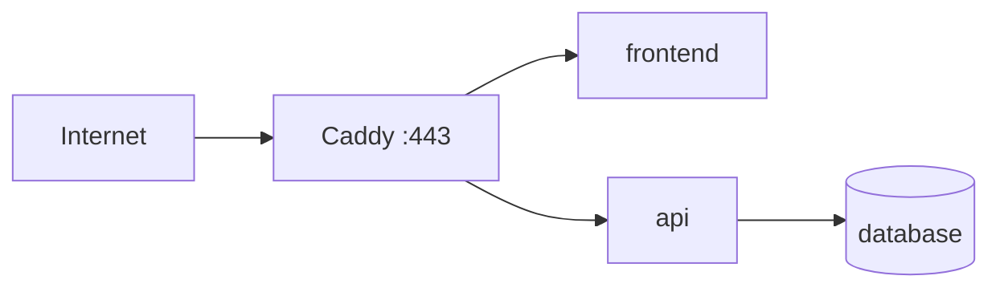

# 14. Web Application Lab: Caddy, Frontend, API, Database

Caddy is the public reverse proxy. The frontend, API, and database belong on an internal user-defined network; only Caddy normally publishes public ports. Docker automates private networks and internal DNS. Administrators still own domain DNS, firewall policy, TLS policy, secrets, backups, authorization, and observability.
