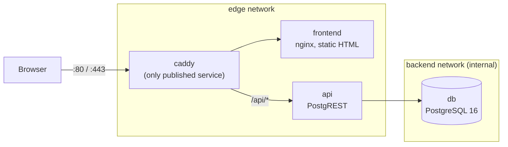

# Web Application Lab: Caddy, Frontend, API, Database

## What You'll Learn

- How to lay out a real multi-tier application on segmented Docker networks
- How a reverse proxy routes by path so only one container publishes ports
- How to prove the database is unreachable from outside and from the proxy
- How Caddy provides HTTPS, locally and with a real domain

## Architecture



- **caddy** is the only container with published ports.
- **frontend** and **api** sit on the `edge` network with Caddy.
- **api** also joins the `backend` network, which is `internal: true` — no route to the internet.
- **db** is only on `backend`. Neither the browser nor Caddy can reach it.

## Project Layout

```text
caddy-lab/
├── compose.yaml
├── .env
├── Caddyfile
├── frontend/
│   └── index.html
└── db/
    └── init.sql
```

```bash
mkdir -p caddy-lab/frontend caddy-lab/db && cd caddy-lab
```

## Step 1 — The Database Schema

PostgREST turns a PostgreSQL schema into a REST API. This script runs once, when the database volume is first created:

```sql title="db/init.sql"
create schema api;

create table api.todos (
  id    serial primary key,
  task  text not null,
  done  boolean not null default false
);

insert into api.todos (task) values
  ('Understand namespaces'),
  ('Understand cgroups'),
  ('Ship the Caddy lab');

-- Role used for anonymous API requests: read-only
create role web_anon nologin;
grant usage on schema api to web_anon;
grant select on api.todos to web_anon;

-- Role PostgREST logs in as; it can only switch to web_anon
create role authenticator noinherit login password 'change-me-authenticator';
grant web_anon to authenticator;
```

## Step 2 — Environment

```bash title=".env"
POSTGRES_PASSWORD=change-me-superuser
AUTHENTICATOR_PASSWORD=change-me-authenticator
SITE_ADDRESS=:80
```

Keep `.env` out of Git. For a real deployment, use Docker secrets or a secret manager instead of plain environment variables.

## Step 3 — Frontend

```html title="frontend/index.html"
<!doctype html>
<html lang="en">
<head><meta charset="utf-8"><title>Caddy Lab</title></head>
<body>
  <h1>Todos</h1>
  <ul id="todos"><li>Loading…</li></ul>
  <script>
    fetch('/api/todos?order=id')
      .then(r => r.json())
      .then(items => {
        document.getElementById('todos').innerHTML =
          items.map(t => `<li>${t.done ? '✅' : '⬜'} ${t.task}</li>`).join('');
      })
      .catch(err => { document.getElementById('todos').textContent = 'API error: ' + err; });
  </script>
</body>
</html>
```

The page calls `/api/todos` on the **same origin**, so no CORS configuration is needed — Caddy routes the path.

## Step 4 — Caddyfile

```caddy title="Caddyfile"
{$SITE_ADDRESS} {
    encode zstd gzip

    handle_path /api/* {
        reverse_proxy api:3000
    }

    handle {
        reverse_proxy frontend:80
    }

    header {
        X-Content-Type-Options nosniff
        Referrer-Policy strict-origin-when-cross-origin
        -Server
    }

    log {
        output stdout
        format json
    }
}
```

- `handle_path /api/*` strips the `/api` prefix, so `/api/todos` reaches PostgREST as `/todos`.
- `api:3000` and `frontend:80` resolve through Docker's embedded DNS on the `edge` network.

## Step 5 — compose.yaml

```yaml title="compose.yaml"
name: caddylab

services:
  caddy:
    image: caddy:2
    restart: unless-stopped
    ports:
      - "80:80"
      - "443:443"
    environment:
      SITE_ADDRESS: ${SITE_ADDRESS}
    volumes:
      - ./Caddyfile:/etc/caddy/Caddyfile:ro
      - caddy_data:/data
      - caddy_config:/config
    networks: [edge]
    depends_on: [frontend, api]

  frontend:
    image: nginx:stable
    restart: unless-stopped
    volumes:
      - ./frontend:/usr/share/nginx/html:ro
    networks: [edge]

  api:
    image: postgrest/postgrest:v12.2.3
    restart: unless-stopped
    environment:
      PGRST_DB_URI: postgres://authenticator:${AUTHENTICATOR_PASSWORD}@db:5432/app
      PGRST_DB_SCHEMAS: api
      PGRST_DB_ANON_ROLE: web_anon
    networks: [edge, backend]
    depends_on:
      db:
        condition: service_healthy

  db:
    image: postgres:16
    restart: unless-stopped
    environment:
      POSTGRES_DB: app
      POSTGRES_PASSWORD: ${POSTGRES_PASSWORD}
    volumes:
      - db_data:/var/lib/postgresql/data
      - ./db/init.sql:/docker-entrypoint-initdb.d/init.sql:ro
    networks: [backend]
    healthcheck:
      test: ["CMD-SHELL", "pg_isready -U postgres -d app"]
      interval: 5s
      timeout: 3s
      retries: 10

networks:
  edge: {}
  backend:
    internal: true

volumes:
  db_data: {}
  caddy_data: {}
  caddy_config: {}
```

## Step 6 — Start and Verify

```bash
docker compose up -d
docker compose ps
```

```text
NAME                  SERVICE    STATUS                   PORTS
caddylab-api-1        api        Up 10 seconds
caddylab-caddy-1      caddy      Up 9 seconds             0.0.0.0:80->80/tcp, 0.0.0.0:443->443/tcp
caddylab-db-1         db         Up 16 seconds (healthy)
caddylab-frontend-1   frontend   Up 10 seconds
```

Only `caddy` shows published ports. Test the routes:

```bash
curl -s http://localhost/ | head -5
curl -s http://localhost/api/todos | jq
```

```json
[
  { "id": 1, "task": "Understand namespaces", "done": false },
  { "id": 2, "task": "Understand cgroups", "done": false },
  { "id": 3, "task": "Ship the Caddy lab", "done": false }
]
```

Open `http://localhost` in a browser to see the frontend render the list.

## Step 7 — Prove the Isolation

```bash
# The database has no published port on the host
nc -zv localhost 5432                    # connection refused

# Caddy can reach the API...
docker compose exec caddy wget -qO- http://api:3000/todos | head -c 80; echo

# ...but not the database: db isn't on the edge network, so the name doesn't even resolve
docker compose exec caddy nslookup db    # can't resolve 'db'

# The API can reach the database
docker run --rm --network caddylab_backend busybox nc -zv db 5432   # open

# The backend network has no route out
docker run --rm --network caddylab_backend busybox wget -T 5 -qO- http://example.com  # fails
```

And the API is read-only for anonymous users, as the schema intended:

```bash
curl -s -X POST http://localhost/api/todos -H 'Content-Type: application/json' -d '{"task":"hack"}'
# {"code":"42501","message":"permission denied for table todos", ...}
```

## Step 8 — HTTPS

For local HTTPS, set `SITE_ADDRESS=localhost` in `.env` and recreate Caddy:

```bash
docker compose up -d --force-recreate caddy
curl -k https://localhost/api/todos
```

Caddy issues a certificate from its own internal CA (stored in the `caddy_data` volume). Browsers warn until you trust that CA.

On a server with a public DNS record pointing at it and ports 80/443 open, set `SITE_ADDRESS=shop.example.com`. Caddy obtains and renews a publicly trusted certificate automatically. Keep the `caddy_data` volume — it holds certificates and keys, and losing it means re-issuing and possibly hitting rate limits.

## Step 9 — Clean Up

```bash
docker compose down            # keep volumes
docker compose down -v         # also delete the database and certificates
```

## What You Still Own

Docker created the networks, DNS, and isolation. It didn't handle:

- **DNS records and firewall policy** for the public site.
- **Secrets management** — passwords in `.env` are a lab shortcut.
- **Backups** of `db_data`, and tested restores — see [Storage](15-storage.md).
- **Authentication and authorization** for writes (PostgREST supports JWTs).
- **Observability** — Caddy logs JSON to stdout; ship it with a collector such as [Grafana Alloy](../monitoring-tools/logging.md).
- **Updates** — pin image versions, and update them deliberately.

## Common Mistakes

- Publishing ports on every service "for debugging" and forgetting to remove them.
- Putting the database on the same network as the reverse proxy.
- Expecting `init.sql` to re-run after changing it — init scripts only run when the data volume is empty.
- Using `depends_on` without a health condition, so the API starts before PostgreSQL accepts connections.
- Deleting `caddy_data` and losing certificates.

## Check Your Understanding

1. Why can Caddy resolve `api` but not `db`?
2. What does `internal: true` on the `backend` network prevent?
3. Why doesn't changing `db/init.sql` affect an existing database?
4. What does `handle_path` do that `handle` doesn't?

## Next

Continue to [Storage and Persistent Data](15-storage.md).
