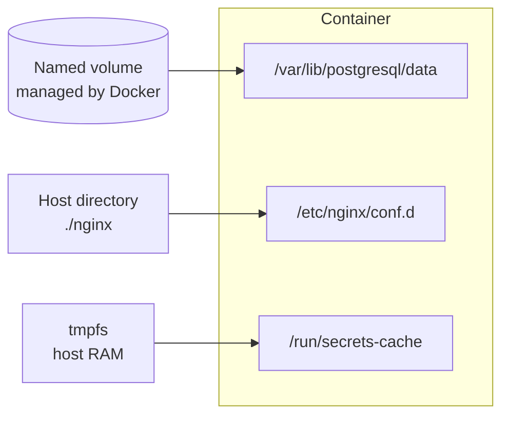

# Storage and Persistent Data

## What You'll Learn

- Why data written inside a container disappears, and when that's what you want
- The three mount types — named volumes, bind mounts, and tmpfs — and when to use each
- How to fix the UID/GID permission errors everyone hits
- How to back up and restore volumes, and why database backups need the database's own tools

## The Writable Layer

Every container gets a thin writable layer on top of its read-only image layers (the copy-on-write mechanism is covered in [Container Images](16-container-images.md)). Anything the process writes lands there — and is deleted with the container.

```bash
docker run --name scratch alpine sh -c 'echo important > /data.txt'
docker start -a scratch >/dev/null; docker cp scratch:/data.txt -    # still there after restart
docker rm scratch                                                    # now it's gone for good
```

A `docker stop`/`start` keeps the layer; `docker rm` destroys it, and every image upgrade means a new container. **Anything you need to keep must live outside the writable layer.**

## Three Ways to Mount Storage



| Type | Data lives in | Best for | Caveat |
| --- | --- | --- | --- |
| **Named volume** | `/var/lib/docker/volumes/<name>/_data`, managed by Docker | Databases and service data | Invisible in your project folder — back it up deliberately |
| **Bind mount** | Any host path you choose | Config files, source code during development | Host paths and permissions make it less portable |
| **tmpfs** | Host memory | Scratch files, sensitive temporary data | Gone when the container stops; counts against memory |

### Named volumes

```bash
docker volume create pgdata
docker run -d --name db \
  -e POSTGRES_PASSWORD=lab \
  --mount type=volume,source=pgdata,target=/var/lib/postgresql/data \
  postgres:16

docker volume inspect pgdata -f '{{.Mountpoint}}'
docker rm -f db
docker run -d --name db2 -e POSTGRES_PASSWORD=lab -v pgdata:/var/lib/postgresql/data postgres:16
# the same data is still there
```

A named volume that's empty is **pre-populated** from the image's files at that path on first use — useful, and a source of surprise when you expected an empty directory.

### Bind mounts

```bash
mkdir -p nginx
cat > nginx/default.conf <<'EOF'
server { listen 80; location / { return 200 "configured from the host\n"; } }
EOF

docker run -d --name web -p 8080:80 \
  --mount type=bind,source="$PWD/nginx",target=/etc/nginx/conf.d,readonly \
  nginx:stable
curl http://localhost:8080
```

Bind mounts **hide** whatever the image had at the target path. Mount read-only (`readonly` or `:ro`) whenever the container shouldn't write.

### tmpfs

```bash
docker run --rm --mount type=tmpfs,target=/tmp/work,tmpfs-size=64m alpine df -h /tmp/work
```

### `-v` vs. `--mount`

`-v pgdata:/data` and `--mount type=volume,source=pgdata,target=/data` do the same thing. `--mount` is more explicit and fails loudly on typos; `-v` silently creates a **directory** on the host if a bind-mount source path doesn't exist.

## Permissions: The Error Everyone Hits

```text
mkdir: cannot create directory '/data/uploads': Permission denied
```

Files have numeric owners (UID/GID). The container process runs as some UID; a bind-mounted host directory is owned by some UID. If they don't match, writes fail. Names don't matter — numbers do.

```bash
docker run --rm -v "$PWD/uploads:/data" alpine id           # uid=0(root)
docker run --rm -v "$PWD/uploads:/data" node:22-alpine id   # uid=0 unless USER is set
ls -ln uploads                                              # numeric owner on the host
```

Fixes, in order of preference:

1. **Match ownership.** Run the container as a known UID and own the host directory with the same UID:

    ```bash
    sudo chown -R 10001:10001 uploads
    docker run --rm --user 10001:10001 -v "$PWD/uploads:/data" alpine touch /data/ok
    ```

2. **Use a named volume** and create the directory with the right owner in the Dockerfile — Docker copies ownership into a new empty volume.
3. **SELinux hosts** (RHEL, Fedora): add `:z` (shared) or `:Z` (private) to bind mounts so Docker relabels them.

Never "fix" it with `chmod 777`.

## Backups and Restores

### Filesystem-level backup of a volume

```bash
docker run --rm \
  -v pgdata:/source:ro \
  -v "$PWD/backups:/backup" \
  alpine tar czf /backup/pgdata-$(date +%F).tar.gz -C /source .
```

Restore into a fresh volume:

```bash
docker volume create pgdata_restored
docker run --rm \
  -v pgdata_restored:/target \
  -v "$PWD/backups:/backup:ro" \
  alpine tar xzf /backup/pgdata-2026-09-13.tar.gz -C /target
```

!!! danger "Don't tar a running database"
    Copying a live database's data files can produce a corrupt, unusable backup — the files change mid-copy. Stop the container first, or use the database's own backup tool.

### Database-aware backup

```bash
docker exec db pg_dump -U postgres -Fc app > backups/app-$(date +%F).dump

# Restore into a new container and check it
docker run -d --name restore-test -e POSTGRES_PASSWORD=lab postgres:16
sleep 5
docker exec -i restore-test createdb -U postgres app
docker exec -i restore-test pg_restore -U postgres -d app < backups/app-2026-09-13.dump
docker exec restore-test psql -U postgres -d app -c 'select count(*) from api.todos;'
docker rm -f restore-test
```

A backup you haven't restored is a hope, not a backup. Schedule the restore test too.

## Where Volumes Fit in Production

- Local named volumes live on **one host**. If the host dies, so does the data unless it's backed up or replicated.
- Volume **drivers** and plugins can place data on NFS, cloud block storage, or distributed storage.
- In Kubernetes the same ideas become PersistentVolumes and StorageClasses — see [Kubernetes Storage](../kubernetes/storage/index.md).
- Managed databases often beat running your own database container for anything critical.

## Common Mistakes

- Running a database without a volume and losing everything on the first upgrade.
- Using `-v ./data:/data` with a mistyped path, silently creating an empty host directory.
- Bind-mounting over a path that contains files the image needs.
- Solving permission errors with `chmod 777` instead of matching UIDs.
- Running `docker volume prune` "to free space" and deleting a detached database volume.
- Backing up volumes but never testing a restore.

## Check Your Understanding

1. What happens to files in a container's writable layer on `docker rm`? On `docker stop`?
2. When would you choose a bind mount over a named volume?
3. Why do permission errors on bind mounts depend on numeric UIDs, not user names?
4. Why is `pg_dump` safer than copying the volume of a running PostgreSQL container?

## Next

Continue to [Container Images](16-container-images.md).
