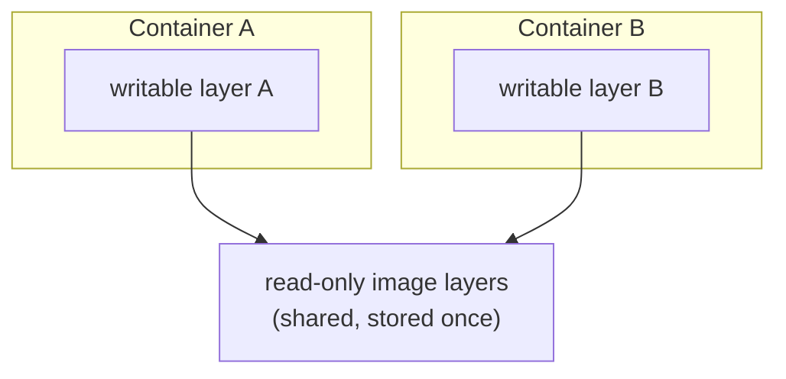

# Container Images

## What You'll Learn

- What an image is made of, and how to see its layers and configuration
- How copy-on-write lets many containers share one image
- Why tags move and digests don't, and how to deploy by digest
- How multi-architecture images work
- How to find what's making an image large, and how to scan it

## What an Image Is

> An image is **metadata plus ordered filesystem layers**. The layers stack into a root filesystem; the metadata says how to run it (command, environment, user, working directory). An image is never "running" — a container is a process started from it.

The formats are defined by the OCI image spec from [OCI Standards](07-oci-standards.md).

## Seeing the Layers

```bash
docker pull python:3.12-slim
docker image history python:3.12-slim
```

```text
IMAGE          CREATED       CREATED BY                                      SIZE
a1b2c3d4e5f6   2 weeks ago   CMD ["python3"]                                 0B
<missing>      2 weeks ago   RUN /bin/sh -c set -eux; ... python ...         40.1MB
<missing>      2 weeks ago   ENV PYTHON_VERSION=3.12.x                       0B
<missing>      2 weeks ago   RUN /bin/sh -c set -eux; apt-get update ...     3.8MB
<missing>      3 weeks ago   # debian.sh --arch 'amd64' out/ 'bookworm' ...  74.8MB
```

Each filesystem-changing instruction (`RUN`, `COPY`, `ADD`) creates a layer. Metadata instructions (`ENV`, `CMD`) add 0 B layers of configuration. `<missing>` just means those layers were built elsewhere.

```bash
docker image inspect python:3.12-slim -f '{{json .Config}}' | jq '{Cmd, Env, User, WorkingDir}'
docker image inspect python:3.12-slim -f '{{json .RootFS.Layers}}' | jq
```

## Shared Layers and Copy-on-Write

Layers are stored once and shared. Two images built `FROM python:3.12-slim` share its base layers on disk and in the registry; pulling the second one downloads only what's new.

When containers start, the storage driver (overlayfs) stacks the image's read-only layers and adds a **writable layer** per container:



When a container **modifies** a file from the image, overlayfs first copies it up into that container's writable layer — **copy-on-write**. The image, and every other container, is unaffected.

```bash
docker run -d --name a nginx:stable
docker run -d --name b nginx:stable
docker exec a sh -c 'echo changed > /usr/share/nginx/html/index.html'
docker exec b cat /usr/share/nginx/html/index.html | head -3     # still the original
docker ps -s --format 'table {{.Names}}\t{{.Size}}'
# a   1.1kB (virtual 192MB)
# b   1.09kB (virtual 192MB)
```

`virtual` is the shared image; the first number is each container's own writable layer. This is why starting 50 containers from one image is fast and cheap.

## Tags and Digests

```text
registry.example.com/team/payment-api:v1.2.0@sha256:3f7a...e91c
└──────┬───────────┘ └──────┬───────┘ └─┬──┘ └──────┬──────┘
    registry            repository     tag       digest
```

| | Tag | Digest |
|---|---|---|
| Example | `nginx:stable`, `myapp:1.4.0` | `nginx@sha256:9a1b...` |
| Mutable? | **Yes** — can be moved to different content | **No** — derived from the content itself |
| Good for | Humans, release names | Deployments, audits, reproducibility |

`latest` is just the tag used when you don't specify one. It's not "the newest" by any rule, and it changes without warning.

```bash
docker image inspect nginx:stable -f '{{index .RepoDigests 0}}'
# nginx@sha256:9a1b...

docker pull nginx@sha256:9a1b...        # always exactly this content
```

In production manifests, deploy by digest (or by an immutable release tag your registry enforces), so a re-pushed tag can't change what runs.

## Multi-Architecture Images

One tag can point to an **index** with a manifest per platform. The client picks the one matching its CPU:

```bash
docker buildx imagetools inspect nginx:stable | grep Platform
#  Platform:  linux/amd64
#  Platform:  linux/arm64/v8
#  ...

docker run --rm --platform linux/arm64 alpine uname -m     # aarch64 (emulated on amd64 if QEMU is set up)
```

`exec format error` when a container starts almost always means an image for the wrong architecture — common when building on an Apple silicon Mac and deploying to amd64 servers. Building multi-platform images is covered in [Dockerfiles](17-dockerfiles.md#multi-platform-builds).

## Why Images Get Big, and How to Shrink Them

```bash
docker image ls --format 'table {{.Repository}}:{{.Tag}}\t{{.Size}}'
docker image history --no-trunc myapp:1.0 --format '{{.Size}}\t{{.CreatedBy}}' | sort -hr | head
```

| Cause | Fix |
|---|---|
| Full OS base image | `-slim`, `-alpine`, or distroless bases |
| Compilers and build tools left in the image | [Multi-stage builds](17-dockerfiles.md#multi-stage-builds) |
| Package manager caches | `--no-cache-dir`, `rm -rf /var/lib/apt/lists/*` in the **same** `RUN` |
| Deleting files in a later layer | Delete in the same `RUN` that created them — later layers can't shrink earlier ones |
| Large build context copied in | `.dockerignore` |

Deleting a file in a later layer hides it but the bytes remain in the earlier layer — including secrets. Never add a secret and delete it later.

## Moving Images Without a Registry

```bash
docker save myapp:1.0 | gzip > myapp-1.0.tar.gz
# copy to an air-gapped host, then:
gunzip -c myapp-1.0.tar.gz | docker load
```

## Scanning for Vulnerabilities

Images carry OS packages and libraries that accumulate CVEs over time:

```bash
docker run --rm -v /var/run/docker.sock:/var/run/docker.sock aquasec/trivy:latest image python:3.12-slim
```

Scan in CI, rebuild regularly to pick up patched base images, and see [Image and Supply Chain Security](../kubernetes/security/05-image-and-supply-chain-security.md) for signing and admission policies.

## Common Mistakes

- Deploying `:latest` and not knowing what version is actually running.
- Assuming `docker rmi` of a deleted file's layer removes a leaked secret from pushed images.
- Building on ARM and deploying to amd64 without a multi-platform build.
- Treating image size as cosmetic — large images slow every pull, scale-out, and recovery.
- Never rebuilding an image, so its base OS packages grow stale.

## Check Your Understanding

1. Why can 50 containers from the same image start almost instantly?
2. What happens, at the storage level, when a container edits a file that came from the image?
3. Why should a production deployment reference a digest rather than a tag?
4. Why doesn't `RUN rm secret.txt` in a later layer remove the secret from the image?

## Next

Continue to [Dockerfiles](17-dockerfiles.md).
