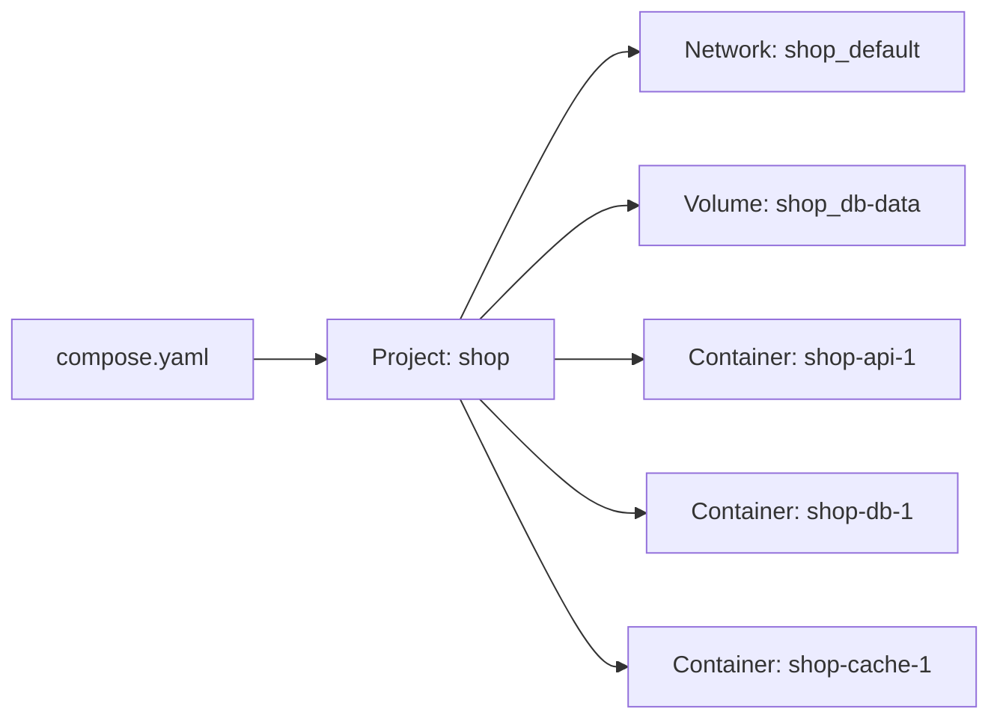

# Docker Compose

## What You'll Learn

- How a `compose.yaml` maps to the containers, networks, and volumes you've created by hand
- How to wait for real readiness with health checks
- How environment variables, `.env` files, and interpolation work
- How to use profiles, override files, secrets, and watch mode
- The commands for running, debugging, and cleaning up a stack
- Where Compose stops being the right tool

## Why Compose

A three-service app needs a network, two volumes, environment variables, published ports, and a start order — a dozen `docker run` commands that someone has to remember. Compose describes the whole application as one reviewed file and turns it into those same Docker objects.



Everything Compose creates is prefixed with the **project name** (by default the directory name, or `name:` in the file).

## A Realistic Stack

```yaml title="compose.yaml"
name: shop

services:
  api:
    build:
      context: .
      target: runtime
    image: registry.example.com/shop/api:${API_TAG:-dev}
    ports:
      - "127.0.0.1:8000:8000"
    environment:
      DATABASE_URL: postgresql://shop:${DB_PASSWORD:?set DB_PASSWORD in .env}@db:5432/shop
      REDIS_URL: redis://cache:6379/0
      LOG_LEVEL: ${LOG_LEVEL:-info}
    depends_on:
      db:
        condition: service_healthy
      cache:
        condition: service_started
    healthcheck:
      test: ["CMD", "python", "-c", "import urllib.request; urllib.request.urlopen('http://127.0.0.1:8000/healthz')"]
      interval: 10s
      timeout: 3s
      retries: 5
      start_period: 15s
    restart: unless-stopped

  db:
    image: postgres:16
    environment:
      POSTGRES_USER: shop
      POSTGRES_DB: shop
      POSTGRES_PASSWORD: ${DB_PASSWORD}
    volumes:
      - db-data:/var/lib/postgresql/data
    healthcheck:
      test: ["CMD-SHELL", "pg_isready -U shop -d shop"]
      interval: 5s
      timeout: 3s
      retries: 10
    restart: unless-stopped

  cache:
    image: redis:7-alpine
    command: ["redis-server", "--save", "", "--appendonly", "no"]
    restart: unless-stopped

  adminer:
    image: adminer:4
    ports:
      - "127.0.0.1:8081:8080"
    profiles: [tools]

volumes:
  db-data: {}
```

```bash title=".env"
DB_PASSWORD=change-me
API_TAG=dev
```

The top-level `version:` key is obsolete; current Compose ignores it and warns.

## Start Order vs. Readiness

`depends_on` alone controls only **start order** — the API container can start while PostgreSQL is still initializing. `condition: service_healthy` waits for the dependency's health check to pass.

| Condition | Waits until |
|---|---|
| `service_started` | The container has started (default) |
| `service_healthy` | Its `healthcheck` reports healthy |
| `service_completed_successfully` | A one-off container (like a migration) exited with code 0 |

A migration job that must finish before the API starts:

```yaml
  migrate:
    image: registry.example.com/shop/api:${API_TAG:-dev}
    command: ["alembic", "upgrade", "head"]
    environment:
      DATABASE_URL: postgresql://shop:${DB_PASSWORD}@db:5432/shop
    depends_on:
      db:
        condition: service_healthy

  api:
    depends_on:
      migrate:
        condition: service_completed_successfully
```

Health-based ordering helps on startup, but applications should still retry connections — dependencies restart in production too.

## Environment and Interpolation

| Syntax in compose.yaml | Meaning |
|---|---|
| `${VAR}` | Value from the shell or `.env` |
| `${VAR:-default}` | Default if unset or empty |
| `${VAR:?message}` | Fail with a message if unset or empty |

- The `.env` file next to `compose.yaml` feeds **interpolation** in the Compose file.
- `env_file: [api.env]` on a service passes variables **into the container**.
- Check the fully resolved configuration before running:

```bash
docker compose config
```

## Running the Stack

```bash
docker compose up -d --build           # build, create, start in the background
docker compose ps                      # status and health
docker compose logs -f api             # follow one service
docker compose exec db psql -U shop    # a shell or command in a running service
docker compose run --rm api pytest     # a one-off container using the service definition
docker compose restart api
docker compose up -d --no-deps api     # recreate only api after changing its config
docker compose --profile tools up -d   # include services in the "tools" profile
docker compose down                    # stop and remove containers and the network
docker compose down -v                 # ...and named volumes (deletes the database)
```

## Override Files

Compose automatically merges `compose.override.yaml` on top of `compose.yaml` — a good place for development-only settings:

```yaml title="compose.override.yaml"
services:
  api:
    build:
      target: base
    command: ["uvicorn", "app.main:app", "--host", "0.0.0.0", "--port", "8000", "--reload"]
    volumes:
      - ./app:/app/app
    environment:
      LOG_LEVEL: debug
```

Use explicit files for other environments:

```bash
docker compose -f compose.yaml -f compose.ci.yaml up -d
```

## Watch Mode for Development

Instead of bind mounts, `develop.watch` syncs files or rebuilds when they change:

```yaml
services:
  api:
    develop:
      watch:
        - action: sync
          path: ./app
          target: /app/app
        - action: rebuild
          path: requirements.txt
```

```bash
docker compose watch
```

## Secrets

Compose secrets mount files into containers at `/run/secrets/<name>`, keeping values out of environment variables and `docker inspect` output:

```yaml
services:
  db:
    image: postgres:16
    environment:
      POSTGRES_PASSWORD_FILE: /run/secrets/db_password
    secrets: [db_password]

secrets:
  db_password:
    file: ./secrets/db_password.txt
```

Many official images support `*_FILE` variables for exactly this.

## Troubleshooting

| Symptom | Check |
|---|---|
| A service keeps restarting | `docker compose logs <service>`, `docker compose ps` exit code |
| `dependency failed to start: container ... is unhealthy` | Run the health check command yourself with `docker compose exec` |
| Variable is empty | `docker compose config` — typo in `.env`, or set in the shell to an empty value |
| Can't reach another service | Use the **service name** as the host; `localhost` is the container itself |
| Old code still running | `docker compose up -d --build`, or the image tag didn't change |
| Changed `init.sql` doesn't apply | Init scripts only run on an empty volume — `down -v` in development |

## When Compose Isn't Enough

Compose runs a project on **one Docker host**. It doesn't reschedule containers when the host fails, spread replicas across machines, or roll out across a fleet. Use it for local development, CI test environments, and simple single-host deployments. For multi-host production, the same concepts continue in [Kubernetes](../kubernetes/index.md).

## Common Mistakes

- `depends_on` without health conditions, and an app that crashes because the database wasn't ready.
- Publishing database ports on all interfaces in a file that also gets used on servers.
- Running `docker compose down -v` out of habit and deleting data.
- Committing `.env` with real credentials.
- Using `localhost` in connection strings between services.
- Keeping an obsolete `version:` key and legacy `docker-compose` v1 commands in scripts.

## Check Your Understanding

1. What's the difference between `service_started` and `service_healthy`?
2. What do `${DB_PASSWORD:?...}` and `${LOG_LEVEL:-info}` do?
3. Which file does Compose merge automatically, and what belongs in it?
4. Why isn't Compose a replacement for Kubernetes in multi-host production?

## Next

Continue to [Registries and Publishing](19-registries-and-publishing.md).
