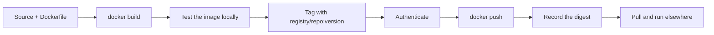

# Image Registries and Publishing

## What You'll Learn

- How registry, repository, tag, and digest fit together in an image name
- How to authenticate without leaking tokens
- A tagging strategy that makes deployments traceable and rollbacks easy
- How to publish from CI, including multi-architecture images
- How to run a local registry, mirror public images, and sign images

## Anatomy of an Image Name

```text
ghcr.io/acme/payment-api:1.4.0
└──┬──┘ └──────┬───────┘ └─┬─┘
registry   repository     tag
```

| Part | Meaning | Default when omitted |
|---|---|---|
| Registry | The server implementing the OCI Distribution API | `docker.io` (Docker Hub) |
| Repository | A named collection of image versions (`namespace/name`) | `library/` for official images |
| Tag | A human-friendly, **movable** version label | `latest` |
| Digest | The content hash of one exact image | — |

So `nginx` really means `docker.io/library/nginx:latest`.

Common registries: Docker Hub, GitHub Container Registry (`ghcr.io`), GitLab Container Registry, Amazon ECR, Google Artifact Registry, Azure Container Registry, and self-hosted Harbor.

## The Publish Workflow



```bash
docker build -t payment-api:dev .
docker run --rm -p 8000:8000 payment-api:dev          # test before publishing

docker tag payment-api:dev ghcr.io/acme/payment-api:1.4.0
docker push ghcr.io/acme/payment-api:1.4.0
# 1.4.0: digest: sha256:3f7a...e91c size: 1789
```

Keep the digest from the push output. It's the exact identity of what you released.

## Authenticating Safely

```bash
# Read the token from a file or environment variable, never type it on the command line
echo "$GHCR_TOKEN" | docker login ghcr.io -u acme-bot --password-stdin
```

- `docker login` stores credentials in `~/.docker/config.json`. Without a **credential helper**, they're only base64-encoded. Configure one (`osxkeychain`, `wincred`, `pass`, or a cloud helper like `docker-credential-ecr-login`) on workstations.
- In CI, prefer short-lived credentials: GitHub Actions' `GITHUB_TOKEN` for GHCR, or OIDC federation to a cloud role for ECR, Artifact Registry, and ACR.
- Use **robot/service accounts** with push rights to specific repositories, not a person's account.
- Authenticate pulls too: Docker Hub rate-limits anonymous pulls per IP address, which breaks CI runners sharing an address.

## Tagging Strategy

| Tag | Example | Mutable? | Use |
|---|---|---|---|
| Semantic version | `1.4.0` | Should be immutable | Releases |
| Git commit SHA | `sha-3f7a2c1` | Immutable | Traceability from image to source |
| Minor / major alias | `1.4`, `1` | Moves to newest patch | Consumers who accept updates |
| Environment | `staging` | Moves | Avoid for deployments — use digests instead |
| `latest` | `latest` | Moves | Local convenience only |

Enable **tag immutability** where the registry supports it (ECR, Harbor, Artifact Registry policies), so `1.4.0` can never be overwritten. Deploy by digest:

```yaml
image: ghcr.io/acme/payment-api:1.4.0@sha256:3f7a...e91c
```

Promote the **same** image through environments by retagging, never by rebuilding:

```bash
docker buildx imagetools create \
  --tag ghcr.io/acme/payment-api:1.4.0 \
  ghcr.io/acme/payment-api:sha-3f7a2c1
```

`imagetools create` copies the manifest inside the registry without pulling layers locally.

## Publishing From CI

```yaml title=".github/workflows/image.yml"
name: Build and publish image
on:
  push:
    tags: ["v*"]

permissions:
  contents: read
  packages: write

jobs:
  image:
    runs-on: ubuntu-latest
    steps:
      - uses: actions/checkout@v5

      - uses: docker/setup-qemu-action@v3
      - uses: docker/setup-buildx-action@v3

      - uses: docker/login-action@v3
        with:
          registry: ghcr.io
          username: ${{ github.actor }}
          password: ${{ secrets.GITHUB_TOKEN }}

      - id: meta
        uses: docker/metadata-action@v5
        with:
          images: ghcr.io/${{ github.repository_owner }}/payment-api
          tags: |
            type=semver,pattern={{version}}
            type=semver,pattern={{major}}.{{minor}}
            type=sha

      - uses: docker/build-push-action@v6
        with:
          context: .
          platforms: linux/amd64,linux/arm64
          push: true
          tags: ${{ steps.meta.outputs.tags }}
          labels: ${{ steps.meta.outputs.labels }}
          cache-from: type=gha
          cache-to: type=gha,mode=max
```

The full pipeline, including tests and deployment, is covered in [GitHub Actions](../jenkins/github-actions.md).

## A Local Registry

Useful for labs, air-gapped environments, and testing registry behavior:

```bash
docker run -d --name registry -p 127.0.0.1:5000:5000 \
  -v registry-data:/var/lib/registry registry:3

docker tag payment-api:dev localhost:5000/payment-api:dev
docker push localhost:5000/payment-api:dev
curl -s http://localhost:5000/v2/_catalog
curl -s http://localhost:5000/v2/payment-api/tags/list
```

`localhost` registries are allowed over plain HTTP. Any other host needs TLS, or it must be listed under `insecure-registries` in `daemon.json` — acceptable only in a closed lab. For production self-hosting, Harbor adds authentication, RBAC, scanning, replication, and retention policies.

## Mirrors and Pull-Through Caches

A mirror caches public images inside your network, avoiding rate limits and outages:

```json title="/etc/docker/daemon.json"
{
  "registry-mirrors": ["https://mirror.internal.example.com"]
}
```

Docker's `registry-mirrors` setting applies to Docker Hub images. Cloud registries (ECR pull-through cache, Artifact Registry remote repositories) and Harbor proxy projects can cache other upstream registries too.

## Signing and Provenance

A signature proves an image came from your pipeline and wasn't altered:

```bash
cosign sign --yes ghcr.io/acme/payment-api@sha256:3f7a...e91c
cosign verify ghcr.io/acme/payment-api@sha256:3f7a...e91c \
  --certificate-identity-regexp 'https://github.com/acme/.*' \
  --certificate-oidc-issuer https://token.actions.githubusercontent.com
```

Always sign a **digest**, not a tag. Enforcing signatures at deploy time is covered in [Image and Supply Chain Security](../kubernetes/security/05-image-and-supply-chain-security.md).

## Retention

Registries fill up. Set lifecycle policies: keep release tags, keep the last N commit-SHA images, delete untagged manifests after a few days — and never delete a digest that's still deployed.

## Common Mistakes

- `docker login -p <token>`, leaving the token in shell history.
- Pushing personal-account credentials into CI.
- Deploying mutable tags (`staging`, `latest`) and not knowing what's running.
- Rebuilding an image for each environment, so production runs a different artifact than the one tested.
- Anonymous Docker Hub pulls from busy CI runners, then intermittent rate-limit failures.
- Signing a tag rather than the digest.

## Check Your Understanding

1. What does `nginx` expand to as a full image reference?
2. Why deploy `image:1.4.0@sha256:...` rather than `image:1.4.0`?
3. How do you promote a tested image to production without rebuilding it?
4. What does a credential helper protect against?

## Next

Continue to [Podman](20-podman.md).
