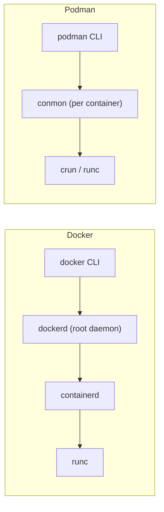

# Podman

## What You'll Learn

- How Podman's architecture differs from Docker Engine
- How rootless containers work, and the UID-mapping and port issues you'll meet
- Pods, and generating or playing Kubernetes YAML
- Running containers as systemd services with Quadlet
- When to choose Podman, Docker, or both

## Architecture: No Central Daemon



- `podman run` forks the container directly, with a small **conmon** process per container to hold its stdio and exit code — similar to containerd's shim.
- There's no long-running root daemon to protect or crash. Each user's containers are that user's processes.
- Podman uses the same OCI images and registries, so images built by Docker run under Podman and vice versa.

## Install and First Run

```bash
sudo apt-get install -y podman          # Ubuntu; `dnf install podman` on Fedora/RHEL
podman version
podman info --format '{{.Host.Security.Rootless}}'    # true for a normal user

podman run -d --name web -p 8080:80 docker.io/library/nginx:stable
podman ps
curl -I http://localhost:8080
podman logs web
podman rm -f web
```

The CLI is intentionally Docker-compatible. Many teams simply `alias docker=podman`.

!!! note "Use fully qualified image names"
    Docker assumes `docker.io` for short names like `nginx`. Podman consults `unqualified-search-registries` in `/etc/containers/registries.conf` and may prompt you to choose. Writing `docker.io/library/nginx:stable` avoids ambiguity — and avoids pulling a lookalike image from an unexpected registry.

## Rootless Containers

Rootless is Podman's default for normal users. "root" inside the container maps to **your** user outside, using a range of subordinate IDs:

```bash
grep "$USER" /etc/subuid /etc/subgid
# alice:100000:65536

podman run --rm docker.io/library/alpine id              # uid=0(root) inside
podman run -d --name sleeper docker.io/library/alpine sleep 600
ps -o user,pid,cmd -C sleep                               # alice ... sleep 600 — your user on the host
podman unshare cat /proc/self/uid_map
#          0       1000          1
#          1     100000      65536
```

If a container escapes, it lands as an unprivileged user, not root.

### Rootless trade-offs

| Issue | Why | Fix |
|---|---|---|
| Can't publish ports below 1024 | Unprivileged users can't bind low ports | Publish a high port behind a proxy, or lower `net.ipv4.ip_unprivileged_port_start` |
| Permission denied on bind mounts | Container UIDs map to subordinate host UIDs | Use `:U` to chown the mount to the container user, or `podman unshare chown` |
| Slower or different networking | User-mode networking (`pasta`) instead of kernel bridges | Usually fine; use rootful Podman for heavy network workloads |
| Containers stop when you log out | User services end with the session | `loginctl enable-linger <user>` |

```bash
mkdir -p data
podman run --rm -v ./data:/data:U docker.io/library/alpine touch /data/ok
ls -ln data     # owned by a mapped subordinate UID
```

## Pods

A **pod** groups containers that share a network namespace (and optionally more), exactly like a Kubernetes Pod:

```bash
podman pod create --name shop -p 8080:80
podman run -d --pod shop --name app docker.io/library/nginx:stable
podman run -d --pod shop --name sidecar docker.io/library/alpine \
  sh -c 'while true; do wget -qO- http://127.0.0.1:80 >/dev/null && echo ok; sleep 10; done'

podman pod ps
podman logs sidecar              # the sidecar reaches nginx on localhost — same network namespace
```

## Kubernetes YAML Both Ways

```bash
podman kube generate shop > shop-pod.yaml      # export the running pod as Kubernetes YAML
podman pod rm -f shop
podman kube play shop-pod.yaml                 # recreate it from YAML
podman kube down shop-pod.yaml
```

Handy for prototyping manifests locally — review the generated YAML before applying it to a real cluster.

## Running Containers as systemd Services: Quadlet

Quadlet turns a small unit file into a systemd service that runs a container, with restart handling and boot integration:

```ini title="~/.config/containers/systemd/web.container"
[Unit]
Description=Nginx web container

[Container]
Image=docker.io/library/nginx:stable
PublishPort=8080:80
Volume=%h/site:/usr/share/nginx/html:ro,Z
AutoUpdate=registry

[Service]
Restart=always

[Install]
WantedBy=default.target
```

```bash
systemctl --user daemon-reload
systemctl --user start web.service
systemctl --user status web.service
journalctl --user -u web.service -f
loginctl enable-linger "$USER"       # keep it running without a login session
```

System-wide units go in `/etc/containers/systemd/` and are managed with `sudo systemctl`. `AutoUpdate=registry` plus `podman auto-update` pulls newer images for the tag and restarts the service.

## Compose With Podman

```bash
systemctl --user enable --now podman.socket
export DOCKER_HOST=unix://$XDG_RUNTIME_DIR/podman/podman.sock
docker compose up -d          # Docker's Compose, talking to Podman's Docker-compatible API
# or: podman compose up -d    # wraps an installed compose provider
```

## Podman vs. Docker

| | Docker Engine | Podman |
|---|---|---|
| Architecture | Root daemon (`dockerd`) + containerd | Daemonless; conmon per container |
| Rootless | Optional mode | Default for users |
| Pods | No | Yes |
| systemd integration | Restart policies inside Docker | Quadlet units managed by systemd |
| Kubernetes YAML | No | `kube generate` / `kube play` |
| Compose | Native `docker compose` | Via the Docker-compatible socket or `podman compose` |
| Desktop app | Docker Desktop | Podman Desktop |
| Typical home | Developer laptops, CI, many servers | RHEL/Fedora servers, security-focused environments |

Choose based on platform support, existing tooling, security requirements, and what your team already operates — both run the same images.

## Common Mistakes

- Short image names resolving to an unexpected registry.
- Expecting rootless containers to bind port 80.
- Chasing bind-mount permission errors without understanding UID mapping.
- Rootless services that die at logout because lingering isn't enabled.
- Assuming a Docker Compose file with Docker-specific features (like `host.docker.internal` on Linux) behaves identically.

## Check Your Understanding

1. What replaces `dockerd` in Podman's architecture?
2. When root inside a rootless container writes a file to a bind mount, who owns it on the host?
3. What does a pod share between its containers?
4. How does Quadlet make a container start at boot?

## Next

Continue to [Kubernetes Container Runtimes](21-kubernetes-runtimes.md).
