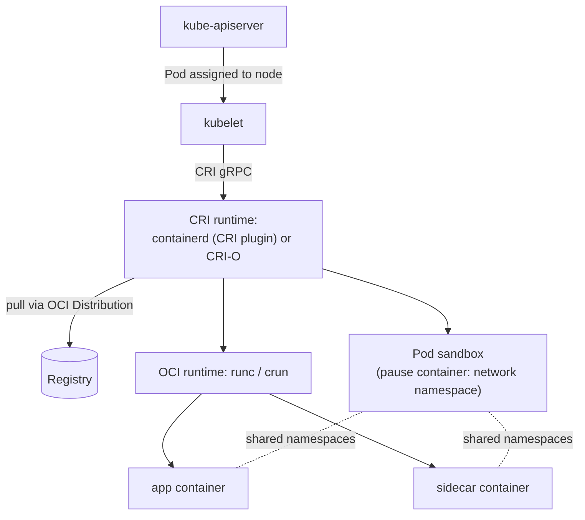

# Kubernetes Container Runtimes

## What You'll Learn

- The path from a Pod spec to a running process on a node
- What the Container Runtime Interface (CRI) is, and which runtimes implement it
- What the removal of dockershim actually changed — and what it didn't
- How to inspect containers on a Kubernetes node with `crictl`
- How RuntimeClass selects gVisor or Kata Containers for specific workloads

## From Pod Spec to Process



1. The scheduler assigns a Pod to a node; the **kubelet** on that node sees it.
2. The kubelet calls the runtime over the **CRI**, a gRPC API: create a pod sandbox, pull images, create and start containers.
3. The runtime creates the **sandbox** — a tiny `pause` container holding the Pod's network namespace — then starts each container joined to it. That's why containers in a Pod share `localhost`.
4. An OCI runtime (`runc` or `crun`) creates each container process, exactly as in [Architecture](08-runc-containerd-and-docker.md).

## The CRI Runtimes

| Runtime | Notes |
|---|---|
| **containerd** | The most common default (EKS, GKE, AKS, kubeadm, kind, k3s). CRI support is a built-in plugin |
| **CRI-O** | Built specifically for Kubernetes; the runtime in OpenShift |
| **cri-dockerd** | An adapter that lets the kubelet use Docker Engine — only for environments that truly need Docker on nodes |

## The dockershim Story

Early Kubernetes talked to Docker Engine directly through built-in code called **dockershim**. Docker Engine doesn't implement the CRI, so dockershim translated. Kubernetes **removed dockershim in v1.24**.

What that changed:

- The kubelet no longer talks to Docker Engine unless you install `cri-dockerd`.
- `docker ps` on a node shows nothing — the containers are managed by containerd or CRI-O.
- Tools that mounted `/var/run/docker.sock` inside Pods (for builds or log collection) stopped working on those nodes.

What it did **not** change:

- **Images built with Docker run exactly as before.** They're OCI images; containerd and CRI-O pull and run them.
- Developers can keep using Docker locally to build, test, and push.

The confusion came from mixing up Docker **Engine** (a daemon and API) with the image **format** (a standard).

## Inspecting a Node With crictl

`crictl` speaks CRI directly, so it works with any CRI runtime:

```bash
# On a node (for kind: docker exec -it kind-control-plane bash)
crictl info | head -20
crictl pods                                  # pod sandboxes
crictl ps                                    # running containers
crictl ps -a --name coredns                  # include exited
crictl images
crictl logs <container-id>
crictl inspect <container-id> | jq '.info.pid'
crictl pull docker.io/library/nginx:stable
```

| Docker habit | On a Kubernetes node |
|---|---|
| `docker ps` | `crictl ps` |
| `docker images` | `crictl images` |
| `docker logs` | `crictl logs` (or `kubectl logs`) |
| `docker exec -it` | `crictl exec -it` (or `kubectl exec` / `kubectl debug`) |
| `docker inspect` | `crictl inspect` |

containerd keeps Kubernetes containers in the `k8s.io` namespace, separate from Docker's `moby` namespace:

```bash
ctr --namespace k8s.io containers list
```

Prefer `kubectl` for day-to-day work; use `crictl` when the kubelet or API server can't give you answers — for example a node that's `NotReady`. See [Cluster and Node Problems](../kubernetes/troubleshooting/04-cluster-and-node-problems.md).

## Node Runtime Configuration

Registry mirrors and private CA trust are configured on the runtime, not in Pods:

```toml title="/etc/containerd/certs.d/docker.io/hosts.toml"
server = "https://registry-1.docker.io"

[host."https://mirror.internal.example.com"]
  capabilities = ["pull", "resolve"]
```

Pull credentials for private registries come from `imagePullSecrets` or the node's cloud identity (for example, an EKS node role reading ECR).

## RuntimeClass: Stronger Isolation per Workload

Standard containers share the node's kernel. For untrusted or multi-tenant code, a sandboxed runtime adds a boundary:

```yaml
apiVersion: node.k8s.io/v1
kind: RuntimeClass
metadata:
  name: gvisor
handler: runsc          # must match a runtime handler configured in containerd
---
apiVersion: v1
kind: Pod
metadata:
  name: untrusted-job
spec:
  runtimeClassName: gvisor
  containers:
    - name: job
      image: registry.example.com/tenant-a/job:2.1.0
```

| Handler | Isolation | Cost |
|---|---|---|
| `runc` (default) | Namespaces + cgroups + seccomp, shared kernel | Lowest overhead |
| `runsc` (gVisor) | System calls handled by a user-space kernel | Some syscall-heavy workloads slow down |
| `kata` (Kata Containers) | Each Pod in a lightweight VM with its own kernel | More memory per Pod, slower start |

## Building Images in Clusters Without Docker

With no Docker socket on nodes, in-cluster builds use daemonless builders: BuildKit (rootless), Buildah, or Kaniko-style tools running as ordinary Pods. Better still, build in CI and deploy the pushed digest — see [CI/CD Pipelines for Kubernetes](../kubernetes/cicd-and-gitops/01-cicd-pipelines-for-kubernetes.md).

## Common Mistakes

- Believing Docker-built images stopped working after Kubernetes 1.24.
- Running `docker ps` on a node to debug Pods and concluding nothing is running.
- Mounting `/var/run/docker.sock` into Pods for builds — it doesn't exist on containerd nodes, and where it does, it's root on the node.
- Using `ctr` to delete containers the kubelet manages.
- Choosing gVisor or Kata cluster-wide without measuring the performance impact.

## Check Your Understanding

1. Which component on a node talks to the container runtime, and over what API?
2. What's the purpose of the `pause` container in a Pod?
3. Why do images built with Docker still run on a containerd-only cluster?
4. When would you set `runtimeClassName` on a Pod?

## Next

Continue to [macOS and Apple Container Technology](22-macos-containers.md).
