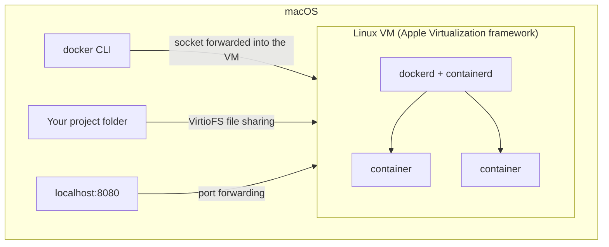
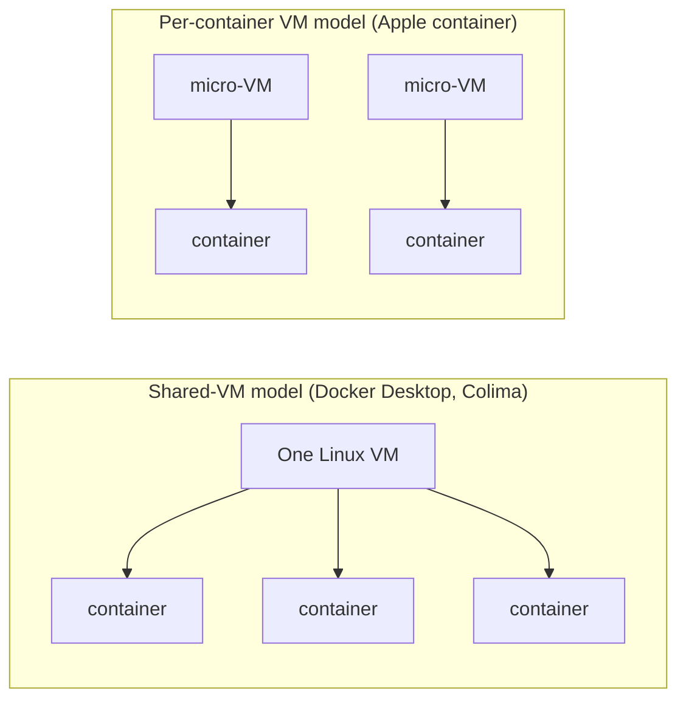

# macOS and Apple Container Technology

## What You'll Learn

- Why every Linux container on a Mac runs inside some kind of virtual machine
- How Docker Desktop is put together, and the performance consequences
- The main alternatives, and how Apple's `container` tool differs architecturally
- How to handle Apple silicon (arm64) vs. amd64 images correctly

## Why a VM Is Always Involved

Linux containers are Linux processes using Linux kernel features — namespaces, cgroups, overlayfs. The macOS kernel (XNU) has none of them. So a Mac runs Linux containers by running a **Linux kernel in a VM** and starting the containers there.



On native Linux, containers share the host kernel directly. On a Mac, they share the **VM's** kernel.

## Docker Desktop on a Mac

Docker Desktop manages the VM for you and wires three things back to macOS:

| Integration | What it does | What to watch |
|---|---|---|
| **Socket forwarding** | The Mac's `docker` CLI talks to `dockerd` inside the VM | `docker context ls` shows `desktop-linux` |
| **File sharing** (VirtioFS) | Bind mounts from your Mac appear inside containers | Slower than native Linux for many small files |
| **Port forwarding** | `-p 8080:80` becomes reachable on the Mac's `localhost` | Published ports are forwarded by Desktop, not native iptables |

The VM has its own CPU, memory, and disk limits (Settings → Resources). A container killed with exit code 137 on a Mac may be hitting the **VM's** memory ceiling, not your Mac's.

### Speeding up file-heavy projects

```yaml
services:
  web:
    build: .
    volumes:
      - ./src:/app/src              # bind mount only the source you edit
      - node_modules:/app/node_modules   # keep dependencies inside a VM volume
volumes:
  node_modules: {}
```

Dependency directories with tens of thousands of files are the usual bottleneck. Named volumes live inside the VM and avoid file-sharing overhead. [Compose watch](18-docker-compose.md#watch-mode-for-development) is another option.

## Apple Silicon and Image Architecture

Apple silicon Macs are **arm64**. Most servers are **amd64**.

```bash
docker run --rm alpine uname -m                              # aarch64
docker run --rm --platform linux/amd64 alpine uname -m       # x86_64, emulated
```

- Pulling a multi-arch image gives you the arm64 variant — fast and native.
- An amd64-only image runs under emulation (Rosetta or QEMU): it works, but can be slow or occasionally fail.
- An image you **build** on a Mac is arm64 by default. Push it to amd64 servers and it fails with `exec format error`.

Build for the target, or for both:

```bash
docker build --platform linux/amd64 -t myapp:1.0 .
docker buildx build --platform linux/amd64,linux/arm64 -t registry.example.com/myapp:1.0 --push .
```

Better still, build release images in CI on the target architecture — see [Dockerfiles](17-dockerfiles.md#multi-platform-builds).

## Alternatives to Docker Desktop

| Tool | Approach | Notes |
|---|---|---|
| **Colima** | Lima-managed VM running containerd or Docker | Open source, CLI-driven, works with the Docker CLI |
| **OrbStack** | Lightweight VM tuned for fast startup and file sharing | Commercial, Docker-compatible |
| **Podman Desktop** / `podman machine` | Podman inside a Fedora CoreOS VM | Rootless-first; see [Podman](20-podman.md) |
| **Rancher Desktop** | VM with containerd (`nerdctl`) or Docker, plus local Kubernetes | Open source |

```bash
brew install colima docker
colima start --cpu 4 --memory 8 --vm-type vz --mount-type virtiofs
docker context use colima
docker run --rm hello-world
```

All of these run Linux containers in a Linux VM. They differ in licensing, resource use, file-sharing performance, and extras such as bundled Kubernetes. Check Docker Desktop's subscription terms for larger organizations before standardizing on it.

## Apple's container Tool

Apple's open-source [`container`](https://github.com/apple/container) tool takes a different approach: instead of one shared VM running many containers, it runs **each Linux container in its own lightweight VM**, built on Apple's Containerization framework and Virtualization.framework. It consumes and produces OCI-compatible images from standard registries.



| | Shared VM | Per-container lightweight VM |
|---|---|---|
| Kernel boundary between containers | No — they share the VM's kernel | Yes — each has its own |
| Idle overhead | One VM always running | Resources per running container |
| Ecosystem | Docker CLI, Compose, extensions | Its own CLI; OCI images |

Getting started:

```bash
container system start
container run --rm docker.io/library/alpine:latest uname -a
container --help
```

Apple documents Apple silicon and a recent macOS release (macOS 26) as requirements, and the project is evolving quickly. Confirm the current [release documentation](https://github.com/apple/container) before relying on specific commands or adopting it for a team. Apple's [Virtualization documentation](https://developer.apple.com/documentation/virtualization/creating-and-running-a-linux-virtual-machine) explains the underlying framework.

## Common Mistakes

- Building on an Apple silicon Mac and deploying the arm64 image to amd64 servers.
- Assuming a performance problem seen through Mac file sharing will exist on Linux servers.
- Debugging OOM kills without checking the VM's memory allocation.
- Expecting host networking (`--network host`) to expose the Mac's interfaces — it's the VM's network.
- Treating Mac development results as proof of Linux production behavior without testing on Linux in CI.

## Check Your Understanding

1. Why can't macOS run Linux containers natively?
2. What three integrations does Docker Desktop provide between the VM and macOS?
3. How do you make sure an image built on an Apple silicon Mac runs on amd64 servers?
4. What's the key architectural difference between Docker Desktop and Apple's `container` tool?

## Next

Continue to [Monoliths and Microservices](23-monoliths-and-microservices.md).
