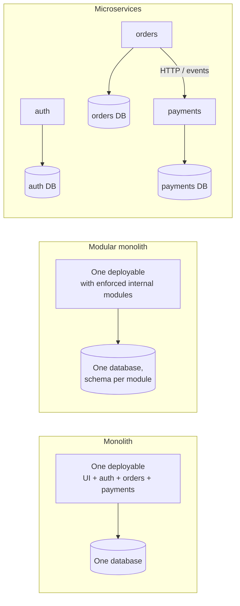
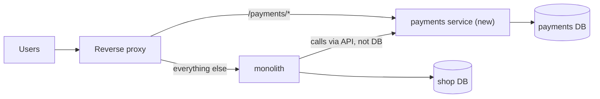

# Monoliths and Microservices

## What You'll Learn

- The real trade-offs between a monolith, a modular monolith, and microservices
- What containers make easier — and the distributed-systems problems they leave untouched
- How to containerize a monolith first, then extract a service safely
- The operational capabilities you need **before** splitting

## Three Shapes



| | Monolith | Modular monolith | Microservices |
|---|---|---|---|
| Deploy | Everything together | Everything together | Each service independently |
| Scale | Whole app | Whole app | Per service |
| Calls between parts | In-process function calls | In-process, through module interfaces | Network calls that can fail or be slow |
| Data | Shared database | Shared database, separated schemas | A database per service |
| Debugging | One stack trace | One stack trace | Distributed tracing across services |
| Team fit | One team or a few | Several teams with clear module owners | Many teams owning services end to end |

A monolith isn't a mistake. For most new products, a well-structured monolith ships faster and fails in simpler ways.

## What Containers Actually Change

Containers make it cheap to **package** and **run** many independently versioned processes, each with its own dependencies. That removes a big practical barrier to microservices: you no longer need a server, runtime install, and deployment script per service.

They don't solve any of these:

| Problem | Why it appears with microservices |
|---|---|
| **Partial failure** | A dependency can be down, slow, or return errors while everything else is fine |
| **Latency** | A page that made 20 function calls now makes 20 network calls |
| **Data consistency** | No single transaction spans the orders and payments databases |
| **Service discovery and routing** | Services must find each other as instances come and go |
| **Versioning** | API changes must stay compatible with callers deployed on different schedules |
| **Observability** | One request's story is spread across many services' logs |
| **Security** | Service-to-service authentication and authorization, network policy |
| **Operational load** | Many pipelines, dashboards, alerts, and on-call responsibilities |

## Start by Containerizing the Monolith

Before splitting anything, get the monolith into a container with the practices from this course: a reproducible [Dockerfile](17-dockerfiles.md), configuration from the environment, logs to stdout, a health endpoint, and persistent data in [volumes](15-storage.md) or a managed database.

```yaml title="compose.yaml"
services:
  shop:
    image: registry.example.com/shop/monolith:3.12.0
    environment:
      DATABASE_URL: postgresql://shop:${DB_PASSWORD}@db:5432/shop
    ports: ["127.0.0.1:8000:8000"]
    depends_on:
      db: { condition: service_healthy }
  db:
    image: postgres:16
    environment: { POSTGRES_USER: shop, POSTGRES_PASSWORD: "${DB_PASSWORD}" }
    volumes: [db-data:/var/lib/postgresql/data]
    healthcheck: { test: ["CMD-SHELL", "pg_isready -U shop"], interval: 5s, retries: 10 }
volumes:
  db-data: {}
```

You get repeatable deployments, horizontal scaling (several identical replicas behind a load balancer), and a foundation for everything else — without taking on distributed-system complexity yet.

## Extract a Service With the Strangler Fig Pattern

When one part has a genuinely different need — for example, payment processing needs PCI isolation and a separate release cadence — extract it **gradually** behind the existing entry point:



1. **Define the boundary** inside the monolith first: payments code only reached through one interface.
2. **Build the new service** implementing that interface, with its own data store.
3. **Route a slice of traffic** at the proxy (one endpoint, or a percentage) to the new service.
4. **Move data ownership**: migrate payments data; the monolith stops touching those tables.
5. **Delete the old code** from the monolith once traffic has fully moved.

The proxy routing is the same technique as the [Caddy lab](14-caddy-web-app-lab.md).

## Design for Partial Failure

Network calls need explicit handling that function calls never did:

- **Timeouts** on every outbound call — never wait forever.
- **Retries with backoff and jitter**, only for idempotent operations.
- **Circuit breakers** to stop hammering a failing dependency.
- **Idempotency keys** so a retried "charge card" request doesn't charge twice.
- **Asynchronous events** (a message queue) for work that doesn't need an immediate answer.
- **Graceful degradation**: the product page still renders if recommendations are down.

## Readiness Checklist Before Splitting

- [ ] Automated CI/CD per deployable, with rollback
- [ ] Centralized logs with a request or trace ID across services
- [ ] Metrics and alerting per service
- [ ] Distributed tracing (OpenTelemetry)
- [ ] A way to run the services together locally or in a shared environment
- [ ] Clear team ownership and on-call for each service
- [ ] Service discovery and a routing layer (Compose networks locally; Kubernetes Services and Gateway API in clusters)

If most boxes are empty, a modular monolith is the safer next step.

## Common Mistakes

- Splitting by technical layer ("database service", "UI service") instead of business capability.
- A "distributed monolith": separate services that must all be deployed together and share one database.
- Adopting microservices because containers make it possible, without a team or scaling reason.
- Synchronous call chains five services deep, where one slow service stalls everything.
- Extracting services before having tracing and centralized logging.

## Check Your Understanding

1. Name three problems microservices introduce that containers don't solve.
2. Why is containerizing the monolith first a useful step?
3. What does the strangler fig pattern route, and where?
4. What makes a system a "distributed monolith"?

## Next

Continue to [Troubleshooting Like a DevOps Engineer](24-production-troubleshooting.md).
