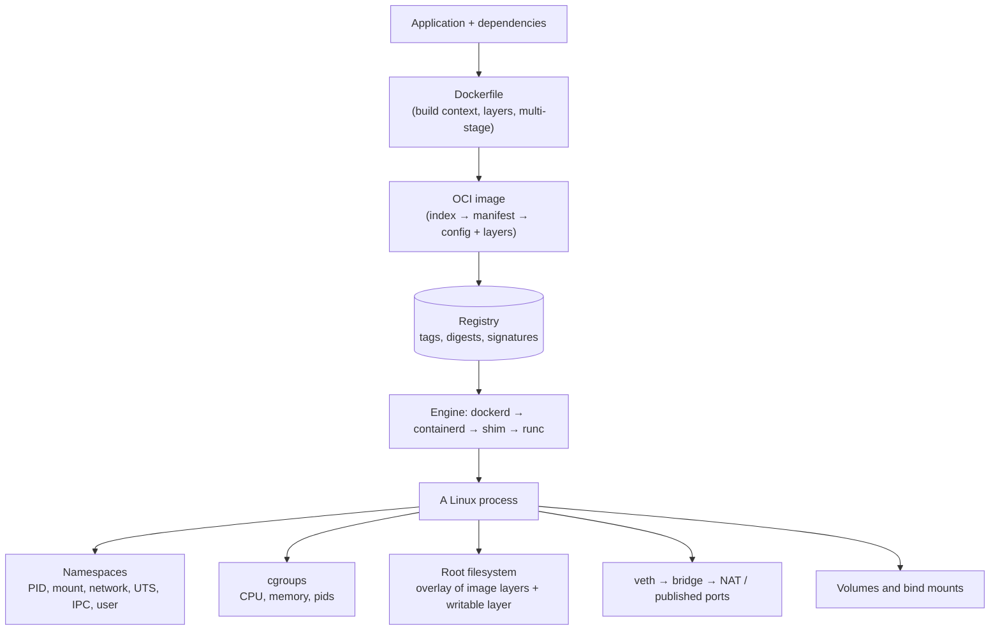

# Course Wrap-Up

You started before containers existed and finished debugging production failures. This page ties the pieces together, gives you a capstone project to prove the skills, and points to what to learn next.

## The Whole Mental Model

If you can explain each arrow — what creates it, what can go wrong, and which command shows it — you understand containers, not just Docker commands.

## What Each Part Gave You

| Part | Key idea | Where it pays off |
|---|---|---|
| I — Why containers exist | Dependency conflicts and environment drift are the real problem | Explaining *why* to teams and managers |
| II — Containers without Docker | A container is a process with namespaces, cgroups, and a root filesystem | Debugging anything below the Docker CLI |
| III — Docker workflows | Images, networks, volumes, and Compose are automation of Part II | Daily development and single-host deployments |
| IV — Beyond Docker | Standards (OCI, CRI) let tools and platforms interoperate | Podman, Kubernetes, macOS, architecture decisions |

## Where the Abstractions Stop

- A container **shares a kernel** — it's not a VM, and not a complete security boundary.
- An image is **not** a running service, and a tag is **not** an identity.
- A published port is **not** a network design: TLS, authentication, and firewalls are still yours.
- A volume is **not** a backup until you've restored it.
- Docker does **not** make a distributed system simple.

## Capstone Project

Build and operate a small, production-shaped application. Use any language; the example below uses the Python API from [Dockerfiles](17-dockerfiles.md) and the layout from the [Caddy lab](14-caddy-web-app-lab.md).

**Scope:** an API with a PostgreSQL database, behind Caddy, run with Compose, published from CI, and deployed to a Kubernetes lab.

### Acceptance checklist

**Image**

- [ ] Multi-stage Dockerfile; final image runs as a non-root numeric user
- [ ] `.dockerignore` excludes `.git`, `.env`, and dependency folders
- [ ] Exec-form `CMD`, graceful shutdown on `SIGTERM` verified with `docker stop`
- [ ] `HEALTHCHECK` defined and reports healthy
- [ ] Image scanned; no critical vulnerabilities, or each is documented
- [ ] Built for `linux/amd64` and `linux/arm64`

**Runtime**

- [ ] Compose file with health-based `depends_on`
- [ ] Database on an `internal` network, unreachable from the proxy and host
- [ ] Only the proxy publishes ports
- [ ] Database password delivered as a Compose secret, not a plain environment variable
- [ ] Memory and CPU limits set from measured usage
- [ ] Log rotation configured on the host

**Data**

- [ ] Database in a named volume
- [ ] `pg_dump` backup scripted
- [ ] Restore tested into a fresh container, with a row count check

**Delivery**

- [ ] CI builds, tests, scans, and pushes on a version tag
- [ ] Images tagged with version and commit SHA; deployment references a digest
- [ ] Image signed; signature verified before deploy

**Operations**

- [ ] Runbook with the evidence-capture commands from [Troubleshooting](24-production-troubleshooting.md)
- [ ] Deliberately break three things (wrong bind address, OOM, missing volume permission) and diagnose each from evidence alone

**Kubernetes**

- [ ] The **same image digest** deployed to a [kind](../kubernetes/labs/02-kind-lab.md) or [minikube](../kubernetes/labs/01-minikube-lab.md) cluster
- [ ] Liveness and readiness probes mapped from the health check
- [ ] Explain which Docker concepts became Pods, Services, Secrets, and PersistentVolumeClaims

## Self-Assessment

Answer without looking back:

1. Walk through everything that happens between `docker run -p 8080:80 nginx` and a browser receiving a page.
2. A container exits with 137. List three possible causes and the evidence that distinguishes them.
3. Why does an image built on a laptop sometimes fail with `exec format error` on a server?
4. What's the difference between `CMD` and `ENTRYPOINT`, and why does exec form matter for signals?
5. How does rootless Podman change what "root inside the container" means?
6. Why do Docker-built images still run on Kubernetes nodes without Docker Engine?

If any answer is shaky, revisit that chapter from the [course index](index.md).

## Where to Go Next

| If you want to... | Continue with |
|---|---|
| Run containers across many machines | [Kubernetes Getting Started](../kubernetes/getting-started/index.md) |
| Automate builds and deployments | [CI/CD Pipelines](../cicd/index.md) |
| Secure the image supply chain | [Image and Supply Chain Security](../kubernetes/security/05-image-and-supply-chain-security.md) |
| Observe containerized apps | [Monitoring](../monitoring-tools/index.md) |
| Configure the hosts containers run on | [Ansible](../ansible/index.md) |
| Look up a command quickly | [Docker Quick Reference](docker.md) |

Understanding the layers is what turns commands into engineering decisions.
