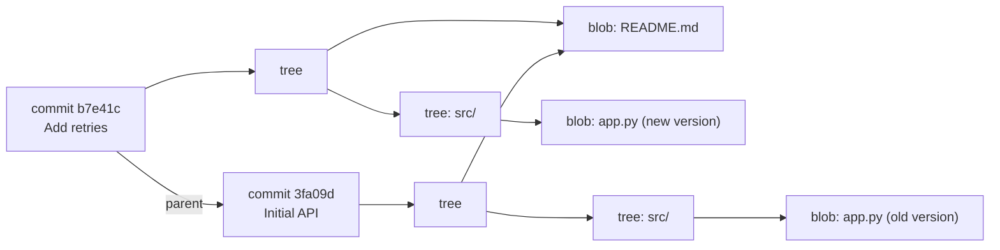
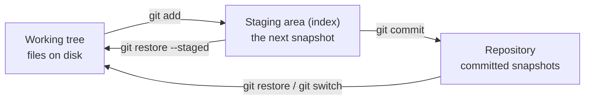
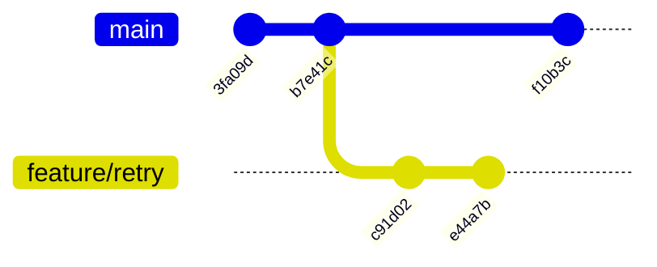

# How Git Works

## What You'll Learn

- How Git stores your project as content-addressed objects
- Why a commit is a snapshot, not a diff
- What the working tree, staging area, and repository each hold
- Why branches are cheap, what `HEAD` points to, and how remotes fit in

## Mental Model

> Git is a database of immutable **snapshots** linked into a graph. **Branches** are movable name tags on that graph. `HEAD` says which tag you're standing on. Almost every Git command either adds snapshots or moves tags.

Once this clicks, "dangerous" commands like `reset` and `rebase` become understandable: they move tags and create new snapshots, and the old snapshots are still there for a while.

## The Object Database

Everything Git stores lives in `.git/objects`, named by a hash of its content.

| Object | Stores | Points to |
|---|---|---|
| **blob** | The contents of one file (no name, no permissions) | Nothing |
| **tree** | A directory listing: names, modes, and the hashes of blobs and subtrees | Blobs and trees |
| **commit** | Author, committer, message, timestamp | One tree (the snapshot) and zero or more parent commits |
| **tag** (annotated) | A named, optionally signed, pointer with a message | Usually a commit |



Unchanged files are shared between snapshots — `README.md` is stored once. That's why snapshots are cheap.

### See it yourself

```bash
mkdir git-internals && cd git-internals && git init -q
echo "hello" > greeting.txt
git add greeting.txt
git commit -qm "Add greeting"

git cat-file -p HEAD                  # the commit object
```

```text
tree 6d0cf2a3c1b56a1c3a0f4a0d0c7f3f3c5c0a4a2e
author Priya Shah <priya@example.com> 1757840400 +0000
committer Priya Shah <priya@example.com> 1757840400 +0000

Add greeting
```

```bash
git cat-file -p 'HEAD^{tree}'         # the tree: one blob named greeting.txt
git cat-file -p HEAD:greeting.txt     # the blob: hello
```

Because an object's name is the hash of its content, changing anything — a file, a message, a parent — produces a different hash. That's what makes history tamper-evident, and why rewriting one old commit changes every commit after it.

## Three Places Your Changes Live



| Area | Holds | Inspect with |
|---|---|---|
| Working tree | Files as you're editing them | `git status`, `git diff` |
| Staging area | Exactly what the next commit will contain | `git diff --staged` |
| Repository | Every commit | `git log` |

The staging area lets you commit **part** of your changes:

```bash
git add -p app.py        # stage selected hunks interactively
git commit -m "Add request timeout"
# the rest of your edits stay uncommitted
```

## Branches Are Pointers

A branch is a file containing one commit hash:

```bash
$ cat .git/refs/heads/main
b7e41c9a0f6d2e8c3b1a4f5d6e7c8b9a0d1e2f3a
```

Creating a branch writes a new 41-byte file. Committing on a branch moves that pointer to the new commit.



- `main` points to `f10b3c`.
- `feature/retry` points to `e44a7b`.
- Both share history up to `b7e41c`, their **merge base**.

## HEAD

`HEAD` is a pointer to what you have checked out — normally a **branch**, not a commit:

```bash
$ cat .git/HEAD
ref: refs/heads/feature/retry
```

When you commit, Git writes the commit, then moves the branch `HEAD` points to.

### Detached HEAD

If you check out a commit or tag directly, `HEAD` points at a commit instead of a branch:

```bash
git switch --detach v2.3.0
```

You can look around and even commit, but no branch moves with you. When you switch away, those commits aren't on any branch. Keep them by creating one:

```bash
git switch -c hotfix/from-v2.3.0
```

## Remotes and Remote-Tracking Branches

A remote is another copy of the repository, usually named `origin`.

```bash
git remote -v
git branch -a
```

```text
* feature/retry
  main
  remotes/origin/main
  remotes/origin/feature/retry
```

`origin/main` is your **local record** of where `main` was on the remote the last time you talked to it. It only updates when you `fetch` (or `pull`).

| Command | Does |
|---|---|
| `git fetch` | Download new commits and update `origin/*`. Never touches your branches or files. |
| `git pull` | `fetch`, then merge or rebase `origin/<branch>` into your current branch |
| `git push` | Upload your commits and move the branch on the remote |

Fetching is always safe, so `git fetch` followed by a look at `git log origin/main` is a good habit before changing anything.

## Tags

```bash
git tag -a v2.4.0 -m "Release 2.4.0"   # annotated: author, date, message; can be signed
git push origin v2.4.0
```

A tag is a pointer that doesn't move. Use annotated tags for releases, and never move a published release tag — CI systems, caches, and people depend on it meaning one exact commit.

## Common Mistakes

- Thinking of commits as diffs, and being confused when a rebase "changes every commit hash".
- Believing `git fetch` changes your working files, or that `origin/main` updates itself.
- Committing in detached `HEAD` state and losing track of the work when switching branches.
- Staging everything with `git add .` and committing unrelated changes, secrets, or build output together.
- Moving or deleting published tags that pipelines and deployments reference.

## Interview Questions

- What are the four types of Git objects, and how do they relate?
- What is a branch in Git, physically?
- What does `HEAD` point to, and what is a detached `HEAD`?
- What's the difference between `main` and `origin/main`?
- Why does rewriting an old commit change the hashes of every later commit?

## Next

Continue to [Everyday Workflow](02-everyday-workflow.md).
