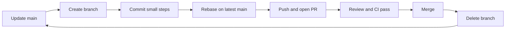
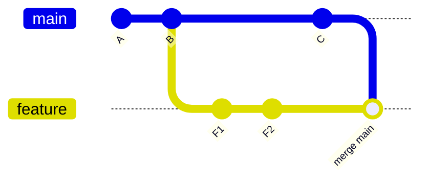

# Everyday Workflow

## What You'll Learn

- A Git configuration that avoids common daily annoyances
- The feature-branch loop from a fresh branch to a merged pull request
- When to rebase and when to merge, and how to resolve conflicts
- How to push safely, including after rewriting your own branch

## Configure Git Once

```bash
git config --global user.name "Priya Shah"
git config --global user.email "priya@example.com"

git config --global init.defaultBranch main
git config --global pull.rebase true          # pull rebases your local commits instead of creating merge commits
git config --global rebase.autoStash true     # stash and restore uncommitted changes around a rebase
git config --global push.autoSetupRemote true # first push of a new branch sets its upstream automatically
git config --global fetch.prune true          # remove origin/* branches deleted on the remote
git config --global rerere.enabled true       # remember how you resolved a conflict and reuse it
git config --global diff.algorithm histogram  # more readable diffs

# Helpful aliases
git config --global alias.lg "log --oneline --graph --decorate"
git config --global alias.st "status -sb"
```

```bash
git config --global --list --show-origin      # see every setting and where it came from
```

## The Feature-Branch Loop



### 1. Start from an up-to-date main

```bash
git switch main
git pull
git switch -c feature/order-retries
```

Name branches by type and purpose: `feature/…`, `fix/…`, `chore/…`, or include a ticket ID such as `fix/OPS-142-disk-alert`.

### 2. Commit small, meaningful steps

```bash
git status
git diff
git add -p                      # review and stage hunk by hunk
git commit -m "Retry order submission on 503 with exponential backoff"
```

A good commit does one thing, builds and passes tests, and has a message that explains **why**. See [commit message conventions](05-collaboration-and-repository-hygiene.md#commit-messages).

### 3. Keep up with main

```bash
git fetch
git rebase origin/main
```

### 4. Push and open a pull request

```bash
git push                        # push.autoSetupRemote sets the upstream on first push
gh pr create --fill             # GitHub CLI: title and body from your commits
```

### 5. After merge, clean up

```bash
git switch main
git pull
git branch -d feature/order-retries      # -d refuses if it isn't merged, which is a useful safety check
```

If your team squash-merges, `git branch -d` may say the branch isn't merged, because the squash commit has a different hash. Confirm it's in `main`, then use `-D`.

## Rebase or Merge?

Both integrate changes from `main` into your branch. They record history differently.



**Merge** keeps both lines of history and adds a merge commit. **Rebase** replays `F1` and `F2` on top of `C` as new commits `F1'` and `F2'`, producing a straight line.

| | `git merge origin/main` | `git rebase origin/main` |
|---|---|---|
| History | Preserves exactly what happened | Linear and easier to read |
| Commit hashes | Unchanged | Your branch's commits are rewritten |
| Conflicts | Resolved once, in the merge commit | Possibly once per replayed commit (`rerere` helps) |
| Safe on shared branches | Yes | No — only on branches only you use |

The practical rule:

- **Rebase your own, unpublished-or-personal feature branches** to keep them current and tidy.
- **Never rebase a branch others have based work on**, such as `main` or a shared release branch.

### Clean up before review

Squash fixups and reword messages before asking for review:

```bash
git commit --fixup=<sha-of-commit-to-fix>     # record a fix for an earlier commit
git rebase -i --autosquash origin/main        # fold fixups into their targets
```

In the interactive list, change `pick` to `reword`, `squash`, `fixup`, or `drop`, or reorder lines.

## Resolving Conflicts

```bash
git rebase origin/main
# CONFLICT (content): Merge conflict in src/orders/client.py
git status
```

```python
<<<<<<< HEAD
TIMEOUT_SECONDS = 10
=======
TIMEOUT_SECONDS = 5
MAX_RETRIES = 3
>>>>>>> 3c1e9a2 (Retry order submission on 503)
```

During a rebase, `HEAD` (the top section) is the branch you're rebasing **onto** — `main` — and the bottom is your commit being replayed. It's the opposite of a merge, which confuses everyone at least once.

```bash
# Edit the file to the correct combined result, then:
git add src/orders/client.py
git rebase --continue

# Or back out completely and try again later
git rebase --abort
```

Use a merge tool if you prefer (`git mergetool`), and always run the tests after resolving — a conflict-free rebase can still produce code that doesn't work.

## Pushing Safely

After a rebase, your branch's history no longer matches the remote, so a normal push is rejected. Use:

```bash
git push --force-with-lease
```

`--force-with-lease` overwrites the remote branch **only if it's still where you last saw it**. If a teammate pushed to your branch in the meantime, it refuses instead of silently deleting their work. Plain `--force` never checks.

!!! warning "Never force-push shared branches"
    Protect `main` and release branches so force-pushes are blocked for everyone. See [rulesets and branch protection](05-collaboration-and-repository-hygiene.md#protect-important-branches).

## Seeing History

```bash
git lg -20                                  # graph of recent commits
git log --oneline main..feature/order-retries   # commits on the branch not yet in main
git log -p -- src/orders/client.py          # history of one file with diffs
git log -S "MAX_RETRIES" --oneline          # commits that added or removed this string
git blame -w -C src/orders/client.py        # who last changed each line, ignoring whitespace and moves
git show <sha>                              # one commit in full
```

## Common Mistakes

- Working directly on `main`, then struggling to separate your changes from teammates' work.
- Long-lived feature branches that drift for weeks and turn integration into a painful conflict marathon.
- `git push --force` instead of `--force-with-lease`, deleting someone else's commits.
- Rebasing a shared branch and forcing everyone else to repair their local copies.
- Resolving conflicts and committing without running tests.
- Committing with `git commit -am "wip"` and pushing a history nobody can review.

## Interview Questions

- What's the difference between `git merge` and `git rebase`? When would you use each?
- Why is `--force-with-lease` safer than `--force`?
- During a rebase conflict, which side is `HEAD`?
- What does `git pull` do, exactly, and how does `pull.rebase` change it?
- How do you list the commits on your branch that aren't in `main` yet?

## Next

Continue to [Branching Strategies](03-branching-strategies.md).
