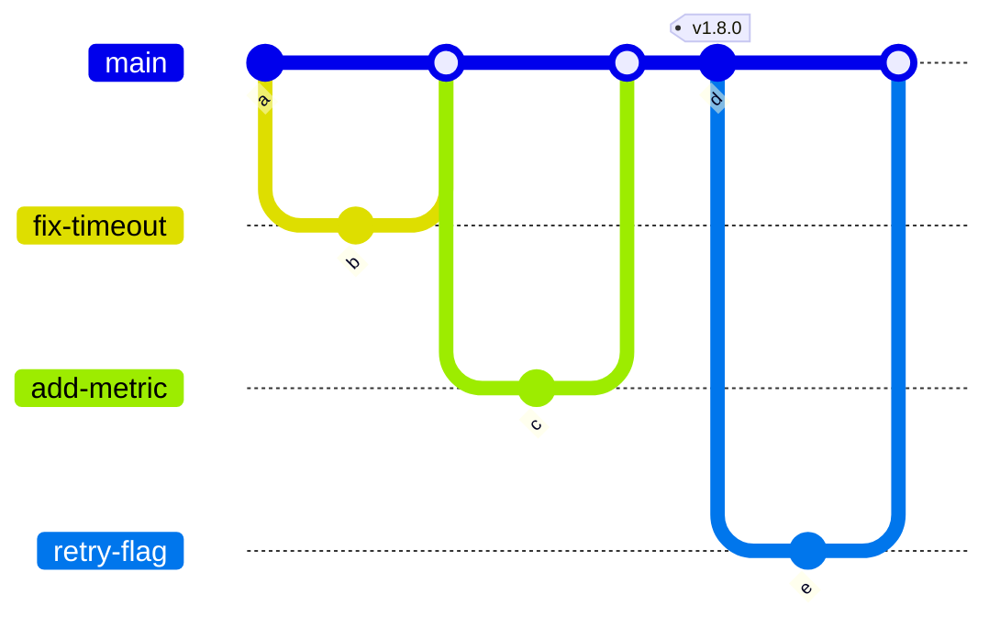
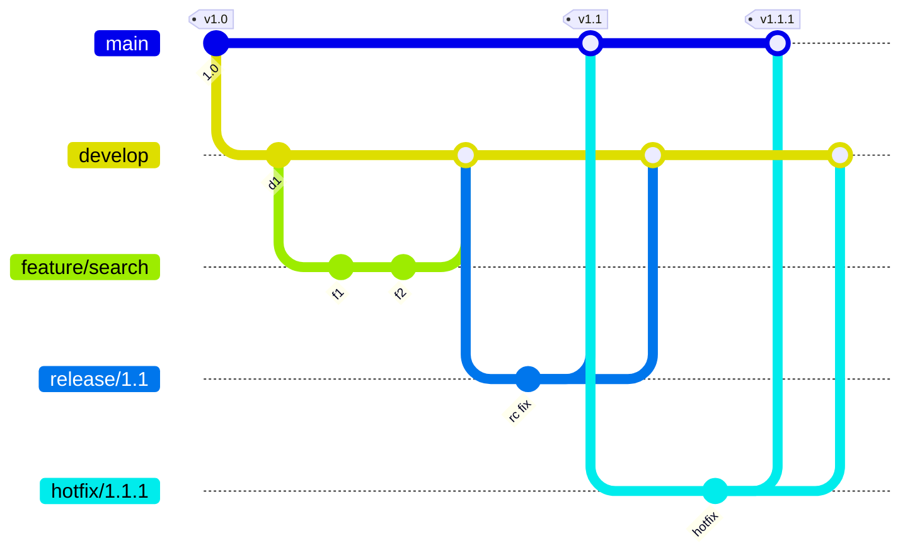

# Branching Strategies

## What You'll Learn

- How trunk-based development, GitHub flow, GitFlow, and release branches work
- How to choose a strategy based on how you deliver software
- How merge commits, squash merges, and rebase merges affect history
- Why feature flags make short-lived branches possible, and how GitOps repositories are laid out

## Why the Strategy Matters

A branching strategy decides how long changes live apart before they're integrated. The longer branches live, the bigger and riskier every merge becomes. Research on software delivery performance, including the DORA reports, consistently associates short-lived branches and frequent integration with higher delivery performance.

## Trunk-Based Development

Everyone integrates into one main branch (the trunk) at least daily. Branches, if used, live for hours to a day or two.



- `main` is always releasable, protected by CI.
- Unfinished features are merged behind **feature flags**, not held back on branches.
- Releases are tags on `main`, or deploys of every commit.

**Best for:** continuous delivery, web services, teams with solid automated tests.

## GitHub Flow

A lightweight version of the same idea:

1. Branch from `main`.
2. Commit and push.
3. Open a pull request; CI runs; reviewers approve.
4. Merge to `main`.
5. Deploy `main`.

It's trunk-based development with pull requests as the integration step, and it's the default for most teams on GitHub and GitLab.

## GitFlow

A structured model with long-lived branches:



| Branch | Lifetime | Purpose |
|---|---|---|
| `main` | Permanent | Released code only |
| `develop` | Permanent | Integration of finished features |
| `feature/*` | Days to weeks | One feature |
| `release/*` | Until release | Stabilization and version bumps |
| `hotfix/*` | Hours | Urgent fixes to production, merged to both `main` and `develop` |

GitFlow fits software shipped in versioned releases on a schedule — desktop apps, on-premises products, libraries. For continuously deployed services, it adds overhead and delays integration; even its original author has since recommended simpler workflows for web applications delivered continuously.

## Release Branches

When you must support several versions at once (for example `2.x` and `3.x` of a library or product), keep trunk-based development on `main` and cut **release branches** for maintenance:

```bash
git switch -c release/2.4 v2.4.0
# Fix on main first, then bring the fix back to the release branch
git switch release/2.4
git cherry-pick -x 9f3c2d1          # -x records the original commit in the message
git tag -a v2.4.1 -m "Release 2.4.1"
```

Fixing on `main` first and cherry-picking **back** ensures the fix isn't lost in the next major version.

## Choosing a Strategy

| Your situation | Choose |
|---|---|
| Web services deployed many times a day with good automated tests | Trunk-based development or GitHub flow |
| A small team starting out | GitHub flow |
| Versioned releases customers install, several supported versions | Trunk-based with release branches |
| Scheduled releases with a formal stabilization phase | GitFlow, knowing it slows integration |
| Regulated environments needing approvals per environment | GitHub flow plus deployment environments and approvals in CI/CD, not per-environment branches |

## Merge Methods

Pull requests can be merged three ways:

| Method | Result on `main` | Keep when |
|---|---|---|
| **Merge commit** | All branch commits plus a merge commit | Individual commits matter and are well curated |
| **Squash merge** | One commit per pull request | Branch commits are noisy; you want one revertible unit per change |
| **Rebase merge** | Branch commits replayed linearly, no merge commit | Commits are curated and you want linear history |

Many teams allow **squash only**: one pull request becomes one commit, `git revert` undoes a whole change, and `git log` on `main` reads like a changelog. The pull request title becomes the commit message, so write good titles.

## Feature Flags

Short-lived branches need a way to merge incomplete work safely:

```python
if flags.is_enabled("order-retries", user=current_user):
    submit_with_retries(order)
else:
    submit(order)
```

- Code is merged and deployed dark, then **released** by flipping the flag — for internal users first, then a percentage, then everyone.
- A bad feature is turned off in seconds without a rollback.
- Remove flags after launch. Stale flags become permanent branches in your code.

## Branches and Environments in GitOps

A common mistake is one Git branch per environment (`dev`, `staging`, `prod`), promoted by merging between them. Branches drift, merges carry unrelated changes, and it's hard to see what differs between environments.

Prefer **one branch, one folder per environment**:

```text
platform-config/
├── base/
│   ├── deployment.yaml
│   └── kustomization.yaml
└── overlays/
    ├── dev/
    │   └── kustomization.yaml       # image tag abc1234, 1 replica
    ├── staging/
    │   └── kustomization.yaml       # image tag abc1234, 2 replicas
    └── prod/
        └── kustomization.yaml       # image tag 9e8d7c6, 6 replicas
```

Promotion is a pull request that changes the image tag in the next environment's folder — reviewable, auditable, and trivially revertible. See [GitOps with ArgoCD and Flux](../../kubernetes/cicd-and-gitops/04-gitops-with-argocd-and-flux.md).

## Common Mistakes

- Adopting GitFlow for a continuously deployed web service and wondering why integration is painful.
- Feature branches that live for weeks because there's no feature-flag mechanism.
- One long-lived branch per environment, merged forward, with environments silently diverging.
- Fixing a bug on a release branch and forgetting to fix `main`.
- Allowing every merge method, so `main`'s history is an unreadable mix.

## Interview Questions

- Compare trunk-based development and GitFlow. When would you choose each?
- How do feature flags enable trunk-based development?
- What are the trade-offs between squash merges and merge commits?
- How would you structure branches for a product that supports versions 2.x and 3.x?
- Why is a branch per environment an anti-pattern for GitOps, and what do you use instead?

## Next

Continue to [Undo and Recovery](04-undo-and-recovery.md).
