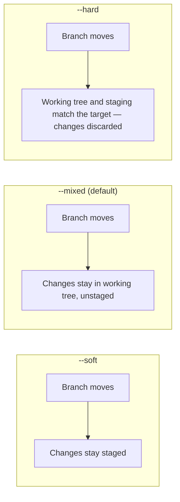

# Undo and Recovery

## What You'll Learn

- Which undo command to use for each situation, and which ones rewrite history
- The difference between `reset` and `revert`, and why it matters once you've pushed
- How to recover commits you think you've lost, using the reflog
- How to move commits with `cherry-pick`, park work with `stash`, and find bugs with `bisect`

## The Golden Rule

> **Rewrite only history nobody else has.** Before pushing, you can amend, reset, and rebase freely. After others may have pulled a commit, undo it by **adding** a new commit with `git revert`.

## Pick the Right Command

| Situation | Command | Rewrites history? |
|---|---|---|
| Discard uncommitted edits to a file | `git restore file` | No (but the edits are gone) |
| Unstage a file, keep the edits | `git restore --staged file` | No |
| Change the last commit's message or add a forgotten file | `git commit --amend` | Yes — last commit |
| Undo the last commit, keep its changes staged | `git reset --soft HEAD~1` | Yes |
| Undo the last commit, keep changes unstaged | `git reset HEAD~1` | Yes |
| Throw away the last commit and its changes | `git reset --hard HEAD~1` | Yes — changes gone from the working tree |
| Undo a commit that's already pushed and shared | `git revert <sha>` | No — adds a new commit |
| Bring one commit to another branch | `git cherry-pick <sha>` | No |
| Get back something you "lost" | `git reflog` | No |

## Working Tree and Staging

```bash
git restore src/app.py                 # discard unstaged edits to one file
git restore .                          # discard all unstaged edits (careful)
git restore --staged src/app.py        # unstage, keep edits
git restore --source=HEAD~3 src/app.py # bring back the file as it was three commits ago
git clean -nd                          # preview untracked files that would be deleted
git clean -fd                          # delete them
```

`git restore` and `git clean -f` delete work that was never committed, and Git can't recover it. Always preview with `git clean -n`.

## Amend the Last Commit

```bash
git add forgotten_test.py
git commit --amend --no-edit           # add to the previous commit, keep its message
git commit --amend -m "Better message" # change the message
```

If you already pushed the commit to your own feature branch, follow up with `git push --force-with-lease`.

## Reset: Move the Branch Pointer

`git reset <commit>` moves the current branch to `<commit>`. The mode decides what happens to the changes from the commits you moved past:



```bash
# Squash the last three local commits into one
git reset --soft HEAD~3
git commit -m "Add order retries with backoff and metrics"

# Make local main match the remote exactly, discarding local commits
git fetch
git reset --hard origin/main
```

## Revert: Undo by Adding a Commit

```bash
git revert 9f3c2d1                     # new commit that reverses 9f3c2d1
git revert --no-edit HEAD~2..HEAD      # revert the last two commits, one revert commit each
git push
```

Reverting a **merge commit** needs to know which parent is the mainline:

```bash
git revert -m 1 <merge-sha>            # keep parent 1 (main), undo what the merged branch brought in
```

!!! note "Reverting a revert"
    If you revert a merged feature and later want it back, **revert the revert** commit. Merging the original branch again does nothing, because Git considers its commits already merged.

On a squash-merge workflow, each pull request is one commit, so `git revert <sha>` cleanly undoes one whole change — often the fastest production rollback.

## The Reflog: Git's Safety Net

Every time a branch or `HEAD` moves — commit, reset, rebase, checkout — Git records it in the **reflog**. Commits you "lost" are usually still there.

```bash
$ git reflog
e44a7b1 (HEAD -> feature/retry) HEAD@{0}: reset: moving to HEAD~2
91c0d3e HEAD@{1}: commit: Add retry metrics
7ab21f4 HEAD@{2}: commit: Retry on 503
b7e41c9 HEAD@{3}: checkout: moving from main to feature/retry
```

### Recover after a bad `reset --hard`

```bash
git reset --hard HEAD@{1}              # move back to where you were before the reset
# or keep the recovered work on a new branch
git branch recovered 91c0d3e
```

### Recover a deleted branch

```bash
git reflog | grep 'feature/search'     # find the last commit it pointed to
git branch feature/search <sha>
```

### Recover after a rebase went wrong

```bash
git reflog                             # find the entry before "rebase (start)"
git reset --hard HEAD@{5}
```

Reflog entries are local to your clone and expire (by default, reachable entries after 90 days and unreachable ones after 30). Recover promptly, and remember that a teammate's reflog can't rescue your work.

## Cherry-Pick

Copy a commit onto the current branch as a new commit:

```bash
git switch release/2.4
git cherry-pick -x 9f3c2d1             # -x appends "(cherry picked from commit ...)"
git cherry-pick -x a1b2c3d..f6e5d4c    # a range (excludes the first commit)
git cherry-pick --abort                # if conflicts get out of hand
```

Use it for backporting fixes. If you cherry-pick often between long-lived branches, that's a sign your branching strategy needs attention.

## Stash

Park uncommitted work to switch context:

```bash
git stash push -m "half-done retry config"
git stash push --include-untracked -m "with new files"
git stash list
git stash show -p stash@{0}
git stash pop                          # reapply and drop
git stash apply stash@{1}              # reapply and keep
git stash drop stash@{1}
```

Stashes are easy to forget. For anything that lasts longer than a few minutes, commit to a branch instead.

## Bisect: Find the Commit That Broke It

Binary search through history. With 1,000 commits between good and bad, it takes about 10 steps.

```bash
git bisect start
git bisect bad                          # the current commit is broken
git bisect good v2.3.0                  # this release worked
# Git checks out a commit halfway; test it, then mark it:
git bisect good    # or: git bisect bad
# ...repeat until Git prints "<sha> is the first bad commit"
git bisect reset
```

Automate it with a script that exits `0` for good and non-zero for bad:

```bash
git bisect start HEAD v2.3.0
git bisect run ./scripts/test-checkout-flow.sh
git bisect reset
```

## Worktrees: Two Branches at Once

Instead of stashing to review a hotfix, check out another branch in a separate directory:

```bash
git worktree add ../app-hotfix hotfix/payment-timeout
cd ../app-hotfix
# ...work, test, commit, push...
cd - && git worktree remove ../app-hotfix
```

## Common Mistakes

- `git reset --hard` on a branch others have pulled, then force-pushing — use `git revert` instead.
- Running `git clean -fd` or `git restore .` without previewing, and deleting uncommitted work permanently.
- Panicking after a bad rebase instead of checking `git reflog`.
- Re-merging a branch after reverting it, and being surprised nothing comes back.
- Leaving important work in a stash for weeks.
- Cherry-picking fixes to a release branch but never to `main`.

## Interview Questions

- What's the difference between `git reset` and `git revert`? When must you use `revert`?
- Explain `--soft`, `--mixed`, and `--hard` for `git reset`.
- You ran `git reset --hard` and lost two commits. How do you get them back?
- How do you undo a merge commit that's already on `main`?
- How would you find which of the last 500 commits introduced a bug?

## Next

Continue to [Collaboration and Repository Hygiene](05-collaboration-and-repository-hygiene.md).
