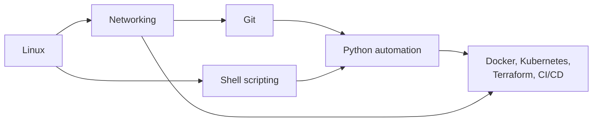

# DevOps Foundations

Docker, Kubernetes, Terraform, and CI/CD all sit on the same four skills. A container is a Linux process. A Service is a network address and a DNS name. A pipeline starts with a Git push. And the glue between tools is usually a script. When those foundations are solid, every tool on top becomes easier to learn and much easier to debug.

## What You'll Learn

- How to operate and troubleshoot Linux servers with confidence
- How traffic actually moves — IP, TCP, DNS, HTTP, TLS, and load balancers
- How Git works internally, and how teams branch, review, and recover
- How to write Python automation that is safe to run unattended

## The Four Tracks

| Track | Why it matters | Start |
|---|---|---|
| **Linux for DevOps** | Every server, container, and CI runner is Linux. Permissions, processes, systemd, disks, and performance are daily work. | [Linux](linux/index.md) |
| **Networking** | Most production incidents involve DNS, TLS, timeouts, or a load balancer. | [Networking](networking/index.md) |
| **Git and Branching** | Git is the interface to CI/CD and GitOps. Recovery skills prevent lost work. | [Git](git/index.md) |
| **Python Automation** | When a shell script outgrows itself, Python handles APIs, data, and error handling cleanly. | [Python](python/index.md) |

## Suggested Order

You don't need to finish everything before moving on. A good rule: complete **Linux** and **Networking** before the [Docker course](../docker/index.md), and **Git** before [CI/CD Pipelines](../cicd/index.md).

## How to Practice

- **Use a disposable Linux machine.** A local VM (Multipass, UTM, VirtualBox), a WSL2 distribution, or a small cloud instance you can delete. Ubuntu 24.04 LTS matches the examples.
- **Break things on purpose.** Fill a disk, kill a process, misconfigure DNS — then fix it with the tools each chapter teaches.
- **Write down what changed and why.** Your notes become your runbooks.

!!! warning "Practice safely"
    Commands that change users, firewalls, disks, or SSH settings can lock you out or destroy data. Run them on a machine you can rebuild, and keep a second session open when editing SSH or firewall rules.

## Related Sections

- [Shell Scripting](shell-scripting/index.md) — turn the commands from these chapters into safe, reusable scripts
- [SRE Practices](../sre/index.md) — the reliability practices these skills support
- [Security](../security/index.md) — secrets, supply chain, and hardening beyond the basics

## Further Reading

- [Linux man-pages online](https://man7.org/linux/man-pages/)
- [Pro Git book](https://git-scm.com/book/en/v2)
- [IETF RFC index](https://www.rfc-editor.org/) — the specifications behind TCP/IP, DNS, HTTP, and TLS

## Next

Start with [Linux for DevOps](linux/index.md).
