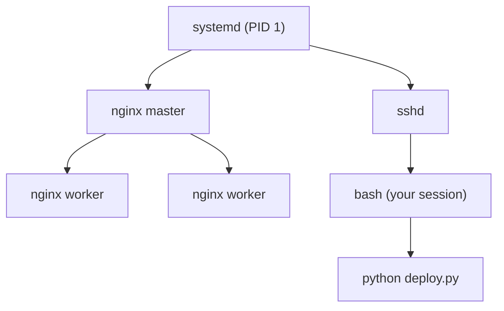

# Processes and Signals

## What You'll Learn

- What a process is, how processes are created, and what each process state means
- How to inspect processes with `ps`, `pgrep`, and `/proc`
- How signals work, and why graceful shutdown depends on handling `SIGTERM`
- How to deal with zombies, stuck processes, priorities, open files, and limits

## Mental Model

> A process is a running program with its own memory, open files, environment, and a numeric **PID**. Every process except PID 1 has a **parent**. The kernel schedules processes, delivers **signals** to them, and records their exit status for the parent to collect.



New processes are created by `fork()` (copy the parent) and usually `exec()` (replace the copy with a new program). That's why a child inherits its parent's environment variables, working directory, and open file descriptors.

## Inspecting Processes

```bash
ps aux --sort=-%cpu | head               # top CPU consumers
ps -eo pid,ppid,user,stat,%mem,etime,cmd --forest | less   # tree with elapsed time
pgrep -a nginx                           # PIDs and command lines by name
pstree -p $(pgrep -o nginx)              # tree under the oldest nginx
top -o %MEM                              # interactive, sorted by memory
```

### Process states

The `STAT` column tells you what a process is doing:

| State | Meaning | What to think |
|---|---|---|
| `R` | Running or runnable | Using or waiting for CPU |
| `S` | Interruptible sleep | Waiting for an event — normal for idle services |
| `D` | Uninterruptible sleep | Waiting on I/O, usually disk or NFS; can't be killed until the I/O returns |
| `T` | Stopped | Paused by a signal or debugger |
| `Z` | Zombie | Exited, but the parent hasn't collected its exit status |

Many processes stuck in `D` point at storage or network filesystem problems, and they push up the load average without using CPU.

## `/proc`: The Live View

Every process has a directory at `/proc/<pid>`:

```bash
PID=$(pgrep -o nginx)
cat /proc/$PID/cmdline | tr '\0' ' '; echo   # exact command line
sudo cat /proc/$PID/environ | tr '\0' '\n'   # environment it started with
sudo ls -l /proc/$PID/cwd                    # working directory
sudo ls -l /proc/$PID/fd | wc -l             # number of open file descriptors
cat /proc/$PID/limits                        # effective resource limits
grep -E 'VmRSS|Threads' /proc/$PID/status    # resident memory and threads
```

This is invaluable when a service behaves differently from your shell: its environment and limits are often not what you expect.

## Signals

A signal is an asynchronous notification to a process.

| Signal | Number | Default action | Typical use |
|---|---|---|---|
| `SIGTERM` | 15 | Terminate | Polite shutdown request — the default for `kill`, `systemctl stop`, and `docker stop` |
| `SIGINT` | 2 | Terminate | Ctrl+C in a terminal |
| `SIGHUP` | 1 | Terminate | Many daemons reload configuration on it |
| `SIGKILL` | 9 | Terminate, can't be caught | Last resort |
| `SIGSTOP` / `SIGCONT` | 19 / 18 | Pause / resume | Freeze a runaway process while you investigate |
| `SIGUSR1`, `SIGUSR2` | 10, 12 | Terminate | Application-defined, such as reopening log files |

```bash
kill <pid>                    # SIGTERM
kill -HUP $(pgrep -o nginx)   # ask nginx to reload
pkill -f 'python worker.py'   # match against the full command line
kill -9 <pid>                 # only after SIGTERM and a wait
```

### Why `SIGTERM` first

`SIGKILL` stops a process instantly: no flushing buffers, no finishing in-flight requests, no removing lock files. Well-behaved services catch `SIGTERM`, stop accepting new work, finish what's in progress, and exit. Kubernetes and Docker rely on exactly this — they send `SIGTERM`, wait for a grace period, then send `SIGKILL`.

```python title="graceful.py"
import signal, sys, time

running = True

def handle_term(signum, frame):
    global running
    print("SIGTERM received, finishing current job...", flush=True)
    running = False

signal.signal(signal.SIGTERM, handle_term)

while running:
    time.sleep(1)          # do one unit of work

print("clean exit", flush=True)
sys.exit(0)
```

!!! note "Shell wrappers swallow signals"
    If a container or unit runs `sh -c "python app.py"`, the signal goes to `sh`, which may not forward it. Use `exec python app.py` in wrapper scripts so the application replaces the shell and receives signals directly.

## Zombies and Orphans

- A **zombie** has exited and holds only a process-table entry until its parent calls `wait()`. You can't kill a zombie — it's already dead. Fix or restart the **parent**.
- An **orphan** is a running process whose parent exited. It's re-parented to PID 1 (or a subreaper), which reaps it later.

```bash
ps -eo pid,ppid,stat,cmd | awk '$3 ~ /^Z/'   # list zombies with their parent PID
```

A handful of zombies is harmless. Thousands mean a buggy parent that never reaps children, and can eventually exhaust the PID limit.

## Priorities: `nice` and `ionice`

```bash
nice -n 10 tar czf /backup/etc.tgz /etc        # start with lower CPU priority
renice -n 15 -p <pid>                           # lower an existing process
ionice -c 3 -p <pid>                            # idle I/O class: only when the disk is free
```

Nice values range from `-20` (highest priority) to `19` (lowest). Lowering priority for backups and batch jobs keeps them from starving user-facing services.

## Open Files and Limits

```bash
sudo lsof -p <pid> | wc -l                    # files and sockets a process holds
sudo lsof -i :8080                            # who has port 8080 open
sudo lsof +L1                                 # deleted files still held open (see the storage chapter)
ulimit -n                                     # your shell's open-file limit
```

"Too many open files" means the process hit its `nofile` limit. Raise it for the **service**, not your shell — with `LimitNOFILE=` in the systemd unit — and also check for descriptor leaks.

## Tracing a Stuck Process

```bash
sudo strace -f -p <pid> -e trace=network,file   # which syscalls it's making or blocked on
sudo cat /proc/<pid>/stack                      # kernel stack for a process in D state
sudo cat /proc/<pid>/wchan; echo                # the kernel function it's waiting in
```

`strace` slows the traced process considerably. Attach briefly on production systems.

## Common Mistakes

- Reaching for `kill -9` first, and corrupting data or leaving stale lock and PID files behind.
- Trying to kill zombies instead of fixing or restarting their parent.
- Running an application through `sh -c` in a container so it never receives `SIGTERM`, and every shutdown waits for the grace period and then kills it.
- Raising `ulimit -n` in a shell and expecting a systemd service to inherit it.
- Assuming a high load average means high CPU usage, when processes are actually stuck in `D` state waiting on I/O.

## Interview Questions

- What's the difference between `SIGTERM` and `SIGKILL`, and why does it matter for deployments?
- What is a zombie process, and how do you get rid of one?
- A process is in state `D` and ignores `kill -9`. Why, and what do you investigate?
- How do you find which process is listening on port 443?
- Why might a service see different environment variables or limits than your login shell?

## Next

Continue to [systemd and journald](03-systemd-and-journald.md).
