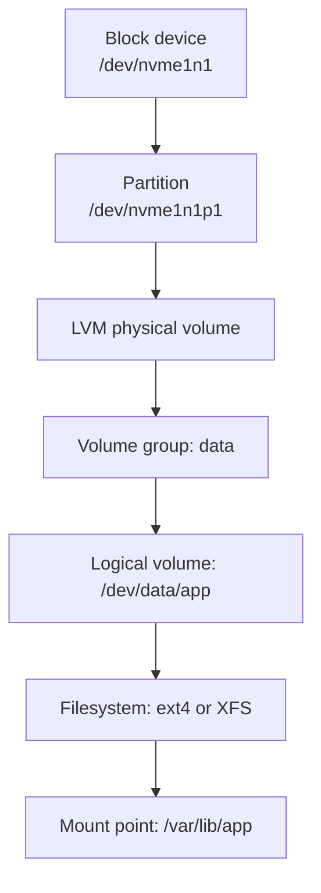

# Storage, Disks, and LVM

## What You'll Learn

- How block devices, partitions, filesystems, and mounts fit together
- How to add a disk and mount it persistently and safely
- How LVM makes volumes flexible, and how to grow a cloud disk without downtime
- How to diagnose and fix "No space left on device", including inode exhaustion and deleted files

## Mental Model



LVM is optional — you can put a filesystem straight on a partition or a whole disk — but each layer adds a capability: partitions divide a disk, LVM lets volumes span and grow across disks, and the filesystem organizes files.

## See What You Have

```bash
lsblk -f                      # devices, partitions, filesystems, UUIDs, mount points
df -hT                        # mounted filesystems: size, used, type
df -i                         # inode usage
findmnt /var/lib/docker       # which filesystem a path lives on, and its options
sudo blkid                    # UUIDs and filesystem types
```

On cloud instances, NVMe device names (`nvme0n1`, `nvme1n1`) can change order between boots. That's why mounts should use UUIDs, never device names.

## Add and Mount a New Disk

```bash
# 1. Identify the new, empty disk
lsblk

# 2. Create a filesystem (whole disk, no partition, for a simple data volume)
sudo mkfs.xfs -L appdata /dev/nvme1n1        # or: sudo mkfs.ext4 -L appdata /dev/nvme1n1

# 3. Mount it
sudo mkdir -p /var/lib/app
sudo mount /dev/nvme1n1 /var/lib/app

# 4. Make it persistent by UUID
UUID=$(sudo blkid -s UUID -o value /dev/nvme1n1)
echo "UUID=$UUID  /var/lib/app  xfs  defaults,nofail  0  2" | sudo tee -a /etc/fstab

# 5. Test fstab BEFORE rebooting
sudo umount /var/lib/app
sudo mount -a && findmnt /var/lib/app
```

`nofail` lets the machine boot even if this volume is missing. Without it, a detached data disk can drop a cloud instance into emergency mode with no SSH access.

### ext4 or XFS?

| | ext4 | XFS |
|---|---|---|
| Default on | Ubuntu, Debian | RHEL, Rocky, Amazon Linux |
| Grow online | Yes (`resize2fs`) | Yes (`xfs_growfs`) |
| Shrink | Yes (offline) | No |
| Strength | Flexible, familiar | Large files, parallel I/O |

## LVM

```bash
sudo apt install -y lvm2

# Build: physical volume → volume group → logical volume
sudo pvcreate /dev/nvme2n1
sudo vgcreate data /dev/nvme2n1
sudo lvcreate -n app -L 50G data
sudo mkfs.ext4 /dev/data/app

# Inspect
sudo pvs; sudo vgs; sudo lvs

# Add another disk to the group and grow the volume and filesystem in one step
sudo pvcreate /dev/nvme3n1
sudo vgextend data /dev/nvme3n1
sudo lvextend -r -L +100G /dev/data/app      # -r resizes the filesystem too
```

LVM snapshots (`lvcreate -s`) give a point-in-time copy for a quick backup or a safe upgrade, but they slow writes while they exist. Remove them promptly.

## Grow a Cloud Disk Without Downtime

After increasing the volume size in the cloud console, API, or Terraform:

```bash
lsblk                                   # the disk shows the new size; the partition doesn't yet

# Root disk with a partition: grow the partition, then the filesystem
sudo growpart /dev/nvme0n1 1            # from cloud-guest-utils
sudo resize2fs /dev/nvme0n1p1           # ext4
# or
sudo xfs_growfs /                       # XFS takes the mount point

df -h /
```

For a whole-disk filesystem with no partition, skip `growpart`. For LVM, run `pvresize /dev/nvme1n1` and then `lvextend -r -l +100%FREE`.

## "No Space Left on Device"

Work through these in order:

```bash
# 1. Which filesystem is full?
df -hT

# 2. What's big on it? (-x stays on one filesystem)
sudo du -xh --max-depth=1 /var | sort -h | tail
sudo find /var -xdev -type f -size +500M -exec ls -lh {} + 2>/dev/null

# 3. Is it inodes rather than bytes?
df -i
sudo find /var -xdev -type d -exec sh -c 'echo "$(ls -A "$1" | wc -l) $1"' _ {} \; 2>/dev/null | sort -n | tail

# 4. Deleted files still held open by a process
sudo lsof +L1
```

### The deleted-but-open trap

If someone deletes a 20 GB log file that a process still has open, `du` stops counting it but `df` still shows the space as used — the blocks aren't freed until the file is closed.

```bash
sudo lsof +L1 | grep deleted
# nginx  1203  www-data  5w  REG  259,1  21474836480  0  /var/log/nginx/access.log (deleted)

# Fix: restart or signal the process to reopen its logs
sudo systemctl reload nginx
# Emergency without a restart: truncate through the process's file descriptor
sudo truncate -s 0 /proc/1203/fd/5
```

### Usual suspects

| Location | Cause | Fix |
|---|---|---|
| `/var/log` | Unrotated application logs | `logrotate` with `copytruncate` or a reload, size limits |
| `/var/log/journal` | No journald size limit | `SystemMaxUse=` in `journald.conf` |
| `/var/lib/docker` | Old images, stopped containers, build cache | `docker system df`, `docker system prune` |
| `/var/cache/apt` | Package cache | `sudo apt clean` |
| `/tmp` | Abandoned temporary files | Find the job creating them |

To avoid the incident entirely, put `/var/lib/docker` and application data on separate volumes, and alert when any filesystem passes 80%.

## Common Mistakes

- Using `/dev/nvme1n1` in `/etc/fstab` instead of a UUID, then booting with devices in a different order.
- Adding an fstab entry without `nofail` and without testing `mount -a`, leaving the instance unbootable.
- Deleting a large log file instead of truncating it or reloading the writer, so the space never comes back.
- Only checking `df -h` and missing inode exhaustion from millions of tiny files.
- Growing the cloud volume but forgetting to grow the partition and filesystem.
- Formatting the wrong disk — always confirm with `lsblk -f` that the target has no filesystem.

## Interview Questions

- `df` says a filesystem is full, but `du` finds only half the space used. What's going on?
- How do you add a data disk so it survives reboots and device renaming?
- Walk through growing the root filesystem of a cloud VM without downtime.
- What problem does LVM solve, and when would you not bother with it?
- What causes "No space left on device" when `df -h` shows free space?

## Next

Continue to [Users, sudo, and SSH Hardening](05-users-sudo-and-ssh-hardening.md).
