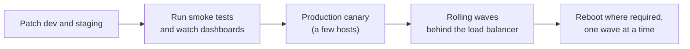

# Packages and Patching

## What You'll Learn

- How apt and dnf work, and the commands you'll use daily
- How to add third-party repositories safely with signed keys
- How to pin or hold versions that must not change unexpectedly
- How to automate security updates and handle reboots across a fleet

## apt and dnf Side by Side

| Task | Debian / Ubuntu (apt) | RHEL / Rocky / Fedora (dnf) |
|---|---|---|
| Refresh metadata | `sudo apt update` | `sudo dnf makecache` |
| Install | `sudo apt install -y nginx` | `sudo dnf install -y nginx` |
| Upgrade everything | `sudo apt upgrade` | `sudo dnf upgrade` |
| Security updates only | `sudo unattended-upgrade` | `sudo dnf upgrade --security` |
| Remove | `sudo apt remove nginx` | `sudo dnf remove nginx` |
| Search | `apt search nginx` | `dnf search nginx` |
| Installed version | `apt policy nginx` | `dnf info --installed nginx` |
| Which package owns a file? | `dpkg -S /usr/sbin/nginx` | `rpm -qf /usr/sbin/nginx` |
| Files in a package | `dpkg -L nginx` | `rpm -ql nginx` |
| Change history | `/var/log/apt/history.log` | `dnf history` |

## Add a Third-Party Repository Safely

Modern apt uses a keyring per repository with `signed-by`, so a key only vouches for its own repository. The old `apt-key add` trusted every key for every repository and is deprecated.

```bash
# Example: the official Docker repository on Ubuntu
sudo install -m 0755 -d /etc/apt/keyrings
sudo curl -fsSL https://download.docker.com/linux/ubuntu/gpg -o /etc/apt/keyrings/docker.asc
sudo chmod a+r /etc/apt/keyrings/docker.asc

cat <<EOF | sudo tee /etc/apt/sources.list.d/docker.sources
Types: deb
URIs: https://download.docker.com/linux/ubuntu
Suites: $(. /etc/os-release && echo "$VERSION_CODENAME")
Components: stable
Signed-By: /etc/apt/keyrings/docker.asc
EOF

sudo apt update
```

Every repository you add can ship code that runs as root during installation. Add only vendors you trust, over HTTPS, with a pinned key.

## Pin and Hold Versions

Some packages — Kubernetes components, database servers, kernel drivers — must upgrade only when you plan it.

```bash
# apt: hold at the installed version
sudo apt-mark hold kubelet kubeadm kubectl
apt-mark showhold
sudo apt-mark unhold kubelet kubeadm kubectl

# apt: install a specific version
apt list -a postgresql-16
sudo apt install postgresql-16=16.10-1.pgdg24.04+1

# dnf: version lock
sudo dnf install -y 'dnf-command(versionlock)'
sudo dnf versionlock add kubelet kubeadm kubectl
sudo dnf versionlock list
```

## Automatic Security Updates

### Ubuntu: unattended-upgrades

```bash
sudo apt install -y unattended-upgrades
sudo dpkg-reconfigure -plow unattended-upgrades
```

```text title="/etc/apt/apt.conf.d/52unattended-upgrades-local"
// Only security updates
Unattended-Upgrade::Allowed-Origins {
    "${distro_id}:${distro_codename}-security";
};
Unattended-Upgrade::Package-Blacklist {
    "kubelet"; "kubeadm"; "postgresql-16";
};
Unattended-Upgrade::Remove-Unused-Dependencies "true";
Unattended-Upgrade::Automatic-Reboot "false";   // reboot deliberately, see below
```

```bash
sudo unattended-upgrade --dry-run --debug | tail
cat /var/log/unattended-upgrades/unattended-upgrades.log
```

### RHEL family: dnf-automatic

```bash
sudo dnf install -y dnf-automatic
sudo sed -i 's/^upgrade_type = .*/upgrade_type = security/; s/^apply_updates = .*/apply_updates = yes/' /etc/dnf/automatic.conf
sudo systemctl enable --now dnf-automatic.timer
```

## Know When a Reboot or Restart Is Needed

Updated libraries don't affect processes already running with the old version loaded, and a new kernel does nothing until you reboot.

```bash
# Ubuntu
[ -f /var/run/reboot-required ] && cat /var/run/reboot-required.pkgs
sudo needrestart -r l          # list services still using outdated libraries

# RHEL family
sudo dnf needs-restarting -r   # exit code 1 means a reboot is needed
sudo dnf needs-restarting -s   # services to restart
```

## A Safe Fleet Patching Process

Automatic security updates keep single servers current. For fleets, patch in waves:



- Drain each host from the load balancer (or cordon and drain Kubernetes nodes) before rebooting.
- Keep enough capacity that one wave can be offline.
- Automate the waves with [Ansible's `serial` keyword](../../ansible/advanced-execution/01-forks-serial-strategy-throttle.md) and stop the rollout if health checks fail.
- In the cloud, prefer **replacing** instances with a freshly built, patched image over patching long-lived servers in place.

## Common Mistakes

- Running `apt upgrade` on production at 3 p.m. on a Friday with no rollback plan.
- Using `apt-key add` or `curl | sudo bash` installers from unverified sources.
- Letting automatic updates upgrade Kubernetes, database, or driver packages that need coordinated upgrades — hold them.
- Installing security updates but never rebooting or restarting services, so the vulnerable code keeps running.
- Enabling automatic reboots on every server at the same time, taking a whole cluster down together.
- Mixing distribution packages with `pip install` or `npm -g` as root into system paths.

## Interview Questions

- How do you add a third-party apt repository securely, and why was `apt-key` deprecated?
- A critical OpenSSL vulnerability is announced. Walk through patching 300 servers.
- How do you know whether a server needs a reboot after updates?
- How do you stop automatic updates from upgrading `kubelet`?
- Why might you replace instances instead of patching them in place?

## Next

Continue to [Performance Troubleshooting](07-performance-troubleshooting.md).
