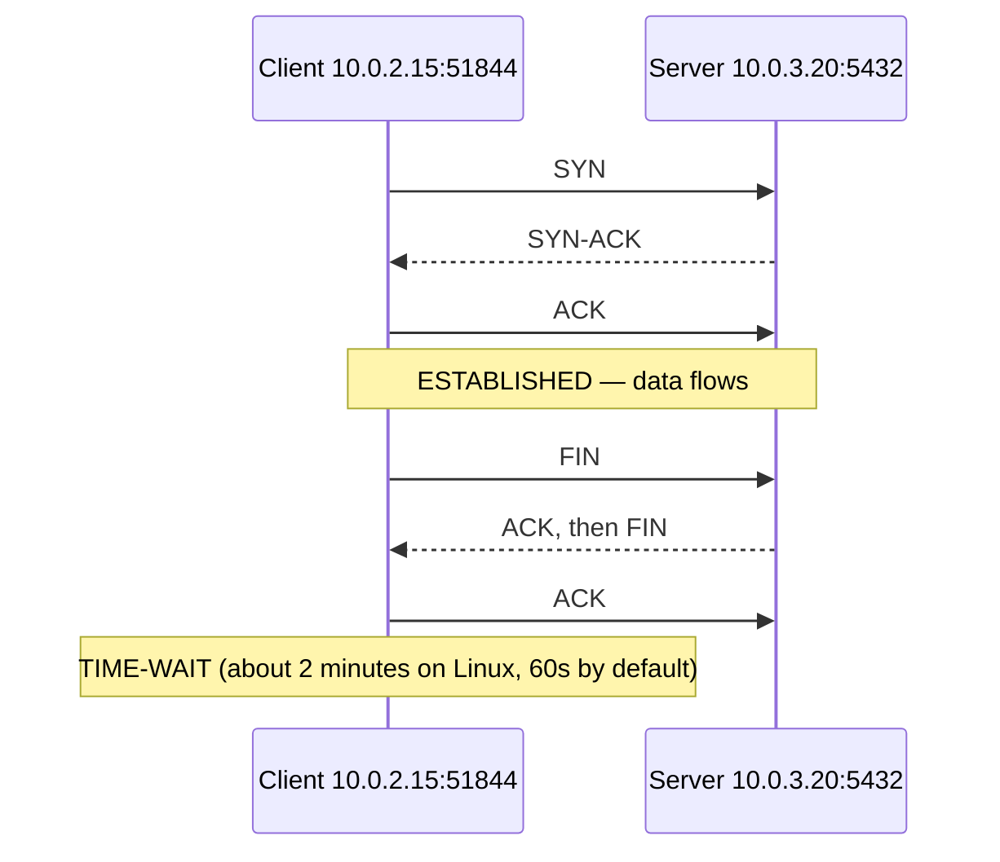

# TCP/IP, Ports, and Sockets

## What You'll Learn

- How IPv4 addresses and CIDR blocks work, and how to size subnets
- How a Linux host decides where to send a packet, and what NAT changes
- How TCP connections open, close, and linger — and when UDP is used instead
- How ports, sockets, ephemeral ports, and MTU cause real production problems

## The Layers That Matter

| Layer | What it does | Examples | You debug it with |
|---|---|---|---|
| Application (7) | The protocol your software speaks | HTTP, DNS, SSH, PostgreSQL | `curl`, `dig`, application logs |
| Transport (4) | Connections and ports between processes | TCP, UDP, QUIC | `ss`, `nc`, `tcpdump` |
| Network (3) | Addressing and routing between networks | IPv4, IPv6, ICMP | `ip route`, `ping`, `mtr` |
| Link (2) | Delivery on the local network | Ethernet, ARP, VLANs | `ip link`, `ip neigh` |

"Layer 4" and "Layer 7" load balancers take their names from this model.

## IP Addresses and CIDR

An IPv4 address is 32 bits, written as four octets: `10.0.2.15`. A CIDR suffix says how many leading bits are the **network**; the rest identify hosts.

| CIDR | Addresses | Typical use |
|---|---|---|
| `/32` | 1 | A single host in a firewall rule |
| `/28` | 16 | A small subnet |
| `/24` | 256 | A common subnet size |
| `/20` | 4,096 | A larger subnet, such as for Kubernetes pods |
| `/16` | 65,536 | A whole VPC |

In a traditional subnet, the first address (network) and last (broadcast) aren't usable by hosts. AWS reserves five addresses in every subnet, so a `/24` gives 251 usable IPs.

### Private address ranges

| Range | CIDR | Notes |
|---|---|---|
| `10.0.0.0` – `10.255.255.255` | `10.0.0.0/8` | Most VPCs and data centers |
| `172.16.0.0` – `172.31.255.255` | `172.16.0.0/12` | Docker's default bridge uses part of this |
| `192.168.0.0` – `192.168.255.255` | `192.168.0.0/16` | Home and office networks |
| `100.64.0.0` – `100.127.255.255` | `100.64.0.0/10` | Carrier-grade NAT; sometimes used for extra pod IPs |

Plan ranges so they never overlap across VPCs, offices, and VPNs you might connect later. Overlapping CIDRs can't be routed to each other without NAT.

```bash
ipcalc 10.0.16.0/20        # network, broadcast, host range (sudo apt install ipcalc)
ip -4 addr show            # addresses on this host
```

## Routing

Every host has a routing table. For each packet, the kernel picks the most specific matching route.

```bash
$ ip route
default via 10.0.0.1 dev eth0 proto dhcp src 10.0.2.15 metric 100
10.0.0.0/16 dev eth0 proto kernel scope link src 10.0.2.15
172.17.0.0/16 dev docker0 proto kernel scope link src 172.17.0.1

$ ip route get 8.8.8.8
8.8.8.8 via 10.0.0.1 dev eth0 src 10.0.2.15
```

- Destinations inside `10.0.0.0/16` go directly out `eth0`.
- Everything else goes to the **default gateway** `10.0.0.1`.
- `ip route get` shows exactly which route and source address a destination uses — the fastest way to answer "why is traffic leaving through that interface?"

On the local segment, the host learns the gateway's MAC address with ARP:

```bash
ip neigh show
```

## NAT

Network address translation rewrites addresses as packets cross a boundary.

| Type | Rewrites | Example |
|---|---|---|
| **Source NAT** (SNAT, masquerade) | The source address of outgoing traffic | Private instances reaching the internet through a NAT gateway; containers through the Docker bridge |
| **Destination NAT** (DNAT, port forwarding) | The destination address of incoming traffic | `docker run -p 8080:80`; Kubernetes Services via kube-proxy |

Two consequences you'll meet in practice:

- Servers behind SNAT all appear to the outside world as the NAT's public IP. Allow-listing that IP allows the whole private network.
- A NAT device tracks every connection. Exhausting its connection table or source ports causes intermittent timeouts under load.

## TCP vs UDP

| | TCP | UDP |
|---|---|---|
| Connection | Established with a handshake | None — independent datagrams |
| Delivery | Reliable, ordered, retransmitted | Best effort; may drop or reorder |
| Flow and congestion control | Yes | No (the application decides) |
| Used by | HTTP/1.1 and HTTP/2, SSH, databases | DNS queries, metrics (StatsD), video, QUIC and HTTP/3 |

### The three-way handshake



What the client sees when the handshake fails tells you a lot:

| Symptom | Meaning | Likely cause |
|---|---|---|
| **Connection refused** (`RST` reply) | The host is reachable, but nothing is listening on that port | Service down, wrong port, listening on `127.0.0.1` only |
| **Connection timed out** (no reply) | Packets are silently dropped | Firewall or security group, wrong route, host down |
| **No route to host** | The network layer can't deliver it | Missing route, or an ICMP reject from a firewall |

### Connection states

```bash
ss -tan state established | head
ss -tan state time-wait | wc -l
ss -s
```

| State | Seen on | Worth investigating when |
|---|---|---|
| `LISTEN` | Servers | The expected port isn't listed |
| `SYN-SENT` | Clients | Many — the destination isn't answering |
| `ESTABLISHED` | Both | Growing without bound — a connection leak |
| `TIME-WAIT` | The side that closed first | Tens of thousands on a client — no connection reuse |
| `CLOSE-WAIT` | The side that hasn't closed yet | Growing — the application never closes sockets (a bug) |

## Ports and Sockets

A **socket** is identified by five values: protocol, source IP, source port, destination IP, and destination port. That's why one server port (`:443`) can hold thousands of connections at once — each has a different client address or port.

```bash
sudo ss -tulpn                       # listening TCP and UDP sockets, with the owning process
sudo ss -tnp dst 10.0.3.20:5432      # connections from this host to the database
nc -vz 10.0.3.20 5432                # can I open a TCP connection?
```

Listening on `127.0.0.1:8080` accepts connections only from the same host. Listening on `0.0.0.0:8080` (or `[::]:8080`) accepts them on every interface — check which one you need.

### Ephemeral ports

The client side of each connection uses a temporary port:

```bash
$ sysctl net.ipv4.ip_local_port_range
net.ipv4.ip_local_port_range = 32768    60999
```

That's about 28,000 ports per destination IP and port. A service opening a new connection for every request to the same backend, with each socket lingering in `TIME-WAIT`, can run out — showing up as `Cannot assign requested address` errors. The fix is connection pooling and keep-alive, not kernel tuning.

## MTU

The maximum transmission unit is the largest packet an interface sends without fragmentation: usually 1500 bytes on Ethernet, and 9001 inside some cloud networks.

When a path has a smaller MTU than the endpoints assume (VPNs, tunnels, overlay networks) and the ICMP messages that report it are blocked, small requests work but large ones hang. This is an **MTU black hole**.

```bash
ip link show eth0 | grep -o 'mtu [0-9]*'
# Test a full-size packet with "don't fragment": 1472 + 28 bytes of headers = 1500
ping -M do -s 1472 -c 3 10.0.3.20
```

If `-s 1472` fails but `-s 1372` works, something on the path has a lower MTU.

## A Note on IPv6

IPv6 uses 128-bit addresses (`2001:db8::10`), has no NAT in the usual design, and is increasingly the default in cloud and Kubernetes environments. The same tools work with `-6` (`ip -6 route`, `ping -6`, `ss` shows both). When something works over IPv4 but not by hostname, check whether the name resolves to an IPv6 address the network doesn't route.

## Common Mistakes

- Choosing overlapping VPC or office CIDRs, then being unable to connect them with peering or VPN.
- Sizing Kubernetes or container subnets too small, and running out of IP addresses as the cluster grows.
- Treating "connection refused" and "connection timed out" as the same problem — one is a missing listener, the other a firewall or routing issue.
- Binding a service to `127.0.0.1` and wondering why other hosts can't reach it.
- Raising the ephemeral port range instead of fixing missing connection reuse.
- Blocking all ICMP, which breaks path MTU discovery and creates hard-to-diagnose hangs.

## Interview Questions

- How many usable IP addresses are in a `/26` subnet in AWS, and why?
- What's the difference between "connection refused" and "connection timed out"?
- Walk through the TCP three-way handshake. What is `TIME-WAIT`, and why does it exist?
- A service logs thousands of `CLOSE-WAIT` sockets. What does that suggest?
- What is an MTU black hole, and how would you detect one?

## Next

Continue to [DNS](02-dns.md).
