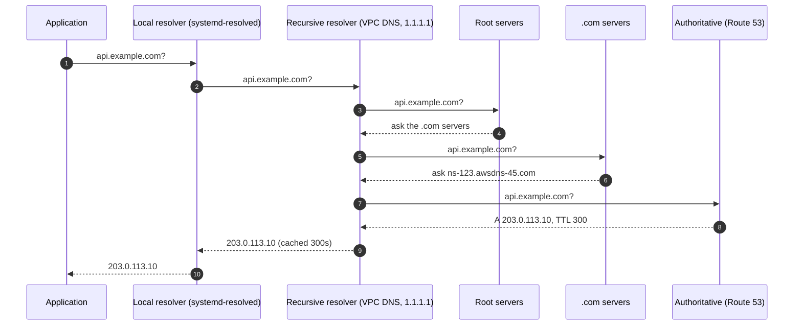

# DNS

## What You'll Learn

- How a name becomes an IP address, step by step
- The record types you'll manage, and the rules that trip people up
- How TTLs and caching control how quickly changes take effect
- How Linux and Kubernetes resolve names, and how to debug DNS with `dig`

## How Resolution Works



- **Authoritative servers** hold the real records for a zone. Route 53, Cloudflare, and your registrar's DNS are authoritative.
- **Recursive resolvers** walk the tree on behalf of clients and cache answers. Your VPC's resolver, your ISP's, and public resolvers such as `1.1.1.1` are recursive.
- Every layer caches — including the application runtime, sometimes indefinitely.

## Record Types

| Type | Maps a name to | Example |
|---|---|---|
| `A` | An IPv4 address | `api.example.com. 300 A 203.0.113.10` |
| `AAAA` | An IPv6 address | `api.example.com. 300 AAAA 2001:db8::10` |
| `CNAME` | Another name (an alias) | `www.example.com. 300 CNAME example.com.` |
| `MX` | Mail servers, with priority | `example.com. 3600 MX 10 mail.example.com.` |
| `TXT` | Arbitrary text: domain verification, SPF, DKIM | `example.com. 300 TXT "v=spf1 include:_spf.google.com ~all"` |
| `NS` | The authoritative name servers for a zone | `example.com. 172800 NS ns-123.awsdns-45.com.` |
| `SOA` | Zone metadata, including the negative-caching TTL | |
| `SRV` | Service host and port | `_sip._tcp.example.com. SRV 10 5 5060 sip.example.com.` |
| `CAA` | Which certificate authorities may issue for the domain | `example.com. CAA 0 issue "letsencrypt.org"` |
| `PTR` | Reverse lookup: IP to name | Used by mail servers and logs |

### Rules that catch people out

- **No CNAME at the zone apex.** `example.com` itself can't be a CNAME because it must also hold `SOA` and `NS` records. Providers offer alias records instead — Route 53 **Alias**, Cloudflare CNAME flattening — to point the apex at a load balancer.
- **A CNAME can't coexist with other records at the same name.** You can't have a CNAME and a TXT on `api.example.com`.
- **Trailing dots matter in zone files.** `example.com.` is fully qualified; `example.com` without the dot may get the zone name appended.

## TTLs and Caching

The **TTL** (time to live) tells resolvers how many seconds to cache an answer.

| TTL | Trade-off |
|---|---|
| 60–300 seconds | Changes take effect quickly; more queries |
| 3,600+ seconds | Fewer queries and resilience if DNS has an outage; changes are slow |

**Negative answers are cached too.** If a name doesn't exist (`NXDOMAIN`), resolvers cache that for the duration set in the zone's `SOA` record. Querying a new record *before* you create it can keep it "missing" for that long.

### Changing a record safely

1. **Days before:** lower the TTL of the record you'll change (for example, from 3600 to 60). Wait at least the **old** TTL so every cache has picked up the short one.
2. **Change the record.** Most clients switch within about a minute.
3. **Keep the old target running** for a while — some clients and runtimes ignore TTLs.
4. **After it's stable:** raise the TTL again.

## Resolution on Linux

```bash
cat /etc/nsswitch.conf | grep hosts    # hosts: files dns — /etc/hosts first, then DNS
cat /etc/hosts
cat /etc/resolv.conf                   # on Ubuntu: nameserver 127.0.0.53 (systemd-resolved stub)
resolvectl status                      # the real upstream DNS servers per interface
resolvectl query api.example.com
resolvectl flush-caches
getent hosts api.example.com           # resolves exactly as applications do, including /etc/hosts
```

`dig` talks straight to DNS and skips `/etc/hosts` and `nsswitch`. When `dig` works but the application doesn't, compare with `getent hosts`.

## Kubernetes DNS and `ndots`

Pods get an `/etc/resolv.conf` like this:

```text
nameserver 10.96.0.10
search shop.svc.cluster.local svc.cluster.local cluster.local
options ndots:5
```

With `ndots:5`, any name with **fewer than five dots** is tried with each search domain first. Looking up `api.stripe.com` (two dots) from a pod queries:

```text
api.stripe.com.shop.svc.cluster.local     → NXDOMAIN
api.stripe.com.svc.cluster.local          → NXDOMAIN
api.stripe.com.cluster.local              → NXDOMAIN
api.stripe.com                            → answer
```

That's four queries, twice over when both `A` and `AAAA` are requested, for every uncached lookup. At scale this overloads CoreDNS and adds latency. Fixes:

- Use fully qualified names with a trailing dot for external hosts: `api.stripe.com.`
- Lower `ndots` for workloads that mostly call external services:

```yaml
spec:
  dnsConfig:
    options:
      - name: ndots
        value: "2"
```

- Run NodeLocal DNSCache to cache on every node.

See [DNS and CoreDNS](../../kubernetes/networking/05-dns-and-coredns.md) for more.

## Debugging With `dig`

```bash
dig api.example.com                      # full answer with TTL and the server that answered
dig +short api.example.com               # just the addresses
dig api.example.com AAAA
dig @1.1.1.1 api.example.com             # ask a specific resolver
dig @ns-123.awsdns-45.com api.example.com   # ask the authoritative server directly — bypasses caches
dig +trace api.example.com               # walk the delegation chain from the root
dig -x 203.0.113.10                      # reverse lookup
dig example.com NS +short                # which name servers are authoritative?
dig example.com SOA                      # includes the negative-caching TTL
```

Reading the answer:

```text
;; ->>HEADER<<- opcode: QUERY, status: NOERROR, id: 4412
;; ANSWER SECTION:
api.example.com.   287   IN   A   203.0.113.10
;; SERVER: 127.0.0.53#53(127.0.0.53) (UDP)
```

| Status | Meaning |
|---|---|
| `NOERROR` with answers | Resolved |
| `NOERROR` with no answers | The name exists but not with that record type |
| `NXDOMAIN` | The name doesn't exist |
| `SERVFAIL` | The resolver couldn't get an answer — often broken DNSSEC or unreachable authoritative servers |
| `REFUSED` | The server won't answer you, such as a private resolver queried from outside |

A TTL counting down (`287`) means the answer came from a cache.

## Common DNS Incidents

| Symptom | Likely cause |
|---|---|
| Some users see the old site after a change | Long TTL, or clients ignoring TTLs |
| A new subdomain stays `NXDOMAIN` for an hour | Negative caching after an early lookup |
| Works from your laptop, fails inside the VPC | Split-horizon DNS: a private hosted zone answers differently |
| Intermittent 5-second delays | Lost UDP DNS packets and resolver retries, or `conntrack` races on busy nodes |
| Certificate issuance fails | A `CAA` record doesn't allow the certificate authority |
| Domain stops resolving entirely | Registration expired, or `NS` records at the registrar don't match the hosted zone |

## Common Mistakes

- Changing a record with a 24-hour TTL and expecting it to take effect in minutes.
- Pointing the zone apex at a load balancer with a CNAME instead of an alias record.
- Debugging with `dig` against a public resolver when the application uses a private zone inside the VPC.
- Hard-coding IP addresses from a DNS lookup into configuration files or firewall rules for cloud load balancers, whose IPs change.
- Letting a domain registration or its auto-renew payment method expire.
- Ignoring `ndots` and search domains when external lookups from Kubernetes are slow.

## Interview Questions

- Walk through what happens when you type `api.example.com` into a browser, from a DNS point of view.
- What's the difference between a recursive resolver and an authoritative server?
- Why can't you use a CNAME at the zone apex, and what do you do instead?
- How do you migrate a DNS record to a new load balancer with minimal disruption?
- Why might external DNS lookups from Kubernetes pods be slow?

## Next

Continue to [HTTP and TLS](03-http-and-tls.md).
