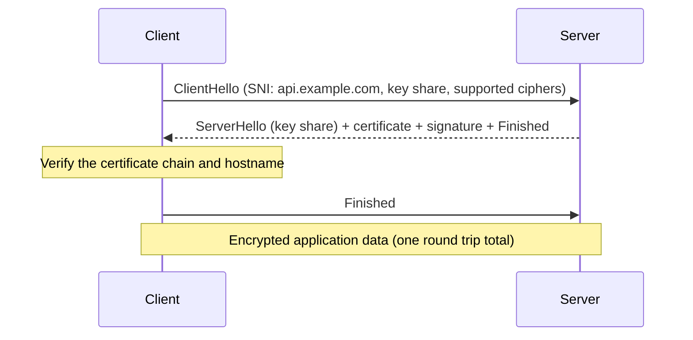
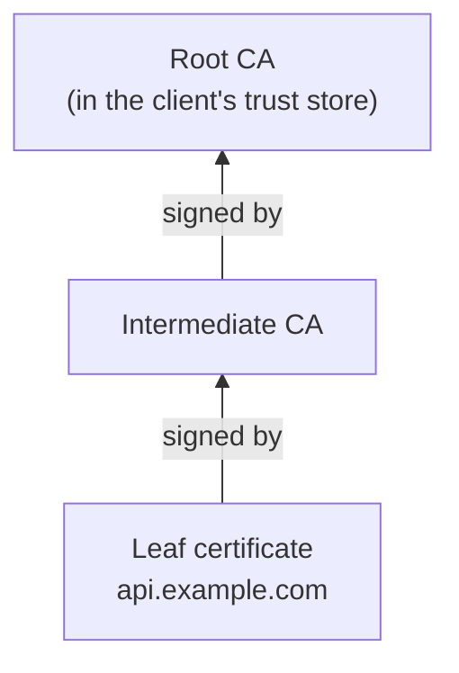

# HTTP and TLS

## What You'll Learn

- The structure of an HTTP request and response, and what status codes really tell you
- The headers that matter for operations: caching, proxies, and host routing
- What HTTP/2 and HTTP/3 change
- How TLS protects traffic, how certificates are validated, and how to debug TLS failures

## Anatomy of an HTTP Request

```bash
curl -v https://api.example.com/orders/42
```

```text
> GET /orders/42 HTTP/2
> Host: api.example.com
> User-Agent: curl/8.9.1
> Accept: */*
>
< HTTP/2 200
< content-type: application/json
< cache-control: no-store
< x-request-id: 7f1c2a9e
<
{"id": 42, "status": "shipped"}
```

The `Host` header tells the server which site you want. One IP address can serve many hostnames — reverse proxies route on it.

## Methods

| Method | Purpose | Safe (no changes) | Idempotent (repeatable) |
|---|---|---|---|
| `GET` | Read a resource | Yes | Yes |
| `HEAD` | `GET` without the body | Yes | Yes |
| `POST` | Create, or trigger an action | No | No |
| `PUT` | Replace a resource | No | Yes |
| `PATCH` | Partially update | No | Not necessarily |
| `DELETE` | Remove | No | Yes |

Idempotency matters for retries: load balancers, clients, and service meshes can safely retry idempotent requests, but retrying a `POST` can create a duplicate order.

## Status Codes

| Range | Meaning | Operational reading |
|---|---|---|
| `2xx` | Success | `200 OK`, `201 Created`, `204 No Content` |
| `3xx` | Redirect | `301` permanent, `302`/`307` temporary, `304 Not Modified` (cache hit) |
| `4xx` | The client's request was wrong | `400` bad input, `401` not authenticated, `403` not allowed, `404` not found, `429` rate limited |
| `5xx` | The server or something in front of it failed | `500` app error, `502` bad gateway, `503` unavailable, `504` gateway timeout |

For SLOs, `5xx` responses are usually counted as errors and most `4xx` are not — a user mistyping a URL isn't an outage. A sudden spike in `401`, `403`, or `429` still deserves an alert. [Load Balancers](04-load-balancers-and-reverse-proxies.md#502-503-and-504) explains what `502`, `503`, and `504` mean when a proxy is involved.

## Headers That Matter in Operations

| Header | Why you care |
|---|---|
| `Host` | Virtual-host routing in proxies and ingress controllers |
| `X-Forwarded-For`, `X-Forwarded-Proto` | The original client IP and scheme after a proxy |
| `Cache-Control`, `ETag`, `Age` | Whether a CDN or browser serves a cached copy |
| `Strict-Transport-Security` | Forces HTTPS for future visits (HSTS) |
| `Retry-After` | How long a client should wait after `429` or `503` |
| `X-Request-Id` / `traceparent` | Correlates one request across logs and traces |
| `Connection: keep-alive` | Reuse TCP connections (default in HTTP/1.1) |

## HTTP/1.1, HTTP/2, and HTTP/3

| | HTTP/1.1 | HTTP/2 | HTTP/3 |
|---|---|---|---|
| Transport | TCP | TCP | QUIC over UDP |
| Requests per connection | One at a time | Many, multiplexed | Many, multiplexed |
| Header format | Text | Binary, compressed | Binary, compressed |
| Head-of-line blocking | Per connection | At the TCP layer | Avoided — a lost packet delays only its own stream |
| TLS | Optional | Effectively required by browsers | Always built in |

HTTP/3 needs UDP port 443 open. If a firewall blocks it, clients fall back to HTTP/2 over TCP — slower to connect but it works.

gRPC runs over HTTP/2, so any proxy in front of a gRPC service must support HTTP/2 end to end.

## Timing a Request

```bash
curl -s -o /dev/null -w '
dns:        %{time_namelookup}s
connect:    %{time_connect}s
tls:        %{time_appconnect}s
first byte: %{time_starttransfer}s
total:      %{time_total}s
status:     %{http_code}
' https://api.example.com/health
```

Each value is cumulative from the start. A large jump between `tls` and `first byte` means the server is slow to respond; a large `dns` value points at resolution; a large `connect` points at network latency or a SYN queue problem.

## TLS

TLS gives three guarantees: **confidentiality** (encryption), **integrity** (tampering is detected), and **authentication** (you're talking to the real `api.example.com`).

### The TLS 1.3 handshake



- **SNI** (server name indication) sends the hostname in the first message, so one IP can serve certificates for many domains.
- TLS 1.3 completes in one round trip. TLS 1.0 and 1.1 are obsolete; TLS 1.2 is still widely supported.

### How a certificate is validated



The client checks that:

1. The chain leads to a root CA it already trusts.
2. The hostname matches a **Subject Alternative Name** in the leaf certificate (the old Common Name field is ignored by modern clients).
3. The current time is within the certificate's validity period.
4. The certificate hasn't been revoked.

The **server must send the intermediate certificates**. Browsers sometimes fetch missing intermediates on their own, which hides the problem — while `curl`, Java, and Python clients fail.

### Inspect a certificate

```bash
# What the server presents, including the chain
openssl s_client -connect api.example.com:443 -servername api.example.com -showcerts </dev/null

# Subject, issuer, SANs, and expiry of the leaf
openssl s_client -connect api.example.com:443 -servername api.example.com </dev/null 2>/dev/null \
  | openssl x509 -noout -subject -issuer -ext subjectAltName -dates

# Days until expiry, for a monitoring check
end=$(openssl s_client -connect api.example.com:443 -servername api.example.com </dev/null 2>/dev/null \
  | openssl x509 -noout -enddate | cut -d= -f2)
echo $(( ( $(date -d "$end" +%s) - $(date +%s) ) / 86400 )) days left

# A certificate file on disk
openssl x509 -in /etc/ssl/certs/app.pem -noout -text | less
```

## Common TLS Errors

| Error | Cause | Fix |
|---|---|---|
| `certificate has expired` | Renewal failed or was never automated | Automate renewal (ACME, cert-manager, a cloud certificate manager) and alert 14+ days before expiry |
| `hostname mismatch` / `no alternative certificate subject name matches` | The requested name isn't in the SANs | Reissue with the right SANs, or fix the name clients use |
| `unable to get local issuer certificate` | Missing intermediate in the chain | Serve the full chain (`fullchain.pem`) |
| `self-signed certificate in certificate chain` | A private CA or a TLS-inspecting proxy the client doesn't trust | Add the CA to the trust store deliberately — never disable verification |
| `certificate is not yet valid` | Clock skew on the client or server | Fix NTP (`timedatectl`) |
| `wrong version number` | Speaking TLS to a plain HTTP port, or the reverse | Check the port and scheme |
| `handshake failure` | No shared protocol version or cipher | Update the client, or review server TLS settings |

!!! warning "Never ship `curl -k` or `verify=False`"
    Disabling certificate verification removes authentication entirely — any machine in the path can impersonate the server. Fix the trust problem instead.

## Certificate Lifetimes and Automation

Public TLS certificates are short-lived and getting shorter: browser and CA industry rules are steadily reducing maximum validity, and Let's Encrypt certificates already last 90 days. Manual renewal no longer works at any scale. Use:

- **ACME clients** such as Certbot for servers
- **cert-manager** in Kubernetes
- **Managed certificates** from cloud load balancers (AWS Certificate Manager, Google-managed certificates), which renew automatically

## Mutual TLS

In **mTLS**, the client also presents a certificate and the server verifies it. It's used for service-to-service authentication inside meshes (Istio, Linkerd) and for machine clients of sensitive APIs. The same chain and expiry rules apply in both directions.

## Common Mistakes

- Serving only the leaf certificate, so non-browser clients fail with "unable to get local issuer certificate".
- Manually renewed certificates with no expiry monitoring — still one of the most common causes of full outages.
- Retrying non-idempotent `POST` requests at the load balancer or client, creating duplicates.
- Counting every `4xx` as an error in SLOs, or ignoring a spike in `401`s after a deploy.
- Using `curl -k` in scripts and health checks, hiding real certificate problems.
- Terminating TLS at a load balancer and sending plaintext across networks you don't control.

## Interview Questions

- What's the difference between `502`, `503`, and `504`?
- Which HTTP methods are idempotent, and why does that matter for retries?
- Walk through a TLS 1.3 handshake. What is SNI for?
- A Python client fails with "unable to get local issuer certificate", but the site works in a browser. Why?
- How would you make sure certificates never expire unnoticed across hundreds of services?

## Next

Continue to [Load Balancers and Reverse Proxies](04-load-balancers-and-reverse-proxies.md).
